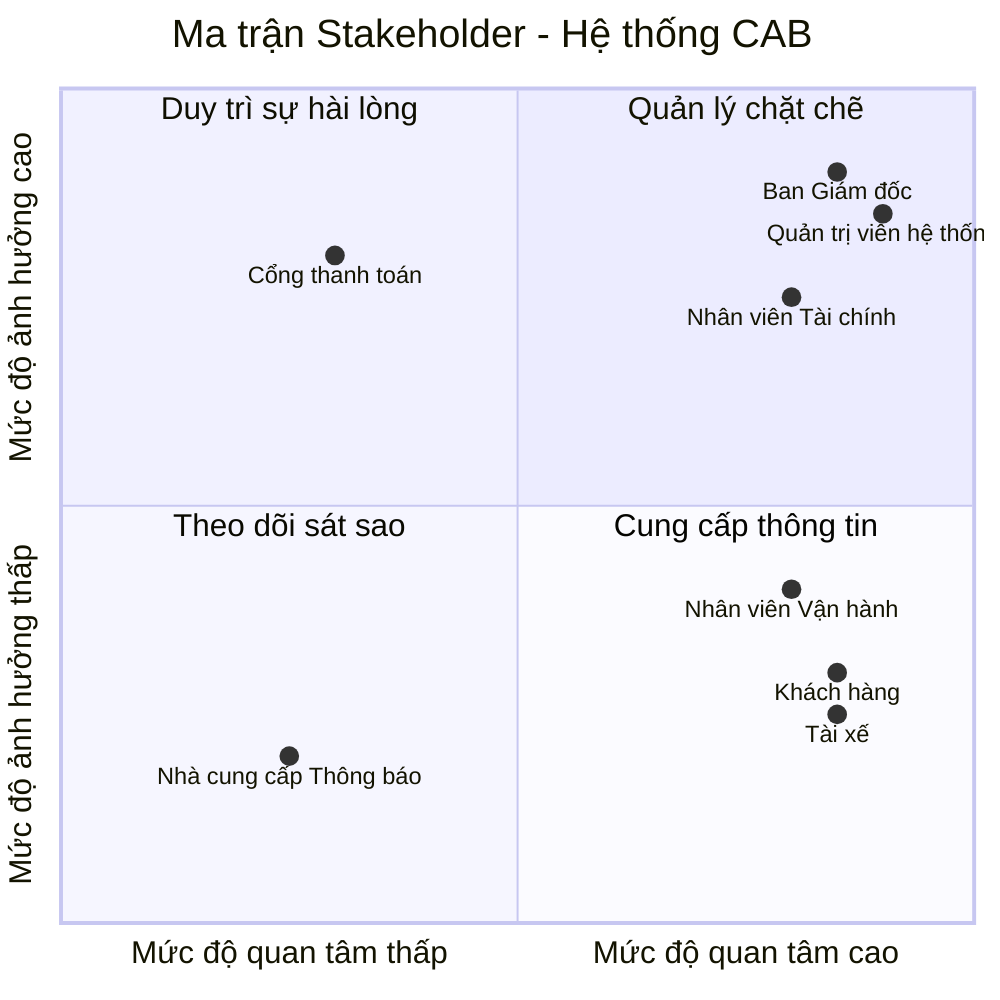

# 23653101_TRUONGHOANGLONG_CABSYSTEM
**###BƯỚC 1: TÌM HIỂU**

**Lý do hệ thống cũ không đáp ứng được và phải xây dựng hệ thống mới:**
* Việc phân công tài xế chủ yếu được thực hiện thủ công, gây tốn thời gian và dễ sai sót.
* Khách hàng khó theo dõi trạng thái chuyến đi theo thời gian thực.
* Thông tin thanh toán chưa được quản lý tập trung, gây khó khăn cho việc đối soát.
* Bộ phận vận hành gặp khó khăn khi muốn mở rộng hệ thống do kiến trúc cũ không linh hoạt và không chịu được tải cao.
### Giải pháp của hệ thống mới 
* **Tự động hóa ghép chuyến (Smart Matching):** Tự động tìm tài xế gần nhất dựa trên GPS; tự động chuyển tiếp sang tài xế khác nếu tài xế đầu tiên từ chối/không phản hồi mà không bắt khách hàng đặt lại.
* **Kiến trúc mở rộng & Chịu lỗi:** Các module (Đặt xe, Thanh toán, Thông báo) hoạt động độc lập, tự động nâng cấp tài nguyên khi tải cao vào giờ cao điểm; sự cố ở module này không làm gián đoạn toàn bộ hệ thống.
* **Bảo mật thanh toán (Tokenization):** Tích hợp cổng thanh toán bên thứ ba an toàn, không lưu thông tin thẻ nhạy cảm trên hệ thống; tự động xử lý lại khi giao dịch thất bại.
* **Quản trị & Phân quyền chặt chẽ:** Áp dụng mô hình phân quyền RBAC cho nhân viên vận hành và ghi nhật ký thao tác (Audit Logs) để kiểm soát rủi ro.
* **Khả năng mở rộng tương lai:** Thiết kế linh hoạt, dễ dàng tích hợp thêm kênh thông báo, phương thức thanh toán hoặc các dịch vụ mới (xe ghép, giao hàng...) trong tương lai.
#### Tác nhân người dùng (User Actors)
* **Khách hàng (Customer):** Đăng ký/đăng nhập, tạo yêu cầu đặt xe, theo dõi vị trí tài xế real-time, thanh toán và đánh giá chất lượng dịch vụ.
* **Tài xế (Driver):** Quản lý hồ sơ/phương tiện, bật trạng thái sẵn sàng, nhận/từ chối chuyến, cập nhật tiến trình chuyến đi và định vị GPS.
* **Nhân viên Vận hành (Ops Staff):** Giám sát chuyến đi real-time, duyệt hồ sơ tài xế, hỗ trợ xử lý sự cố chuyến đi và tra cứu giao dịch.
* **Quản trị viên / Ban Giám đốc (Admin/Management):** Phân quyền hệ thống, kiểm tra Audit Log bảo mật và xem báo cáo doanh thu, hiệu suất vận hành.

####  Tác nhân hệ thống tích hợp (External Systems)
* **Cổng thanh toán (Payment Gateway):** Xử lý giao dịch thanh toán điện tử an toàn theo cơ chế Tokenization.
* **Hạ tầng thông báo (Notification Gateway):** Gửi SMS, Email và Push Notification tức thì đến thiết bị người dùng.
**###BƯỚC 2**
**2. Các bên liên quan**

| Stakeholder | Vai trò trong hệ thống |
| :--- | :--- |
| **Khách hàng** | Khởi tạo yêu cầu đặt xe, theo dõi chuyến đi real-time, thanh toán (tiền mặt/điện tử) và đánh giá dịch vụ. |
| **Tài xế** | Cập nhật hồ sơ/phương tiện, bật trạng thái sẵn sàng, nhận/từ chối chuyến và cập nhật tiến trình chuyến đi. |
| **Nhân viên Vận hành** | Giám sát danh sách chuyến đi/tài xế real-time, quản lý tài khoản và hỗ trợ xử lý các sự cố phát sinh. |
| **Nhân viên Tài chính** | Quản lý đối soát giao dịch thanh toán, theo dõi doanh thu/chiết khấu tài xế, xử lý hoàn tiền và tra cứu dữ liệu tài chính. |
| **Ban Giám đốc** | Xem báo cáo doanh thu & hiệu suất, quản lý phân quyền hệ thống và đưa ra các quyết định kinh doanh. |
| **Quản trị viên hệ thống** | Làm rõ quy tắc nghiệp vụ, thiết kế, xây dựng và triển khai hệ thống trong thời gian 7 tuần. |
| **Cổng thanh toán** | Tiếp nhận và xử lý giao dịch thanh toán trực tuyến . |
| **Nhà cung cấp Thông báo** | Chịu trách nhiệm truyền tải các thông báo (Push Notification/SMS/Email) tức thì đến thiết bị người dùng. |
3. Lập stackholder matric

### Bước 3: Mục đích kinh doanh (Business Purpose & Goals)

* **Tự động hóa vận hành:** Tự động ghép chuyến thông minh qua vị trí GPS, loại bỏ hoàn toàn quy trình phân công thủ công, tối ưu chi phí nhân sự tổng đài.
* **Đa dạng phương thức thanh toán:** Hỗ trợ linh hoạt song song cả **Thanh toán tiền mặt** và **Thanh toán trực tuyến** (Ví điện tử/Thẻ) an toàn qua cơ chế Tokenization.
* **Xử lý truy cập số lượng lớn:** Đảm bảo hệ thống chịu tải cao, phục vụ hàng nghìn khách hàng và tài xế truy cập đồng thời ổn định vào các giờ cao điểm.
* **Nâng cao trải nghiệm khách hàng:** Minh bạch cước phí, theo dõi vị trí xe real-time, nhận thông báo tức thì và đánh giá chất lượng dịch vụ sau chuyến.
* **Tối ưu hiệu suất tài xế:** Giúp tài xế chủ động bật/tắt nhận chuyến, giảm thời gian di chuyển rỗng nhờ nhận các chuyến đi ở vị trí gần nhất.
* **Quản trị tài chính & Kiểm soát rủi ro:** Tập trung hóa dữ liệu giao dịch, tự động xử lý lại khi thanh toán thất bại, ghi log theo vết (Audit Log) và phân quyền truy cập chặt chẽ (RBAC).
* **Công cụ vận hành real-time:** Trang bị Dashboard quản trị cho nhân viên vận hành giám sát chuyến đi, quản lý tài khoản và can thiệp hỗ trợ sự cố kịp thời.
* **Chịu lỗi & Hoạt động liên tục (Fault Tolerance):** Đảm bảo sự cố từ các dịch vụ bên thứ ba (thanh toán, thông báo) không làm ngừng trệ chức năng đặt xe cốt lõi.
* **Hỗ trợ báo cáo & Quyết định kinh doanh:** Cung cấp báo cáo trực quan cho Ban Giám đốc về doanh thu, tỷ lệ hoàn thành/hủy chuyến và KPI hiệu suất tài xế.
* **Sẵn sàng mở rộng tương lai:** Xây dựng kiến trúc linh hoạt để dễ dàng bổ sung thêm dịch vụ mới (giao hàng, xe ghép...), kênh thông báo hoặc phương thức thanh toán mới.
  
**###Bước 4: Phạm vi dự án (Project Scope - 7 Tuần)**

#### 1. Trong phạm vi (In-Scope)

* **Xác thực & Phân quyền cơ bản (Authentication & RBAC):**
  * Đăng ký, đăng nhập an toàn cho người dùng (Khách hàng, Tài xế).
  * Phân quyền truy cập theo vai trò (Khách hàng, Tài xế, Nhân viên Vận hành, Nhân viên Tài chính, Ban Giám đốc).

* **Thiết kế modul hóa (Modular Design):**
  * **Modul Quản lý Khách hàng (Customer Management):** Quản lý thông tin hồ sơ khách hàng, lịch sử chuyến đi, thông tin thanh toán lưu trữ và lịch sử đánh giá/phản hồi dịch vụ.
  * **Modul Tài khoản & Xác thực (Auth):** Quản lý đăng nhập, phân quyền và bảo mật phiên làm việc.
  * **Modul Đặt xe (Booking):** Khởi tạo chuyến đi, tự động tìm tài xế gần nhất qua GPS và xử lý chuyển tiếp khi tài xế từ chối/hết giờ.
  * **Modul Định vị (Tracking):** Theo dõi vị trí tài xế và trạng thái chuyến đi theo thời gian thực trên bản đồ.
  * **Modul Thanh toán (Payment):** Hỗ trợ song song **Tiền mặt** và **Thanh toán trực tuyến** (môi trường thử nghiệm Sandbox).
  * **Modul Quản trị (Dashboard):** Giao diện hỗ trợ cho Nhân viên Vận hành (giám sát), Nhân viên Tài chính (xem giao dịch, đối soát) và Ban Giám đốc (xem báo cáo doanh thu).

#### 2. Ngoài phạm vi (Out-of-Scope)
* Tích hợp cổng thanh toán thực tế (chỉ dùng tài khoản thử nghiệm Sandbox).
* Các tính năng nâng cao: Đặt xe ghép, giao hàng, đặt trước chuyến đi.
* Chương trình tích điểm, khuyến mãi hoặc mã giảm giá phức tạp.

#### 3. Lộ trình 7 tuần (7-Week Roadmap)

| Tuần | Công việc chính |
| :---: | :--- |
| **1** | Thu thập yêu cầu, xác định phạm vi và lập bảng Stakeholder. |
| **2** | Phân tích nghiệp vụ (Sơ đồ Use Case, Activity Diagram). |
| **3** | Thiết kế Cơ sở dữ liệu (ERD) và phân chia cấu trúc các Modul. |
| **4** | Xây dựng Modul Auth (Đăng nhập/Phân quyền), Modul Quản lý Khách hàng & Modul Đặt xe. |
| **5** | Xây dựng Modul Thanh toán (Tiền mặt/Online), Tracking & Giao diện Dashboard Quản trị. |
| **6** | Kiểm thử tích hợp giữa các modul và sửa lỗi. |
| **7** | Hoàn thiện tài liệu README.md và tổng kết báo cáo dự án. |

### Bước 5: Yêu cầu nghiệp vụ (Business Requirements)

#### Bảng Quy trình Nghiệp vụ

| Mã BR | Yêu cầu Nghiệp vụ cốt lõi | KPI & Tiêu chí Nghiệm thu cụ thể |
| :---: | :--- | :--- |
| **BR-01** | **Điều phối & Ghép chuyến thông minh (Smart Matching)** | • **100%** luồng phân công chạy tự động dựa trên tọa độ GPS, loại bỏ hoàn toàn quy trình can thiệp thủ công từ tổng đài. • Hệ thống tự động chuyển tiếp yêu cầu sang tài xế kế cận khi tài xế trước từ chối hoặc hết thời gian phản hồi (timeout). • Đảm bảo trải nghiệm liền mạch: Giữ nguyên dữ liệu chuyến đi, **không bắt khách hàng phải thao tác đặt lại chuyến**. |
| **BR-02** | **Định vị hành trình & Truyền tải thông báo tức thì** | • Cho phép Khách hàng giám sát vị trí tài xế và tiến trình chuyến đi theo thời gian thực trên bản đồ (Modul Tracking). • Tự động kích hoạt **100%** thông báo đa kênh (**Push Notification/SMS/Email**) qua Notification Gateway đến thiết bị người dùng theo từng mốc chuyến đi. • Thu thập phản hồi và đánh giá chất lượng dịch vụ của khách hàng ngay sau khi kết thúc hành trình. |
| **BR-03** | **Quản lý Cước phí & Tích hợp Thanh toán An toàn (Tokenization)** | • Tích hợp linh hoạt hai phương thức: **Thanh toán tiền mặt** và **Thanh toán trực tuyến** (kết nối Cổng thanh toán bên thứ ba qua môi trường thử nghiệm Sandbox). • Tuân thủ an toàn dữ liệu: **0%** lưu trữ thông tin thẻ nhạy cảm (CVV, số thẻ đầy đủ) trên hệ thống CAB nhờ cơ chế Tokenization. • Hỗ trợ tự động xử lý lại (Retry) giao dịch điện tử hoặc cho phép chuyển sang tiền mặt khi thanh toán thất bại. |
| **BR-04** | **Phân quyền truy cập RBAC & Giám sát Vận hành Real-time** | • Thiết lập mô hình phân quyền **RBAC** chặt chẽ cho 5 nhóm tác nhân (*Khách hàng, Tài xế, Nhân viên Vận hành, Nhân viên Tài chính, Ban Giám đốc/Admin*). • Trang bị Dashboard cho Nhân viên Vận hành giám sát các chuyến đi real-time, tra cứu lịch sử và hỗ trợ xử lý sự cố phát sinh. • **100%** các thao tác thay đổi dữ liệu hoặc phân quyền hệ thống phải được ghi lại nhật ký vết (**Audit Logs**) để quản trị rủi ro. |
| **BR-05** | **Quản lý Tài chính, Đối soát & Báo cáo Quản trị** | • Cung cấp công cụ cho Nhân viên Tài chính thực hiện tra cứu giao dịch, đối soát doanh thu/chiết khấu tài xế và xử lý yêu cầu hoàn tiền. • Xuất báo cáo trực quan cho Ban Giám đốc về các chỉ số vận hành: *Doanh thu tổng, số lượng chuyến đi, tỷ lệ hoàn thành/hủy chuyến, KPI hiệu suất tài xế*. |
| **BR-06** | **Thiết kế Modul hóa & Tối ưu Khả năng Chịu lỗi (Fault Tolerance)** | • Kiến trúc phân chia Modul độc lập (*Auth, Customer, Booking, Tracking, Payment, Dashboard*). • **Đảm bảo tính hoạt động liên tục**: Sự cố từ các dịch vụ bên thứ ba (Cổng thanh toán, Hạ tầng thông báo) không làm ngừng trệ chức năng Đặt xe cốt lõi. • Đáp ứng khả năng chịu tải cao vào giờ cao điểm và sẵn sàng mở rộng các dịch vụ mới (*giao hàng, xe ghép...*) trong tương lai. |

### Bước 6: Yêu cầu Chức năng Hệ thống (Functional Requirements - FR)
#### 1. Khách hàng (Customer)
* **FR-CUS-01 (Đăng ký / Đăng nhập):** Đăng ký tài khoản mới và xác thực đăng nhập để truy cập hệ thống.
* **FR-CUS-02 (Quản lý hồ sơ):** Xem, cập nhật thông tin cá nhân (Họ tên, Email, Ảnh đại diện) và quản lý danh sách địa chỉ yêu thích.
* **FR-CUS-03 (Đặt xe):** Nhập điểm đi, điểm đến, chọn loại xe, xem cước phí dự kiến và gửi yêu cầu tìm tài xế.
* **FR-CUS-04 (Hủy xe):** Chủ động hủy yêu cầu đặt xe hoặc hủy chuyến trước khi tài xế đón.
* **FR-CUS-05 (Thanh toán):** Chọn phương thức thanh toán (Tiền mặt / Online) và thực hiện giao dịch cho chuyến đi.
* **FR-CUS-06 (Đánh giá dịch vụ):** Chấm điểm số sao (1–5 sao) và gửi nhận xét về chất lượng chuyến đi sau khi hoàn tất.

#### 2. Tài xế (Driver)
* **FR-DRI-01 (Quản lý hồ sơ & Phương tiện):** Cập nhật thông tin cá nhân và tải lên giấy tờ xe (Bằng lái, Biển số, Cavet, Đăng kiểm) để chờ duyệt.
* **FR-DRI-02 (Cập nhật trạng thái sẵn sàng):** Chủ động bật/tắt chế độ nhận chuyến (Sẵn sàng / Ngừng nhận chuyến).
* **FR-DRI-03 (Xử lý yêu cầu chuyến đi):** Nhận thông báo chuyến đi mới và thực hiện Chấp nhận hoặc Từ chối trong thời gian quy định.
* **FR-DRI-04 (Cập nhật tiến trình đi):** Cập nhật trạng thái thực tế của chuyến đi theo luồng: *Đã đến điểm đón -> Bắt đầu di chuyển -> Hoàn thành chuyến đi*.
* **FR-DRI-05 (Xác nhận thu tiền mặt):** Xác nhận đã thu đủ số tiền mặt từ khách hàng đối với các chuyến đi thanh toán bằng tiền mặt.

#### 3. Nhân viên Vận hành (Ops Staff)
* **FR-OPS-01 (Duyệt hồ sơ tài xế):** Kiểm tra thông tin, hình ảnh giấy tờ do tài xế cung cấp để Phê duyệt hoặc Từ chối cấp quyền hoạt động.
* **FR-OPS-02 (Giám sát vận hành):** Theo dõi danh sách các chuyến đi đang diễn ra và vị trí/trạng thái của tài xế real-time trên bản đồ.
* **FR-OPS-03 (Can thiệp sự cố):** Can thiệp hủy chuyến, điều lại xe hoặc xử lý các sự cố phát sinh trong quá trình vận hành.

#### 4. Nhân viên Tài chính (Finance Staff)
* **FR-FIN-01 (Tra cứu giao dịch):** Khai thác và kiểm tra chi tiết thông tin lịch sử các giao dịch thanh toán trên hệ thống.
* **FR-FIN-02 (Đối soát tài chính):** Đối soát dữ liệu thanh toán giữa CSDL hệ thống và Cổng thanh toán để phát hiện, xử lý các giao dịch chênh lệch.
* **FR-FIN-03 (Quản lý ví tài xế):** Quản lý số dư, lịch sử biến động nguồn tiền, khấu trừ chiết khấu và công nợ trên ví của tài xế.

#### 5. Ban Giám đốc (Management)
* **FR-MGT-01 (Xem báo cáo doanh thu):** Trích xuất và theo dõi các chỉ số doanh thu tổng quan, doanh thu theo thời gian và phương thức thanh toán.
* **FR-MGT-02 (Xem báo cáo hiệu suất):** Theo dõi các báo cáo chỉ số KPI, tỷ lệ hoàn thành/hủy chuyến và hiệu suất hoạt động của tài xế.

#### 6. Quản trị viên Hệ thống (System Admin)
* **FR-ADM-01 (Cập nhật hệ thống):** Cấu hình tham số vận hành, cập nhật tính năng và bảo trì các thiết lập chung của hệ thống.
* **FR-ADM-02 (Quản lý dữ liệu):** Quản trị danh mục, phân quyền truy cập người dùng (RBAC) và quản lý cơ sở dữ liệu.
* **FR-ADM-03 (Sao lưu và lưu trữ):** Thực hiện sao lưu dữ liệu định kỳ, lưu trữ nhật ký thao tác (Audit Log) và khôi phục dữ liệu khi cần.

#### 7. Hệ thống Tích hợp bên ngoài (External Systems)
* **FR-EXT-01 (Cổng thanh toán - Xử lý giao dịch online):** Tiếp nhận và xử lý các giao dịch thanh toán trực tuyến qua Thẻ/Ví điện tử an toàn theo cơ chế Tokenization.
* **FR-EXT-02 (Nhà cung cấp Thông báo - Gửi thông báo):** Chịu trách nhiệm truyền tải các Push Notification, SMS, Email tức thì đến thiết bị của người dùng.

Bước 7: vẽ usecase tổng quát

Bước 8: đặc tả usecase
**###KHÁCH HÀNG**
### **Đặc tả UseCase Đăng nhập**

| Thuộc tính | Nội dung |
| :--- | :--- |
| **– Tên use case:** | Đăng nhập |
| **– Mô tả sơ lược:** | Chức năng Đăng nhập cho phép người dùng (Khách hàng, Tài xế, Nhân viên, Quản trị viên) xác thực tài khoản để truy cập vào hệ thống CAB System. |
| **– Actor chính:** | Người dùng (Khách hàng, Tài xế, Nhân viên Vận hành, Nhân viên Tài chính, Ban Giám đốc, Quản trị viên hệ thống) |
| **– Actor phụ:** | Không |
| **– Tiền điều kiện (Pre-condition):** | Người dùng phải có tài khoản đã được kích hoạt trên hệ thống. |
| **– Hậu điều kiện (Post-condition):** | Nếu đăng nhập thành công thì hệ thống sẽ hiển thị giao diện trang chủ theo đúng vai trò (Role). |

#### **– Luồng sự kiện chính (main flow):**

| Actor: Người dùng | System |
| :--- | :--- |
| **1.** Mở ứng dụng / Truy cập website hệ thống | |
| | **2.** Hiển thị form đăng nhập gồm các thông tin: Số điện thoại / Tên đăng nhập, Mật khẩu |
| **3.** Nhập đầy đủ thông tin đăng nhập và nhấn nút "Đăng nhập" | |
| | **4.** Kiểm tra cú pháp và định dạng dữ liệu đầu vào |
| | **5.** Xác thực thông tin tài khoản và mật khẩu trong cơ sở dữ liệu |
| | **6.** Hệ thống hiển thị trang chủ tương ứng với vai trò của người dùng. Kết thúc usecase |

#### **– Luồng sự kiện thay thế (alternate flow):**

| Actor: Người dùng | System |
| :--- | :--- |
| | **4.1.1.** Hệ thống hiển thị thông báo sai định dạng (ví dụ: Số điện thoại không hợp lệ) |
| **4.1.2.** Quay lại bước 3 | |
| | **5.1.1.** Hệ thống hiển thị thông báo "Tài khoản hoặc mật khẩu không chính xác" |
| **5.1.2.** Quay lại bước 3 | |

#### **– Luồng sự kiện ngoại lệ (exception flow):**

| Actor: Người dùng | System |
| :--- | :--- |
| | **5.2.1.** Hệ thống phát hiện tài khoản chưa tồn tại hoặc đã bị khóa |
| **5.2.3** Nhấn nút đóng hoặc OK. Kết thúc usecase | **5.2.2.** Hệ thống hiển thị thông báo "Tài khoản không tồn tại hoặc đã bị khóa" |

### **Đặc tả UseCase Quản lý hồ sơ**

| Thuộc tính | Nội dung |
| :--- | :--- |
| **– Tên use case:** | Quản lý hồ sơ |
| **– Mô tả sơ lược:** | Chức năng Quản lý hồ sơ cho phép Khách hàng xem, cập nhật thông tin cá nhân (họ tên, email, ảnh đại diện) và quản lý danh sách địa chỉ yêu thích trên ứng dụng. |
| **– Actor chính:** | Khách hàng |
| **– Actor phụ:** | Không |
| **– Tiền điều kiện (Pre-condition):** | Khách hàng đã đăng nhập thành công vào ứng dụng. |
| **– Hậu điều kiện (Post-condition):** | Thông tin hồ sơ mới được lưu cập nhật thành công vào cơ sở dữ liệu. |

#### **– Luồng sự kiện chính (main flow):**

| Actor: Khách hàng | System |
| :--- | :--- |
| **1.** Chọn mục "Hồ sơ cá nhân" từ ứng dụng | |
| | **2.** Hiển thị thông tin cá nhân hiện tại (Họ tên, Số điện thoại, Email, Ảnh đại diện) và danh sách địa chỉ đã lưu |
| **3.** Thay đổi thông tin cá nhân hoặc thêm/sửa thông tin cá nhân | |
| **4.** Nhấn nút "Lưu thay đổi" | |
| | **5.** Kiểm tra định dạng dữ liệu đầu vào (định dạng Email, khoảng trắng...) |
| | **6.** Cập nhật thông tin mới vào cơ sở dữ liệu và hiển thị thông báo "Cập nhật hồ sơ thành công". Kết thúc usecase |

#### **– Luồng sự kiện thay thế (alternate flow):**

| Actor: Khách hàng | System |
| :--- | :--- |
| | **5.1.1.** Hệ thống phát hiện định dạng Email hoặc dữ liệu nhập vào không hợp lệ |
| | **5.1.2.** Hệ thống hiển thị thông báo lỗi chi tiết tại trường thông tin sai |
| **5.1.3.** Quay lại bước 3 | |

#### **– Luồng sự kiện ngoại lệ (exception flow):**

| Actor: Khách hàng | System |
| :--- | :--- |
| | **6.1.1.** Hệ thống gặp lỗi kết nối cơ sở dữ liệu hoặc gián đoạn mạng khi đang lưu |
| | **6.1.2.** Hệ thống hiển thị thông báo "Cập nhật thất bại, vui lòng kiểm tra lại kết nối" |
| **6.1.3.** Nhấn nút OK. Kết thúc usecase | |

### Đặc tả UseCase Đặt xe

| Thuộc tính | Nội dung |
| :--- | :--- |
| **– Tên use case:** | Đặt xe |
| **– Mô tả sơ lược:** | Chức năng Đặt xe cho phép Khách hàng chọn điểm đi, điểm đến, chọn loại xe, xem ước tính cước phí và gửi yêu cầu tìm tài xế trên hệ thống. |
| **– Actor chính:** | Khách hàng |
| **– Actor phụ:** | Tài xế, Cổng thanh toán, Hạ tầng thông báo |
| **– Tiền điều kiện (Pre-condition):** | Khách hàng đã đăng nhập thành công vào ứng dụng và đã bật vị trí (GPS). |
| **– Hậu điều kiện (Post-condition):** | Hệ thống tạo chuyến đi thành công, kết nối với Tài xế và chuyển sang trạng thái theo dõi chuyến đi real-time. |

#### – Luồng sự kiện chính (main flow):

| Actor: Khách hàng | System |
| :--- | :--- |
| **1.** Chọn chức năng "Đặt xe" trên ứng dụng | |
| | **2.** Hiển thị bản đồ vị trí hiện tại và form nhập điểm đi, điểm đến |
| **3.** Nhập điểm đi, điểm đến, chọn loại xe và phương thức thanh toán | |
| | **4.** Tính khoảng cách di chuyển, hiển thị cước phí dự kiến và thời gian tài xế dự kiến đến đón |
| **5.** Nhấn nút "Xác nhận đặt xe" | |
| | **6.** Khởi tạo đơn đặt xe, tìm kiếm Tài xế gần nhất trong bán kính quy định và gửi thông báo mời chuyến đến ứng dụng của Tài xế |
| | **7.** [Tài xế chấp nhận] Nhận phản hồi chấp nhận từ Tài xế |
| | **8.** Hiển thị thông tin tài xế (Họ tên, biển số xe, số điện thoại, vị trí trên bản đồ). Kết thúc usecase |

#### – Luồng sự kiện thay thế (alternate flow):

| Actor: Khách hàng | System |
| :--- | :--- |
| | **6.1.1.** [Tài xế từ chối / Không tìm thấy] Hệ thống không tìm thấy Tài xế nhận chuyến |
| | **6.1.2.** Hiển thị thông báo "Rất tiếc, hiện không có tài xế nào nhận chuyến" kèm 2 lựa chọn: "Thử lại" hoặc "Hủy" |
| **6.1.3a.** [Bấm "Thử lại"] Hệ thống quay lại bước 6 để quét lại danh sách tài xế | |
| **6.1.3b.** [Bấm "Hủy"] Đóng thông báo và quay về trang chủ. Kết thúc usecase | |

#### – Luồng sự kiện ngoại lệ (exception flow):

| Actor: Khách hàng | System |
| :--- | :--- |
| | **2.1.1.** Hệ thống phát hiện thiết bị của Khách hàng bị mất kết nối Internet hoặc chưa bật GPS |
| | **2.1.2.** Hiển thị thông báo "Không có kết nối mạng hoặc GPS bị tắt. Vui lòng kiểm tra lại thiết bị" |
| **2.1.3.** Bấm nút "Đồng ý" để đóng thông báo. Kết thúc usecase | |
| | **6.2.1.** Hệ thống gặp sự cố mất kết nối cơ sở dữ liệu/Server khi đang xử lý đơn đặt xe |
| | **6.2.2.** Hiển thị thông báo "Hệ thống đang gián đoạn, vui lòng thử lại sau ít phút" |
| **6.2.3.** Bấm nút OK. Kết thúc usecase | |
### **Đặc tả UseCase Đánh giá dịch vụ**

| Thuộc tính | Nội dung |
| :--- | :--- |
| **– Tên use case:** | Đánh giá dịch vụ |
| **– Mô tả sơ lược:** | Chức năng Đánh giá dịch vụ cho phép Khách hàng chấm điểm số sao (1-5 sao) và gửi nhận xét về chất lượng chuyến đi cũng như thái độ của tài xế sau khi hoàn thành chuyến. |
| **– Actor chính:** | Khách hàng |
| **– Actor phụ:** | Không |
| **– Tiền điều kiện (Pre-condition):** | Chuyến đi đã được tài xế cập nhật trạng thái "Hoàn thành" và Khách hàng đã thanh toán cước phí. |
| **– Hậu điều kiện (Post-condition):** | Điểm đánh giá và nhận xét được lưu vào cơ sở dữ liệu, tự động cập nhật lại điểm trung bình (Rating) của Tài xế. |

#### **– Luồng sự kiện chính (main flow):**

| Actor: Khách hàng | System |
| :--- | :--- |
| | **1.** Tự động hiển thị màn hình đánh giá dịch vụ ngay khi chuyến đi hoàn tất |
| **2.** Chọn số sao đánh giá (từ 1 đến 5 sao), chọn các tiêu chí nhanh (ví dụ: Lái xe an toàn, Xe sạch sẽ...) và nhập lời nhắn (nếu có) | |
| **3.** Nhấn nút "Gửi đánh giá" | |
| | **4.** Lưu thông tin đánh giá vào cơ sở dữ liệu |
| | **5.** Tự động tính toán lại điểm rating trung bình của Tài xế |
| | **6.** Hiển thị thông báo "Cảm ơn bạn đã đánh giá dịch vụ" và quay về trang chủ. Kết thúc usecase |

#### **– Luồng sự kiện thay thế (alternate flow):**

| Actor: Khách hàng | System |
| :--- | :--- |
| **2.1.1.** Bấm nút "Bỏ qua" hoặc dấu "X" trên màn hình đánh giá | |
| | **2.1.2.** Ghi nhận không có đánh giá, đóng màn hình và quay về trang chủ. Kết thúc usecase |

#### **– Luồng sự kiện ngoại lệ (exception flow):**

| Actor: Khách hàng | System |
| :--- | :--- |
| | **4.1.1.** Hệ thống gặp lỗi kết nối hoặc gián đoạn mạng khi đang gửi đánh giá |
| | **4.1.2.** Hệ thống hiển thị thông báo "Gửi đánh giá thất bại, vui lòng kiểm tra lại kết nối" |
| **4.1.3.** Nhấn nút OK. Kết thúc usecase | |

### **Đặc tả UseCase Hủy chuyến**

| Thuộc tính | Nội dung |
| :--- | :--- |
| **– Tên use case:** | Hủy chuyến |
| **– Mô tả sơ lược:** | Chức năng Hủy chuyến cho phép Khách hàng chủ động hủy yêu cầu đặt xe đã gửi hoặc hủy chuyến đi đang trong trạng thái chờ tài xế đến đón. |
| **– Actor chính:** | Khách hàng |
| **– Actor phụ:** | Tài xế, Hạ tầng thông báo |
| **– Tiền điều kiện (Pre-condition):** | Khách hàng đã gửi yêu cầu đặt xe thành công và chuyến đi chưa chuyển sang trạng thái "Đang di chuyển" (Đang chở khách). |
| **– Hậu điều kiện (Post-condition):** | Chuyển trạng thái chuyến đi thành "Đã hủy", hệ thống giải phóng trạng thái bận của Tài xế (nếu đã nhận) và tính phí hủy chuyến (nếu có). |

#### **– Luồng sự kiện chính (main flow):**

| Actor: Khách hàng | System |
| :--- | :--- |
| **1.** Nhấn nút "Hủy chuyến" trên màn hình chờ hoặc màn hình theo dõi chuyến đi | |
| | **2.** Hiển thị hộp thoại xác nhận kèm danh sách lý do hủy chuyến (ví dụ: Đổi kế hoạch, Chờ quá lâu, Đặt nhầm...) |
| **3.** Chọn lý do hủy chuyến và nhấn nút "Xác nhận hủy" | |
| | **4.** Kiểm tra điều kiện thời gian hủy chuyến và tính phí phạt hủy chuyến (nếu hủy sau 5 phút kể từ khi tài xế nhận chuyến) |
| | **5.** Cập nhật trạng thái chuyến đi thành `Cancelled` trong cơ sở dữ liệu |
| | **6.** Gửi thông báo hủy chuyến đến ứng dụng của Tài xế (nếu đã có tài xế nhận) |
| | **7.** Hiển thị thông báo "Hủy chuyến thành công" và đưa Khách hàng quay về trang chủ. Kết thúc usecase |

#### **– Luồng sự kiện thay thế (alternate flow):**

| Actor: Khách hàng | System |
| :--- | :--- |
| **3.1.1.** Nhấn nút "Quay lại" hoặc "Đóng" trên hộp thoại chọn lý do hủy | |
| | **3.1.2.** Đóng hộp thoại xác nhận và tiếp tục giữ nguyên trạng thái chuyến đi. Kết thúc usecase |

#### **– Luồng sự kiện ngoại lệ (exception flow):**

| Actor: Khách hàng | System |
| :--- | :--- |
| | **4.1.1.** Hệ thống ghi nhận Tài xế đã bấm "Bắt đầu chuyến đi" (đã đón khách lên xe) ngay trước thời điểm Khách hàng bấm hủy |
| | **4.1.2.** Hệ thống không cho phép hủy và hiển thị thông báo "Chuyến đi đã bắt đầu, không thể hủy chuyến" |
| **4.1.3.** Nhấn nút OK. Kết thúc usecase | |
**TÀI XẾ**
### **Đặc tả UseCase Quản lý hồ sơ & Phương tiện**

| Thuộc tính | Nội dung |
| :--- | :--- |
| **– Tên use case:** | Quản lý hồ sơ & Phương tiện |
| **– Mô tả sơ lược:** | Chức năng Quản lý hồ sơ & Phương tiện cho phép Tài xế xem, cập nhật thông tin cá nhân (họ tên, số điện thoại, ảnh chân dung) và tải lên/cập nhật giấy tờ xe (bằng lái, cavet, đăng kiểm, biển số xe) để phục vụ việc duyệt tài khoản. |
| **– Actor chính:** | Tài xế |
| **– Actor phụ:** | Nhân viên Vận hành |
| **– Tiền điều kiện (Pre-condition):** | Tài xế đã đăng nhập thành công vào ứng dụng dành cho Tài xế (Driver App). |
| **– Hậu điều kiện (Post-condition):** | Thông tin/hình ảnh giấy tờ mới được lưu vào hệ thống và chuyển sang trạng thái "Chờ duyệt" nếu có thay đổi thông tin pháp lý/phương tiện. |

#### **– Luồng sự kiện chính (main flow):**

| Actor: Tài xế | System |
| :--- | :--- |
| **1.** Chọn mục "Hồ sơ & Xe" trên ứng dụng Tài xế | |
| | **2.** Hiển thị thông tin cá nhân hiện tại, thông tin xe và trạng thái giấy tờ (Đã duyệt / Chờ duyệt / Bị từ chối) |
| **3.** Chỉnh sửa thông tin cá nhân hoặc tải lên hình ảnh giấy tờ/phương tiện mới | |
| **4.** Nhấn nút "Lưu cập nhật" | |
| | **5.** Kiểm tra định dạng dữ liệu, kích thước và định dạng tệp hình ảnh tải lên |
| | **6.** Cập nhật thông tin vào cơ sở dữ liệu, chuyển trạng thái giấy tờ xe sang "Chờ duyệt", gửi thông báo đến Nhân viên Vận hành và hiển thị thông báo "Cập nhật hồ sơ thành công". Kết thúc usecase |

#### **– Luồng sự kiện thay thế (alternate flow):**

| Actor: Tài xế | System |
| :--- | :--- |
| | **5.1.1.** Hệ thống phát hiện tệp hình ảnh vượt quá dung lượng cho phép hoặc sai định dạng (không phải JPG/PNG) |
| | **5.1.2.** Hệ thống hiển thị thông báo "Kích thước tệp quá lớn hoặc định dạng hình ảnh không hợp lệ" |
| **5.1.3.** Quay lại bước 3 | |

#### **– Luồng sự kiện ngoại lệ (exception flow):**

| Actor: Tài xế | System |
| :--- | :--- |
| | **6.1.1.** Hệ thống gặp lỗi kết nối cơ sở dữ liệu hoặc gián đoạn mạng khi đang tải tệp lên |
| | **6.1.2.** Hệ thống hiển thị thông báo "Tải hồ sơ thất bại, vui lòng kiểm tra lại kết nối mạng" |
| **6.1.3.** Nhấn nút OK. Kết thúc usecase | |

### **Đặc tả UseCase Cập nhật trạng thái sẵn sàng**

| Thuộc tính | Nội dung |
| :--- | :--- |
| **– Tên use case:** | Cập nhật trạng thái sẵn sàng |
| **– Mô tả sơ lược:** | Chức năng Cập nhật trạng thái sẵn sàng cho phép Tài xế chủ động bật/tắt trạng thái hoạt động (Trực tuyến/Ngoại tuyến) trên ứng dụng để nhận hoặc ngừng nhận các yêu cầu chuyến đi từ hệ thống. |
| **– Actor chính:** | Tài xế |
| **– Actor phụ:** | Không |
| **– Tiền điều kiện (Pre-condition):** | Tài xế đã đăng nhập thành công vào ứng dụng Tài xế, tài khoản đã được duyệt và thiết bị đã bật vị trí (GPS). |
| **– Hậu điều kiện (Post-condition):** | Trạng thái hoạt động của Tài xế được cập nhật trên hệ thống (Sẵn sàng nhận chuyến hoặc Ngừng nhận chuyến). |

#### **– Luồng sự kiện chính (main flow):**

| Actor: Tài xế | System |
| :--- | :--- |
| **1.** Nhấn nút gạt (Toggle Switch) "Bật nhận chuyến" trên màn hình chính của ứng dụng | |
| | **2.** Kiểm tra điều kiện tài khoản (trạng thái hồ sơ, số dư ví tài xế tối thiểu) và tín hiệu GPS |
| | **3.** Cập nhật trạng thái Tài xế thành `Online` (Sẵn sàng) trong cơ sở dữ liệu và kích hoạt cơ chế định vị real-time |
| | **4.** Hiển thị giao diện "Đang sẵn sàng nhận chuyến" kèm bản đồ khu vực xung quanh. Kết thúc usecase |

#### **– Luồng sự kiện thay thế (alternate flow):**

| Actor: Tài xế | System |
| :--- | :--- |
| **1.1.1.** Nhấn nút gạt "Tắt nhận chuyến" khi đang ở trạng thái Trực tuyến (`Online`) | |
| | **1.1.2.** Kiểm tra Tài xế hiện không trong tiến trình thực hiện chuyến đi nào |
| | **1.1.3.** Cập nhật trạng thái Tài xế thành `Offline` (Ngoại tuyến), ngừng gửi tọa độ GPS và chuyển giao diện sang "Đã tắt nhận chuyến". Kết thúc usecase |

#### **– Luồng sự kiện ngoại lệ (exception flow):**

| Actor: Tài xế | System |
| :--- | :--- |
| | **2.1.1.** Hệ thống phát hiện tài khoản chưa được duyệt, bị khóa hoặc số dư ví tài xế dưới mức quy định tối thiểu |
| | **2.1.2.** Hệ thống không cho phép bật trạng thái và hiển thị thông báo lỗi chi tiết (ví dụ: "Số dư ví không đủ để bật nhận chuyến") |
| **2.1.3.** Nhấn nút OK. Kết thúc usecase | |

### **Đặc tả UseCase Xử lý yêu cầu chuyến đi**

| Thuộc tính | Nội dung |
| :--- | :--- |
| **– Tên use case:** | Xử lý yêu cầu chuyến đi |
| **– Mô tả sơ lược:** | Chức năng Xử lý yêu cầu chuyến đi cho phép Tài xế xem thông tin chuyến đi được hệ thống đề xuất (điểm đón, điểm đến, cước phí) và đưa ra quyết định Nhận chuyến hoặc Từ chối / Hủy nhận chuyến trong thời gian quy định. |
| **– Actor chính:** | Tài xế |
| **– Actor phụ:** | Khách hàng, Hạ tầng thông báo |
| **– Tiền điều kiện (Pre-condition):** | Tài xế đang ở trạng thái "Trực tuyến" (Sẵn sàng nhận chuyến) và hệ thống phát tín hiệu có chuyến đi mới phù hợp. |
| **– Hậu điều kiện (Post-condition):** | Hệ thống ghi nhận quyết định của Tài xế, cập nhật trạng thái chuyến đi (`Accepted` hoặc `Rejected/Cancelled`) và thông báo cho Khách hàng. |

#### **– Luồng sự kiện chính (main flow):**

| Actor: Tài xế | System |
| :--- | :--- |
| | **1.** Đẩy màn hình thông báo chuyến đi mới (gồm: Điểm đón, Điểm đến, Khoảng cách, Cước phí) kèm đồng hồ đếm ngược 15 giây |
| **2.** Nhấn nút "Nhận chuyến" | |
| | **3.** Kiểm tra điều kiện chuyến đi (đảm bảo chuyến đi chưa bị Khách hàng hủy hoặc chưa được gán cho tài xế khác) |
| | **4.** Cập nhật trạng thái chuyến đi thành `Accepted` và gán Tài xế vào chuyến đi |
| | **5.** Hiển thị màn hình đón khách (bản đồ chỉ đường tới điểm đón và thông tin Khách hàng). Kết thúc usecase |

#### **– Luồng sự kiện thay thế (alternate flow):**

| Actor: Tài xế | System |
| :--- | :--- |
| **2.1.1.** Nhấn nút "Bỏ qua" (Từ chối / Hủy yêu cầu) hoặc hết 15 giây đếm ngược mà không thao tác | |
| | **2.1.2.** Ghi nhận Tài xế từ chối chuyến đi, tự động tìm kiếm và chuyển tiếp yêu cầu sang Tài xế tiếp theo |
| | **2.1.3.** Đóng màn hình đề xuất và đưa Tài xế quay lại màn hình chờ nhận chuyến. Kết thúc usecase |

#### **– Luồng sự kiện ngoại lệ (exception flow):**

| Actor: Tài xế | System |
| :--- | :--- |
| | **3.1.1.** Hệ thống phát hiện Khách hàng đã bấm hủy chuyến ngay trước thời điểm Tài xế bấm "Nhận chuyến" |
| | **3.1.2.** Hệ thống hiển thị thông báo "Chuyến đi đã bị hủy bởi Khách hàng" |
| **3.1.3.** Nhấn nút OK. Kết thúc usecase | |

### **Đặc tả UseCase Cập nhật tiến trình**

| Thuộc tính | Nội dung |
| :--- | :--- |
| **– Tên use case:** | Cập nhật tiến trình |
| **– Mô tả sơ lược:** | Chức năng Cập nhật tiến trình cho phép Tài xế cập nhật trạng thái thực tế của chuyến đi theo thời gian thực (Đã đến điểm đón -> Bắt đầu chuyến đi -> Hoàn thành chuyến đi) để Khách hàng và hệ thống theo dõi. |
| **– Actor chính:** | Tài xế |
| **– Actor phụ:** | Khách hàng, Hạ tầng thông báo |
| **– Tiền điều kiện (Pre-condition):** | Tài xế đã nhận chuyến thành công và đang trên đường thực hiện chuyến đi. |
| **– Hậu điều kiện (Post-condition):** | Trạng thái chuyến đi được ghi nhận thành "Hoàn thành", hệ thống chuyển sang bước thanh toán và giải phóng trạng thái cho Tài xế. |

#### **– Luồng sự kiện chính (main flow):**

| Actor: Tài xế | System |
| :--- | :--- |
| **1.** Nhấn nút "Đã đến điểm đón" khi di chuyển tới vị trí đón Khách | |
| | **2.** Cập nhật trạng thái chuyến đi thành `Arrived`, phát thông báo "Tài xế đã đến" tới ứng dụng Khách hàng |
| **3.** Khách lên xe, Tài xế nhấn nút "Bắt đầu chuyến đi" | |
| | **4.** Cập nhật trạng thái chuyến đi thành `In_Progress`, bật chế độ ghi nhận lộ trình di chuyển qua GPS |
| **5.** Di chuyển tới điểm trả khách và nhấn nút "Hoàn thành chuyến đi" | |
| | **6.** Cập nhật trạng thái chuyến đi thành `Completed`, tính toán quãng đường/thời gian thực tế và hiển thị màn hình thu tiền. Kết thúc usecase |

#### **– Luồng sự kiện thay thế (alternate flow):**

| Actor: Tài xế | System |
| :--- | :--- |
| **1.1.1.** Tài xế chờ quá 10 phút tại điểm đón mà Khách hàng không xuất hiện và không liên lạc được | |
| **1.1.2.** Nhấn nút "Khai báo khách không đến" | |
| | **1.1.3.** Tự động cập nhật trạng thái chuyến đi thành `No_Show`, tính phí hủy do lỗi khách hàng và đưa Tài xế quay lại màn hình chờ nhận chuyến. Kết thúc usecase |

#### **– Luồng sự kiện ngoại lệ (exception flow):**

| Actor: Tài xế | System |
| :--- | :--- |
| | **5.2.1.** Mất kết nối GPS hoặc gián đoạn mạng internet khi Tài xế bấm "Hoàn thành chuyến đi" |
| | **5.2.2.** Hệ thống lưu tạm thời gian/tọa độ hoàn thành tại máy cục bộ và hiển thị thông báo "Đang kết nối lại hệ thống để hoàn tất chuyến đi" |
| **5.2.3.** Nhấn nút Thử lại khi có mạng. Kết thúc usecase | |

### **Đặc tả UseCase Xác nhận thu tiền mặt**

| Thuộc tính | Nội dung |
| :--- | :--- |
| **– Tên use case:** | Xác nhận thu tiền mặt |
| **– Mô tả sơ lược:** | Chức năng Xác nhận thu tiền mặt cho phép Tài xế xác nhận đã nhận đủ số tiền mặt từ Khách hàng sau khi hoàn thành chuyến đi (đối với các chuyến đi chọn phương thức thanh toán bằng tiền mặt), hệ thống sẽ tự động trừ tiền chiết khấu/hoa hồng vào ví tài xế. |
| **– Actor chính:** | Tài xế |
| **– Actor phụ:** | Khách hàng |
| **– Tiền điều kiện (Pre-condition):** | Chuyến đi đã hoàn thành, phương thức thanh toán của chuyến đi là "Tiền mặt" và màn hình thu tiền mặt đang hiển thị. |
| **– Hậu điều kiện (Post-condition):** | Hệ thống ghi nhận chuyến đi đã thanh toán xong, trừ tiền chiết khấu dịch vụ trong Ví tài xế và gửi hóa đơn điện tử cho Khách hàng. |

#### **– Luồng sự kiện chính (main flow):**

| Actor: Tài xế | System |
| :--- | :--- |
| | **1.** Hiển thị màn hình thu tiền mặt với đúng tổng số tiền cước phí Khách hàng cần trả |
| **2.** Thu tiền mặt từ Khách hàng và nhấn nút "Đã nhận đủ tiền" | |
| | **3.** Kiểm tra số dư Ví tài xế để đảm bảo đủ tiền trừ phí hoa hồng/chiết khấu chuyến đi |
| | **4.** Thực hiện trừ phí chiết khấu ứng dụng vào Ví tài xế và lưu lịch sử giao dịch |
| | **5.** Cập nhật trạng thái thanh toán chuyến đi thành `Paid` (Đã thanh toán) |
| | **6.** Hiển thị thông báo "Xác nhận thanh toán thành công" và chuyển sang màn hình Đánh giá khách hàng / Chờ nhận chuyến mới. Kết thúc usecase |

#### **– Luồng sự kiện thay thế (alternate flow):**

| Actor: Tài xế | System |
| :--- | :--- |
| **2.1.1.** Khách hàng không đủ tiền mặt và muốn chuyển sang trả bằng chuyển khoản/ví điện tử | |
| **2.1.2.** Nhấn chọn "Khách đổi phương thức thanh toán" | |
| | **2.1.3.** Hệ thống tạo mã QR thanh toán nhanh để Khách hàng quét trả tiền và tự động cập nhật khi nhận tiền thành công. Kết thúc usecase |

#### **– Luồng sự kiện ngoại lệ (exception flow):**

| Actor: Tài xế | System |
| :--- | :--- |
| | **3.1.1.** Số dư Ví tài xế bị âm vượt quá hạn mức cho phép nên không đủ trừ phí chiết khấu |
| | **3.1.2.** Hệ thống ghi nhận chuyến đi đã thu tiền mặt nhưng tạm thời khóa quyền nhận chuyến tiếp theo của Tài xế cho đến khi nạp thêm tiền vào Ví |
| **3.1.3.** Nhấn nút OK. Kết thúc usecase | |

**Nhân viên vận hành**

### **Đặc tả UseCase Duyệt hồ sơ tài xế**

| Thuộc tính | Nội dung |
| :--- | :--- |
| **– Tên use case:** | Duyệt hồ sơ tài xế |
| **– Mô tả sơ lược:** | Chức năng Duyệt hồ sơ tài xế cho phép Nhân viên Vận hành kiểm tra, đối soát thông tin cá nhân, hình ảnh giấy tờ và phương tiện do Tài xế đăng ký/cập nhật, từ đó quyết định Phê duyệt hoặc Từ chối cấp quyền hoạt động. |
| **– Actor chính:** | Nhân viên Vận hành |
| **– Actor phụ:** | Tài xế, Hạ tầng thông báo |
| **– Tiền điều kiện (Pre-condition):** | Nhân viên Vận hành đã đăng nhập vào hệ thống và có danh sách tài xế ở trạng thái "Chờ duyệt". |
| **– Hậu điều kiện (Post-condition):** | Hồ sơ tài xế được cập nhật trạng thái mới ("Đã duyệt" hoặc "Từ chối"), tài xế nhận được thông báo kết quả. |

#### **– Luồng sự kiện chính (main flow):**

| Actor: Nhân viên Vận hành | System |
| :--- | :--- |
| **1.** Chọn mục "Quản lý tài xế" -> "Dánh sách chờ duyệt" trên hệ thống | |
| | **2.** Hiển thị danh sách các hồ sơ tài xế đang ở trạng thái `Pending` (Chờ duyệt) |
| **3.** Chọn một hồ sơ tài xế cụ thể để xem chi tiết | |
| | **4.** Hiển thị chi tiết thông tin cá nhân, hình ảnh Bằng lái xe, Cavet, Đăng kiểm, Biển số xe và Ảnh chân dung tài xế |
| **5.** Đối soát thông tin hợp lệ và nhấn nút "Phê duyệt" | |
| | **6.** Cập nhật trạng thái tài khoản tài xế thành `Approved` (Đã duyệt), kích hoạt quyền nhận chuyến |
| | **7.** Tự động gửi thông báo / SMS chúc mừng và kích hoạt tài khoản đến ứng dụng của Tài xế. Kết thúc usecase |

#### **– Luồng sự kiện thay thế (alternate flow):**

| Actor: Nhân viên Vận hành | System |
| :--- | :--- |
| **5.1.1.** Phát hiện giấy tờ bị mờ, hết hạn hoặc không hợp lệ | |
| **5.1.2.** Nhấn nút "Từ chối", chọn/nhập lý do từ chối (ví dụ: "Ảnh đăng kiểm bị mờ") | |
| | **5.1.3.** Cập nhật trạng thái hồ sơ thành `Rejected` (Bị từ chối) |
| | **5.1.4.** Gửi thông báo kèm lý do chi tiết tới Tài xế để yêu cầu tải lại giấy tờ. Kết thúc usecase |

#### **– Luồng sự kiện ngoại lệ (exception flow):**

| Actor: Nhân viên Vận hành | System |
| :--- | :--- |
| | **6.1.1.** Mất kết nối mạng hoặc gián đoạn hệ thống khi bấm xác nhận duyệt |
| | **6.1.2.** Hệ thống hiển thị thông báo "Cập nhật trạng thái thất bại, vui lòng kiểm tra lại kết nối" |
| **6.1.3.** Nhấn nút Thử lại. Kết thúc usecase | |

### **Đặc tả UseCase Giám sát vận hành**

| Thuộc tính | Nội dung |
| :--- | :--- |
| **– Tên use case:** | Giám sát vận hành |
| **– Mô tả sơ lược:** | Chức năng Giám sát vận hành cho phép Nhân viên Vận hành theo dõi bản đồ trực quan theo thời gian thực về mật độ tài xế, các chuyến đi đang thực hiện, phát hiện các điểm nóng thiếu xe hoặc các sự cố chuyến đi để can thiệp kịp thời. |
| **– Actor chính:** | Nhân viên Vận hành |
| **– Actor phụ:** | Hạ tầng thông báo |
| **– Tiền điều kiện (Pre-condition):** | Nhân viên Vận hành đã đăng nhập thành công vào hệ thống. |
| **– Hậu điều kiện (Post-condition):** | Hệ thống ghi nhận các tác vụ can thiệp vận hành (nếu có) và xuất báo cáo trạng thái vận hành theo thời gian thực. |

#### **– Luồng sự kiện chính (main flow):**

| Actor: Nhân viên Vận hành | System |
| :--- | :--- |
| **1.** Chọn mục "Giám sát vận hành" trên thanh menu | |
| | **2.** Hiển thị bản đồ Live-Tracking khu vực, vị trí/trạng thái của các Tài xế (Sẵn sàng/Đang chở khách) và các chuyến đi đang diễn ra |
| **3.** Lọc thông tin theo khu vực, trạng thái chuyến đi hoặc tìm kiếm theo mã chuyến/sdt khách hàng/tài xế | |
| | **4.** Cập nhật dữ liệu hiển thị real-time tương ứng với bộ lọc |
| **5.** Chọn một chuyến đi cụ thể để xem chi tiết lộ trình, thời gian đón/trả và trạng thái kết nối GPS | |
| | **6.** Hiển thị bảng chi tiết chuyến đi real-time. Kết thúc usecase |

#### **– Luồng sự kiện thay thế (alternate flow):**

| Actor: Nhân viên Vận hành | System |
| :--- | :--- |
| **5.1.1.** Phát hiện chuyến đi gặp sự cố (tài xế dừng quá lâu, đi sai lộ trình, khách hàng báo khẩn cấp) | |
| **5.1.2.** Nhấn nút "Can thiệp chuyến đi" (Liên hệ tài xế/khách hàng hoặc Hủy chuyến khẩn cấp) | |
| | **5.1.3.** Hệ thống thực hiện lệnh can thiệp, gửi thông báo cập nhật tới các bên liên quan và lưu lại nhật ký xử lý (Audit Log). Kết thúc usecase |

#### **– Luồng sự kiện ngoại lệ (exception flow):**

| Actor: Nhân viên Vận hành | System |
| :--- | :--- |
| | **2.1.1.** Mất kết nối đến Server WebSocket (hệ thống truyền dữ liệu real-time) |
| | **2.1.2.** Hệ thống hiển thị cảnh báo "Mất kết nối dữ liệu trực tuyến, đang tự động kết nối lại..." |
| **2.1.3.** Nhấn nút "Tải lại trang". Kết thúc usecase | |

### **Đặc tả UseCase Can thiệp sự cố**

| Thuộc tính | Nội dung |
| :--- | :--- |
| **– Tên use case:** | Can thiệp sự cố |
| **– Mô tả sơ lược:** | Chức năng Can thiệp sự cố cho phép Nhân viên Vận hành tiếp nhận, xử lý các báo cáo sự cố phát sinh trong chuyến đi (tai nạn, hủy chuyến bất thường, tranh chấp, tín hiệu SOS) và thực hiện các biện pháp can thiệp kỹ thuật/nghiệp vụ để đảm bảo an toàn và quyền lợi cho người dùng. |
| **– Actor chính:** | Nhân viên Vận hành |
| **– Actor phụ:** | Khách hàng, Tài xế, Hạ tầng thông báo |
| **– Tiền điều kiện (Pre-condition):** | Nhân viên Vận hành đã đăng nhập vào hệ thống và có tín hiệu cảnh báo sự cố hoặc yêu cầu hỗ trợ từ chuyến đi. |
| **– Hậu điều kiện (Post-condition):** | Sự cố được ghi nhận phương án xử lý, chuyến đi được cập nhật trạng thái tương ứng, lịch sử can thiệp được lưu vào Audit Log. |

#### **– Luồng sự kiện chính (main flow):**

| Actor: Nhân viên Vận hành | System |
| :--- | :--- |
| **1.** Chọn cảnh báo sự cố từ danh sách "Yêu cầu xử lý khẩn cấp" | |
| | **2.** Hiển thị chi tiết thông tin sự cố (mã chuyến, thông tin khách/tài xế, tọa độ GPS hiện tại, loại sự cố, nhật ký vị trí) |
| **3.** Đánh giá tình huống và chọn phương án xử lý (Liên hệ trực tiếp, Điều xe thay thế, Hủy chuyến đi khẩn cấp, Tạm khóa tài khoản) | |
| **4.** Nhập nội dung biên bản xử lý sự cố và bấm nút "Xác nhận can thiệp" | |
| | **5.** Thực hiện lệnh can thiệp trên hệ thống (cập nhật trạng thái chuyến đi, điều chỉnh cước phí nếu có) |
| | **6.** Gửi thông báo / tin nhắn cập nhật trạng thái xử lý tới ứng dụng Khách hàng và Tài xế. Kết thúc usecase |

#### **– Luồng sự kiện thay thế (alternate flow):**

| Actor: Nhân viên Vận hành | System |
| :--- | :--- |
| **3.1.1.** Nhận diện đây là tín hiệu báo động giả hoặc thông tin nhầm lẫn từ người dùng | |
| **3.1.2.** Chọn phương án "Đóng sự cố" và ghi chú lý do | |
| | **3.1.3.** Hệ thống lưu lại nhật ký, đóng cảnh báo và đưa chuyến đi quay lại trạng thái vận hành bình thường. Kết thúc usecase |

#### **– Luồng sự kiện ngoại lệ (exception flow):**

| Actor: Nhân viên Vận hành | System |
| :--- | :--- |
| | **5.1.1.** Mất kết nối mạng hoặc lỗi hệ thống khi đang gửi lệnh can thiệp khẩn cấp |
| | **5.1.2.** Hệ thống hiển thị cảnh báo "Lệnh can thiệp chưa được gửi, vui lòng kiểm tra lại kết nối" |
| **5.1.3.** Nhấn nút Thử lại. Kết thúc usecase | |

### Bước 9: quy trình nghiệp vụ business process
### QUY TRÌNH 1: ĐẶT XE VÀ TỰ ĐỘNG GHÉP CHUYẾN

### QUY TRÌNH 2: THỰC HIỆN VÀ HOÀN THÀNH CHUYẾN ĐI

### DUYỆT HỒ SƠ TÀI XẾ & TÍCH HỢP HỆ THỐNG

### BƯỚC 10: PHÂN TÍCH QUY TẮC NGHIỆP VỤ (BUSINESS RULES ANALYSIS)

| Nhóm Quy tắc | Tên Quy tắc Nghiệp vụ | Nội dung Chi tiết Đặc tả |
| :--- | :--- | :--- |
| **Ghép chuyến tự động** | Trạng thái Khả dụng | • Chỉ những Tài xế đang ở trạng thái **"Trực tuyến"** (Online) và **"Sẵn sàng"** (Available) mới được hệ thống ưu tiên phát thông báo mời chuyến. |
| **Ghép chuyến tự động** | Thuật toán Định vị (GPS) | • Hệ thống tự động quét và ưu tiên gửi đơn đặt xe cho Tài xế ở gần vị trí điểm đón của Khách hàng nhất trong bán kính tối đa 3km. |
| **Ghép chuyến tự động** | Thời gian Chờ (Timeout) | • Tài xế có tối đa 15 giây để nhấn **"Nhận chuyến"**. Quá 15 giây không phản hồi, hệ thống tự động coi là Từ chối và chuyển chuyến đi cho Tài xế tiếp theo mà không bắt Khách hàng đặt lại. |
| **Vận hành & Hồ sơ** | Điều kiện Hoạt động | • Tài xế chỉ được phép bật trạng thái **"Trực tuyến"** khi hồ sơ cá nhân và phương tiện (Bằng lái, Cavet, Đăng kiểm) đã được Nhân viên Vận hành phê duyệt. |
| **Đặt & Hủy chuyến** | Phí Hủy chuyến | • Khách hàng được miễn phí hủy chuyến trong vòng 2 phút đầu sau khi ghép xế thành công. Nếu hủy sau 2 phút, hệ thống sẽ ghi nhận phí phạt hủy chuyến vào đơn đặt tiếp theo. |
| **Thanh toán & Cước phí** | Khấu trừ Chiết khấu | • Hệ thống tự động trừ % hoa hồng chiết khấu dịch vụ trực tiếp vào Ví tài xế ngay khi chuyến đi hoàn thành thành công. |
| **Đánh giá & Khóa tài khoản** | Tỷ lệ Hoàn thành & Điểm Sao | • Tài xế có điểm đánh giá trung bình dưới 4.0★ hoặc tỷ lệ hủy chuyến quá 15% trong tuần sẽ bị hệ thống tự động tạm khóa quyền nhận chuyến. |

--------------
ĐẶC TẢ API(XUẤT PHÁT TỪ FR-PHÂN RÃ CHỨC NĂNG VD: LẤY VỊ TRÍ KH: CÓ API GET POSITION)

