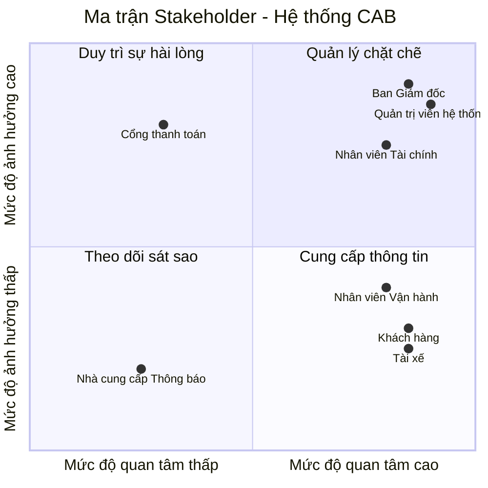

# 23653101_TRUONGHOANGLONG_CABSYSTEM
**###BƯỚC 1: TÌM HIỂU**

**Lý do hệ thống cũ không đáp ứng được và phải xây dựng hệ thống mới:**
* Việc phân công tài xế chủ yếu được thực hiện thủ công, gây tốn thời gian và dễ sai sót.
* Khách hàng khó theo dõi trạng thái chuyến đi theo thời gian thực.
* Thông tin thanh toán chưa được quản lý tập trung, gây khó khăn cho việc đối soát.
* Bộ phận vận hành gặp khó khăn khi muốn mở rộng hệ thống do kiến trúc cũ không linh hoạt và không chịu được tải cao.
### Giải pháp của hệ thống mới 
* **Tự động hóa ghép chuyến (Smart Matching):** Tự động tìm tài xế gần nhất dựa trên GPS; tự động chuyển tiếp sang tài xế khác nếu tài xế đầu tiên từ chối/không phản hồi mà không bắt khách hàng đặt lại.
* **Kiến trúc mở rộng & Chịu lỗi:** Các module (Đặt xe, Thanh toán, Thông báo) hoạt động độc lập, tự động nâng cấp tài nguyên khi tải cao vào giờ cao điểm; sự cố ở module này không làm gián đoạn toàn bộ hệ thống.
* **Bảo mật thanh toán (Tokenization):** Tích hợp cổng thanh toán bên thứ ba an toàn, không lưu thông tin thẻ nhạy cảm trên hệ thống; tự động xử lý lại khi giao dịch thất bại.
* **Quản trị & Phân quyền chặt chẽ:** Áp dụng mô hình phân quyền RBAC cho nhân viên vận hành và ghi nhật ký thao tác (Audit Logs) để kiểm soát rủi ro.
* **Khả năng mở rộng tương lai:** Thiết kế linh hoạt, dễ dàng tích hợp thêm kênh thông báo, phương thức thanh toán hoặc các dịch vụ mới (xe ghép, giao hàng...) trong tương lai.
#### Tác nhân người dùng (User Actors)
* **Khách hàng (Customer):** Đăng ký/đăng nhập, tạo yêu cầu đặt xe, theo dõi vị trí tài xế real-time, thanh toán và đánh giá chất lượng dịch vụ.
* **Tài xế (Driver):** Quản lý hồ sơ/phương tiện, bật trạng thái sẵn sàng, nhận/từ chối chuyến, cập nhật tiến trình chuyến đi và định vị GPS.
* **Nhân viên Vận hành (Ops Staff):** Giám sát chuyến đi real-time, duyệt hồ sơ tài xế, hỗ trợ xử lý sự cố chuyến đi và tra cứu giao dịch.
* **Quản trị viên / Ban Giám đốc (Admin/Management):** Phân quyền hệ thống, kiểm tra Audit Log bảo mật và xem báo cáo doanh thu, hiệu suất vận hành.

####  Tác nhân hệ thống tích hợp (External Systems)
* **Cổng thanh toán (Payment Gateway):** Xử lý giao dịch thanh toán điện tử an toàn theo cơ chế Tokenization.
* **Hạ tầng thông báo (Notification Gateway):** Gửi SMS, Email và Push Notification tức thì đến thiết bị người dùng.
**###BƯỚC 2**
**2. Các bên liên quan**

| Stakeholder | Vai trò trong hệ thống |
| :--- | :--- |
| **Khách hàng** | Khởi tạo yêu cầu đặt xe, theo dõi chuyến đi real-time, thanh toán (tiền mặt/điện tử) và đánh giá dịch vụ. |
| **Tài xế** | Cập nhật hồ sơ/phương tiện, bật trạng thái sẵn sàng, nhận/từ chối chuyến và cập nhật tiến trình chuyến đi. |
| **Nhân viên Vận hành** | Giám sát danh sách chuyến đi/tài xế real-time, quản lý tài khoản và hỗ trợ xử lý các sự cố phát sinh. |
| **Nhân viên Tài chính** | Quản lý đối soát giao dịch thanh toán, theo dõi doanh thu/chiết khấu tài xế, xử lý hoàn tiền và tra cứu dữ liệu tài chính. |
| **Ban Giám đốc** | Xem báo cáo doanh thu & hiệu suất, quản lý phân quyền hệ thống và đưa ra các quyết định kinh doanh. |
| **Quản trị viên hệ thống** | Làm rõ quy tắc nghiệp vụ, thiết kế, xây dựng và triển khai hệ thống trong thời gian 7 tuần. |
| **Cổng thanh toán** | Tiếp nhận và xử lý giao dịch thanh toán trực tuyến . |
| **Nhà cung cấp Thông báo** | Chịu trách nhiệm truyền tải các thông báo (Push Notification/SMS/Email) tức thì đến thiết bị người dùng. |
3. Lập stackholder matric

### Bước 3: Mục đích kinh doanh (Business Purpose & Goals)

* **Tự động hóa vận hành:** Tự động ghép chuyến thông minh qua vị trí GPS, loại bỏ hoàn toàn quy trình phân công thủ công, tối ưu chi phí nhân sự tổng đài.
* **Đa dạng phương thức thanh toán:** Hỗ trợ linh hoạt song song cả **Thanh toán tiền mặt** và **Thanh toán trực tuyến** (Ví điện tử/Thẻ) an toàn qua cơ chế Tokenization.
* **Xử lý truy cập số lượng lớn:** Đảm bảo hệ thống chịu tải cao, phục vụ hàng nghìn khách hàng và tài xế truy cập đồng thời ổn định vào các giờ cao điểm.
* **Nâng cao trải nghiệm khách hàng:** Minh bạch cước phí, theo dõi vị trí xe real-time, nhận thông báo tức thì và đánh giá chất lượng dịch vụ sau chuyến.
* **Tối ưu hiệu suất tài xế:** Giúp tài xế chủ động bật/tắt nhận chuyến, giảm thời gian di chuyển rỗng nhờ nhận các chuyến đi ở vị trí gần nhất.
* **Quản trị tài chính & Kiểm soát rủi ro:** Tập trung hóa dữ liệu giao dịch, tự động xử lý lại khi thanh toán thất bại, ghi log theo vết (Audit Log) và phân quyền truy cập chặt chẽ (RBAC).
* **Công cụ vận hành real-time:** Trang bị Dashboard quản trị cho nhân viên vận hành giám sát chuyến đi, quản lý tài khoản và can thiệp hỗ trợ sự cố kịp thời.
* **Chịu lỗi & Hoạt động liên tục (Fault Tolerance):** Đảm bảo sự cố từ các dịch vụ bên thứ ba (thanh toán, thông báo) không làm ngừng trệ chức năng đặt xe cốt lõi.
* **Hỗ trợ báo cáo & Quyết định kinh doanh:** Cung cấp báo cáo trực quan cho Ban Giám đốc về doanh thu, tỷ lệ hoàn thành/hủy chuyến và KPI hiệu suất tài xế.
* **Sẵn sàng mở rộng tương lai:** Xây dựng kiến trúc linh hoạt để dễ dàng bổ sung thêm dịch vụ mới (giao hàng, xe ghép...), kênh thông báo hoặc phương thức thanh toán mới.
  
**###Bước 4: Phạm vi dự án (Project Scope - 7 Tuần)**

#### 1. Trong phạm vi (In-Scope)

* **Xác thực & Phân quyền cơ bản (Authentication & RBAC):**
  * Đăng ký, đăng nhập an toàn cho người dùng (Khách hàng, Tài xế).
  * Phân quyền truy cập theo vai trò (Khách hàng, Tài xế, Nhân viên Vận hành, Nhân viên Tài chính, Ban Giám đốc).

* **Thiết kế modul hóa (Modular Design):**
  * **Modul Quản lý Khách hàng (Customer Management):** Quản lý thông tin hồ sơ khách hàng, lịch sử chuyến đi, thông tin thanh toán lưu trữ và lịch sử đánh giá/phản hồi dịch vụ.
  * **Modul Tài khoản & Xác thực (Auth):** Quản lý đăng nhập, phân quyền và bảo mật phiên làm việc.
  * **Modul Đặt xe (Booking):** Khởi tạo chuyến đi, tự động tìm tài xế gần nhất qua GPS và xử lý chuyển tiếp khi tài xế từ chối/hết giờ.
  * **Modul Định vị (Tracking):** Theo dõi vị trí tài xế và trạng thái chuyến đi theo thời gian thực trên bản đồ.
  * **Modul Thanh toán (Payment):** Hỗ trợ song song **Tiền mặt** và **Thanh toán trực tuyến** (môi trường thử nghiệm Sandbox).
  * **Modul Quản trị (Dashboard):** Giao diện hỗ trợ cho Nhân viên Vận hành (giám sát), Nhân viên Tài chính (xem giao dịch, đối soát) và Ban Giám đốc (xem báo cáo doanh thu).

#### 2. Ngoài phạm vi (Out-of-Scope)
* Tích hợp cổng thanh toán thực tế (chỉ dùng tài khoản thử nghiệm Sandbox).
* Các tính năng nâng cao: Đặt xe ghép, giao hàng, đặt trước chuyến đi.
* Chương trình tích điểm, khuyến mãi hoặc mã giảm giá phức tạp.

#### 3. Lộ trình 7 tuần (7-Week Roadmap)

| Tuần | Công việc chính |
| :---: | :--- |
| **1** | Thu thập yêu cầu, xác định phạm vi và lập bảng Stakeholder. |
| **2** | Phân tích nghiệp vụ (Sơ đồ Use Case, Activity Diagram). |
| **3** | Thiết kế Cơ sở dữ liệu (ERD) và phân chia cấu trúc các Modul. |
| **4** | Xây dựng Modul Auth (Đăng nhập/Phân quyền), Modul Quản lý Khách hàng & Modul Đặt xe. |
| **5** | Xây dựng Modul Thanh toán (Tiền mặt/Online), Tracking & Giao diện Dashboard Quản trị. |
| **6** | Kiểm thử tích hợp giữa các modul và sửa lỗi. |
| **7** | Hoàn thiện tài liệu README.md và tổng kết báo cáo dự án. |

### Bước 5: Yêu cầu nghiệp vụ (Business Requirements)

#### Bảng Quy trình Nghiệp vụ

| Mã BR | Yêu cầu Nghiệp vụ cốt lõi | KPI & Tiêu chí Nghiệm thu cụ thể |
| :---: | :--- | :--- |
| **BR-01** | **Điều phối & Ghép chuyến thông minh (Smart Matching)** | • **100%** luồng phân công chạy tự động dựa trên tọa độ GPS, loại bỏ hoàn toàn quy trình can thiệp thủ công từ tổng đài. • Hệ thống tự động chuyển tiếp yêu cầu sang tài xế kế cận khi tài xế trước từ chối hoặc hết thời gian phản hồi (timeout). • Đảm bảo trải nghiệm liền mạch: Giữ nguyên dữ liệu chuyến đi, **không bắt khách hàng phải thao tác đặt lại chuyến**. |
| **BR-02** | **Định vị hành trình & Truyền tải thông báo tức thì** | • Cho phép Khách hàng giám sát vị trí tài xế và tiến trình chuyến đi theo thời gian thực trên bản đồ (Modul Tracking). • Tự động kích hoạt **100%** thông báo đa kênh (**Push Notification/SMS/Email**) qua Notification Gateway đến thiết bị người dùng theo từng mốc chuyến đi. • Thu thập phản hồi và đánh giá chất lượng dịch vụ của khách hàng ngay sau khi kết thúc hành trình. |
| **BR-03** | **Quản lý Cước phí & Tích hợp Thanh toán An toàn (Tokenization)** | • Tích hợp linh hoạt hai phương thức: **Thanh toán tiền mặt** và **Thanh toán trực tuyến** (kết nối Cổng thanh toán bên thứ ba qua môi trường thử nghiệm Sandbox). • Tuân thủ an toàn dữ liệu: **0%** lưu trữ thông tin thẻ nhạy cảm (CVV, số thẻ đầy đủ) trên hệ thống CAB nhờ cơ chế Tokenization. • Hỗ trợ tự động xử lý lại (Retry) giao dịch điện tử hoặc cho phép chuyển sang tiền mặt khi thanh toán thất bại. |
| **BR-04** | **Phân quyền truy cập RBAC & Giám sát Vận hành Real-time** | • Thiết lập mô hình phân quyền **RBAC** chặt chẽ cho 5 nhóm tác nhân (*Khách hàng, Tài xế, Nhân viên Vận hành, Nhân viên Tài chính, Ban Giám đốc/Admin*). • Trang bị Dashboard cho Nhân viên Vận hành giám sát các chuyến đi real-time, tra cứu lịch sử và hỗ trợ xử lý sự cố phát sinh. • **100%** các thao tác thay đổi dữ liệu hoặc phân quyền hệ thống phải được ghi lại nhật ký vết (**Audit Logs**) để quản trị rủi ro. |
| **BR-05** | **Quản lý Tài chính, Đối soát & Báo cáo Quản trị** | • Cung cấp công cụ cho Nhân viên Tài chính thực hiện tra cứu giao dịch, đối soát doanh thu/chiết khấu tài xế và xử lý yêu cầu hoàn tiền. • Xuất báo cáo trực quan cho Ban Giám đốc về các chỉ số vận hành: *Doanh thu tổng, số lượng chuyến đi, tỷ lệ hoàn thành/hủy chuyến, KPI hiệu suất tài xế*. |
| **BR-06** | **Thiết kế Modul hóa & Tối ưu Khả năng Chịu lỗi (Fault Tolerance)** | • Kiến trúc phân chia Modul độc lập (*Auth, Customer, Booking, Tracking, Payment, Dashboard*). • **Đảm bảo tính hoạt động liên tục**: Sự cố từ các dịch vụ bên thứ ba (Cổng thanh toán, Hạ tầng thông báo) không làm ngừng trệ chức năng Đặt xe cốt lõi. • Đáp ứng khả năng chịu tải cao vào giờ cao điểm và sẵn sàng mở rộng các dịch vụ mới (*giao hàng, xe ghép...*) trong tương lai. |

### Bước 6: Yêu cầu Chức năng Hệ thống (Functional Requirements - FR)
#### 1. Khách hàng (Customer)
* **FR-CUS-01 (Đăng ký / Đăng nhập):** Đăng ký tài khoản mới và xác thực đăng nhập để truy cập hệ thống.
* **FR-CUS-02 (Quản lý hồ sơ):** Xem, cập nhật thông tin cá nhân (Họ tên, Email, Ảnh đại diện) và quản lý danh sách địa chỉ yêu thích.
* **FR-CUS-03 (Đặt xe):** Nhập điểm đi, điểm đến, chọn loại xe, xem cước phí dự kiến và gửi yêu cầu tìm tài xế.
* **FR-CUS-04 (Hủy xe):** Chủ động hủy yêu cầu đặt xe hoặc hủy chuyến trước khi tài xế đón.
* **FR-CUS-05 (Thanh toán):** Chọn phương thức thanh toán (Tiền mặt / Online) và thực hiện giao dịch cho chuyến đi.
* **FR-CUS-06 (Đánh giá dịch vụ):** Chấm điểm số sao (1–5 sao) và gửi nhận xét về chất lượng chuyến đi sau khi hoàn tất.

#### 2. Tài xế (Driver)
* **FR-DRI-01 (Quản lý hồ sơ & Phương tiện):** Cập nhật thông tin cá nhân và tải lên giấy tờ xe (Bằng lái, Biển số, Cavet, Đăng kiểm) để chờ duyệt.
* **FR-DRI-02 (Cập nhật trạng thái sẵn sàng):** Chủ động bật/tắt chế độ nhận chuyến (Sẵn sàng / Ngừng nhận chuyến).
* **FR-DRI-03 (Xử lý yêu cầu chuyến đi):** Nhận thông báo chuyến đi mới và thực hiện Chấp nhận hoặc Từ chối trong thời gian quy định.
* **FR-DRI-04 (Cập nhật tiến trình đi):** Cập nhật trạng thái thực tế của chuyến đi theo luồng: *Đã đến điểm đón -> Bắt đầu di chuyển -> Hoàn thành chuyến đi*.
* **FR-DRI-05 (Xác nhận thu tiền mặt):** Xác nhận đã thu đủ số tiền mặt từ khách hàng đối với các chuyến đi thanh toán bằng tiền mặt.

#### 3. Nhân viên Vận hành (Ops Staff)
* **FR-OPS-01 (Duyệt hồ sơ tài xế):** Kiểm tra thông tin, hình ảnh giấy tờ do tài xế cung cấp để Phê duyệt hoặc Từ chối cấp quyền hoạt động.
* **FR-OPS-02 (Giám sát vận hành):** Theo dõi danh sách các chuyến đi đang diễn ra và vị trí/trạng thái của tài xế real-time trên bản đồ.
* **FR-OPS-03 (Can thiệp sự cố):** Can thiệp hủy chuyến, điều lại xe hoặc xử lý các sự cố phát sinh trong quá trình vận hành.

#### 4. Nhân viên Tài chính (Finance Staff)
* **FR-FIN-01 (Tra cứu giao dịch):** Khai thác và kiểm tra chi tiết thông tin lịch sử các giao dịch thanh toán trên hệ thống.
* **FR-FIN-02 (Đối soát tài chính):** Đối soát dữ liệu thanh toán giữa CSDL hệ thống và Cổng thanh toán để phát hiện, xử lý các giao dịch chênh lệch.
* **FR-FIN-03 (Quản lý ví tài xế):** Quản lý số dư, lịch sử biến động nguồn tiền, khấu trừ chiết khấu và công nợ trên ví của tài xế.

#### 5. Ban Giám đốc (Management)
* **FR-MGT-01 (Xem báo cáo doanh thu):** Trích xuất và theo dõi các chỉ số doanh thu tổng quan, doanh thu theo thời gian và phương thức thanh toán.
* **FR-MGT-02 (Xem báo cáo hiệu suất):** Theo dõi các báo cáo chỉ số KPI, tỷ lệ hoàn thành/hủy chuyến và hiệu suất hoạt động của tài xế.

#### 6. Quản trị viên Hệ thống (System Admin)
* **FR-ADM-01 (Cập nhật hệ thống):** Cấu hình tham số vận hành, cập nhật tính năng và bảo trì các thiết lập chung của hệ thống.
* **FR-ADM-03 (Sao lưu và lưu trữ):** Thực hiện sao lưu dữ liệu định kỳ, lưu trữ nhật ký thao tác (Audit Log) và khôi phục dữ liệu khi cần.

#### 7. Hệ thống Tích hợp bên ngoài (External Systems)
* **FR-EXT-01 (Cổng thanh toán - Xử lý giao dịch online):** Tiếp nhận và xử lý các giao dịch thanh toán trực tuyến qua Thẻ/Ví điện tử an toàn theo cơ chế Tokenization.
* **FR-EXT-02 (Nhà cung cấp Thông báo - Gửi thông báo):** Chịu trách nhiệm truyền tải các Push Notification, SMS, Email tức thì đến thiết bị của người dùng.

Bước 7: vẽ usecase tổng quát

Bước 8: đặc tả usecase
**###KHÁCH HÀNG**
**Đặc tả usecase Đăng ký**
##1. Use case: Đăng ký

| Thuộc tính | Nội dung |
| :--- | :--- |
| **– Tên use case:** | Đăng ký |
| **– Mô tả sơ lược:** | Cho phép Khách hàng tạo tài khoản mới trên hệ thống CAB System bằng số điện thoại/email để có thể sử dụng dịch vụ đặt xe. |
| **– Actor chính:** | Khách hàng |
| **– Actor phụ:** | Nhà cung cấp Thông báo (gửi mã OTP xác thực) |
| **– Tiền điều kiện (Pre-condition):** | Khách hàng chưa có tài khoản được đăng ký bằng số điện thoại/email trên hệ thống. |
| **– Hậu điều kiện (Post-condition):** | Tài khoản Khách hàng được tạo và kích hoạt thành công, sẵn sàng đăng nhập sử dụng. |

#### – Luồng sự kiện chính (main flow):

| Actor: Khách hàng | System |
| :--- | :--- |
| **1.** Chọn chức năng "Đăng ký" | |
| | **2.** Hiển thị form đăng ký gồm: Họ tên, Số điện thoại, Email, Mật khẩu, Xác nhận mật khẩu |
| **3.** Nhập đầy đủ thông tin và nhấn nút "Đăng ký" | |
| | **4.** Kiểm tra định dạng dữ liệu đầu vào (số điện thoại, email, độ mạnh mật khẩu) |
| | **5.** Kiểm tra số điện thoại/email chưa tồn tại trong hệ thống |
| | **6.** Gửi mã OTP xác thực đến số điện thoại/email đăng ký |
| **7.** Nhập mã OTP và nhấn "Xác nhận" | |
| | **8.** Xác thực mã OTP hợp lệ, tạo tài khoản, hiển thị thông báo đăng ký thành công. Kết thúc use case |

#### – Luồng sự kiện thay thế (alternate flow):

| Actor: Khách hàng | System |
| :--- | :--- |
| | **4.1.** Dữ liệu sai định dạng (ví dụ: số điện thoại không hợp lệ, mật khẩu không đủ mạnh), hiển thị thông báo lỗi tương ứng |
| **4.2.** Nhập lại thông tin, quay lại bước 3 | |
| | **5.1.** Số điện thoại/Email đã tồn tại trên hệ thống, hiển thị thông báo "Số điện thoại/Email đã được sử dụng" |
| **5.2.** Nhập lại thông tin khác, quay lại bước 3 | |
| | **8.1.** Mã OTP không đúng hoặc đã hết hạn, hiển thị thông báo "Mã OTP không chính xác hoặc đã hết hạn" |
| **8.2.** Chọn nhập lại mã OTP hoặc nhấn "Gửi lại mã OTP" | **8.3.** Nếu Khách hàng chọn nhập lại → quay lại bước 7; nếu Khách hàng chọn "Gửi lại mã OTP" → gửi mã OTP mới, quay lại bước 7 |

#### – Luồng sự kiện ngoại lệ (exception flow):

| Actor: Khách hàng | System |
| :--- | :--- |
| | **9.1.** Mất kết nối Internet trong quá trình gửi thông tin đăng ký, gửi OTP hoặc xác thực OTP, hiển thị thông báo "Mất kết nối, vui lòng kiểm tra Internet và thử lại" |
| **9.2.** Nhấn "OK", kiểm tra kết nối và thực hiện lại từ bước tương ứng | |

##2. Use case: Đăng nhập

| Thuộc tính | Nội dung |
| :--- | :--- |
| **– Tên use case:** | Đăng nhập |
| **– Mô tả sơ lược:** | Cho phép Người dùng (Khách hàng, Tài xế, Nhân viên Vận hành, Nhân viên Tài chính, Ban Giám đốc, Quản trị viên hệ thống) xác thực danh tính bằng Số điện thoại/Email và Mật khẩu để truy cập hệ thống theo đúng vai trò và quyền hạn được phân quyền (RBAC). |
| **– Actor chính:** | Người dùng (Khách hàng/Tài xế/Nhân viên Vận hành/Nhân viên Tài chính/Ban Giám đốc/Quản trị viên hệ thống) |
| **– Actor phụ:** | Không có |
| **– Tiền điều kiện (Pre-condition):** | Người dùng đã có tài khoản được đăng ký/khởi tạo hợp lệ trên hệ thống. |
| **– Hậu điều kiện (Post-condition):** | Người dùng được xác thực thành công, hệ thống khởi tạo phiên làm việc (session), ghi nhận vào Audit Log và điều hướng vào giao diện tương ứng với vai trò. |

#### – Luồng sự kiện chính (main flow):

| Actor: Người dùng | System |
| :--- | :--- |
| **1.** Chọn chức năng "Đăng nhập" | |
| | **2.** Hiển thị form đăng nhập gồm: Số điện thoại/Email, Mật khẩu |
| **3.** Nhập thông tin đăng nhập và nhấn nút "Đăng nhập" | |
| | **4.** Kiểm tra dữ liệu đầu vào: (a) dữ liệu đã được nhập đầy đủ; (b) dữ liệu đúng định dạng quy định |
| | **5.** Kiểm tra tài khoản có tồn tại trong hệ thống |
| | **6.** Kiểm tra mật khẩu có khớp với tài khoản |
| | **7.** Kiểm tra trạng thái tài khoản (đã được duyệt/kích hoạt, không bị khóa hoặc vô hiệu hóa) |
| | **8.** Xác định vai trò (Role) của tài khoản theo mô hình RBAC |
| | **9.** Khởi tạo phiên làm việc (session), ghi nhận thời gian đăng nhập vào Audit Log |
| | **10.** Điều hướng người dùng vào giao diện/Dashboard tương ứng với vai trò. Kết thúc use case |

#### – Luồng sự kiện thay thế (alternate flow):

| Actor: Người dùng | System |
| :--- | :--- |
| | **4.1.** Số điện thoại/Email bị bỏ trống, hiển thị thông báo "Vui lòng nhập Số điện thoại/Email" |
| **4.1.1.** Nhập lại thông tin, quay lại bước 3 | |
| | **4.2.** Mật khẩu bị bỏ trống, hiển thị thông báo "Vui lòng nhập Mật khẩu" |
| **4.2.1.** Nhập lại thông tin, quay lại bước 3 | |
| | **4.3.** Số điện thoại/Email sai định dạng, hiển thị thông báo "Số điện thoại/Email không đúng định dạng" |
| **4.3.1.** Nhập lại thông tin, quay lại bước 3 | |
| | **5.1.** Tài khoản không tồn tại, hiển thị thông báo chung "Số điện thoại/Email hoặc mật khẩu không đúng" (không tiết lộ chi tiết tài khoản) |
| **5.1.1.** Nhập lại thông tin, quay lại bước 3 | |
| | **6.1.** Mật khẩu không đúng, hiển thị thông báo "Số điện thoại/Email hoặc mật khẩu không đúng" và ghi nhận số lần đăng nhập sai liên tiếp |
| | **6.1.1.** Số lần đăng nhập sai liên tiếp từ 1 đến 4 lần: tài khoản chưa bị khóa |
| **6.1.2.** Nhập lại thông tin, quay lại bước 3 | |
| | **6.2.** Số lần đăng nhập sai liên tiếp đạt đến lần thứ 5: tạm khóa tài khoản theo thời gian quy định của hệ thống, hiển thị thông báo "Tài khoản tạm khóa do đăng nhập sai quá nhiều lần, vui lòng thử lại sau" và không cho phép đăng nhập trong thời gian khóa |
| | **7.1.** Tài khoản chưa được duyệt (ví dụ: Tài xế chưa được phê duyệt), hiển thị thông báo "Tài khoản chưa được kích hoạt hoặc đã bị khóa" và không cho phép đăng nhập |
| | **7.2.** Tài khoản đang bị khóa, hiển thị thông báo "Tài khoản chưa được kích hoạt hoặc đã bị khóa" và không cho phép đăng nhập |
| | **7.3.** Tài khoản đã bị vô hiệu hóa, hiển thị thông báo "Tài khoản chưa được kích hoạt hoặc đã bị khóa" và không cho phép đăng nhập |

#### – Luồng sự kiện ngoại lệ (exception flow):

| Actor: Người dùng | System |
| :--- | :--- |
| | **3.1.** Mất kết nối Internet khi gửi thông tin đăng nhập (phát sinh tại bước 3), hiển thị thông báo "Mất kết nối, vui lòng kiểm tra Internet và thử lại" |
| **3.2.** Nhấn "OK", kiểm tra kết nối và thực hiện lại từ bước 3 | |
| | **8.1.** Hệ thống gặp sự cố nội bộ (server lỗi/timeout) trong quá trình xác thực tài khoản/mật khẩu/vai trò (phát sinh tại bước 4, 5, 6, 7 hoặc 8), hiển thị thông báo "Hệ thống đang gặp sự cố, vui lòng thử lại sau" và ghi log lỗi để Quản trị viên hệ thống xử lý |
| | **9.1.** Hệ thống không tạo được phiên làm việc (session) hoặc gặp lỗi khi ghi Audit Log (phát sinh tại bước 9), hệ thống ghi nhận lỗi và xử lý theo cơ chế dự phòng của hệ thống |

## 3. Quản lý hồ sơ (Khách hàng)

| **Quản lý hồ sơ** | |
|---|---|
| **Mục đích** | Cho phép Khách hàng xem, cập nhật thông tin cá nhân và quản lý địa chỉ yêu thích. |
| **Mô tả** | Use Case cho phép Khách hàng xem, cập nhật hồ sơ và thêm/xoá địa chỉ yêu thích trong hệ thống. |
| **Tiền điều kiện** | Khách hàng đã đăng nhập thành công và hệ thống hoạt động bình thường. |
| **Hậu điều kiện** | Nếu Use Case thành công, thông tin hồ sơ được hiển thị hoặc cập nhật, hoặc địa chỉ yêu thích được thêm/xoá và dữ liệu thay đổi được lưu vào hệ thống. Nếu Use Case không thành công, dữ liệu hiện tại không thay đổi. |
| **Actor chính** | Khách hàng |
| **Actor phụ** | Không |
| **Ràng buộc dữ liệu** | Họ tên: bắt buộc, tối đa 50 ký tự. Tên địa chỉ: bắt buộc, tối đa 50 ký tự. |

### Basic flow

| Khách hàng | Hệ thống |
|---|---|
| 1. Chọn chức năng "Quản lý hồ sơ" | 2. Hiển thị các chức năng: Xem hồ sơ, Cập nhật hồ sơ, Thêm địa chỉ yêu thích, Xoá địa chỉ yêu thích |
| 3. Chọn một trong các chức năng được yêu cầu.  Nếu chọn "Xem hồ sơ", subflow **Xem hồ sơ** được thực hiện.  Nếu chọn "Cập nhật hồ sơ", subflow **Cập nhật hồ sơ** được thực hiện.  Nếu chọn "Thêm địa chỉ yêu thích", subflow **Thêm địa chỉ yêu thích** được thực hiện.  Nếu chọn "Xoá địa chỉ yêu thích", subflow **Xoá địa chỉ yêu thích** được thực hiện. | |

### Xem hồ sơ

| Khách hàng | Hệ thống |
|---|---|
| 1. Chọn chức năng "Xem hồ sơ" | 2. Hiển thị thông tin hồ sơ gồm: Họ tên, Email, Số điện thoại, Ảnh đại diện và danh sách địa chỉ yêu thích. |

### Cập nhật hồ sơ

| Khách hàng | Hệ thống |
|---|---|
| 1. Chọn chức năng "Cập nhật hồ sơ" | 2. Hiển thị biểu mẫu chứa thông tin hồ sơ hiện tại (Họ tên, Email, Ảnh đại diện). |
| 3. Thay đổi thông tin cần cập nhật (Họ tên, Email, Ảnh đại diện). | 4. Hiển thị thông tin đã nhập để Khách hàng kiểm tra. |
| 5. Xác nhận cập nhật thông tin hồ sơ. | 6. Kiểm tra thông tin hồ sơ (Họ tên bắt buộc, tối đa 50 ký tự; Email đúng định dạng). |
| | 7. Cập nhật thông tin hồ sơ vào CSDL. |
| | 8. Thông báo cập nhật hồ sơ thành công. |

### Thêm địa chỉ yêu thích

| Khách hàng | Hệ thống |
|---|---|
| 1. Chọn chức năng "Thêm địa chỉ yêu thích" | 2. Hiển thị biểu mẫu nhập thông tin địa chỉ. |
| 3. Nhập thông tin địa chỉ gồm: Tên địa chỉ, Địa chỉ chi tiết, Toạ độ (GPS). | |
| 4. Xác nhận thêm địa chỉ. | 5. Kiểm tra thông tin địa chỉ (Tên địa chỉ bắt buộc, tối đa 50 ký tự; Toạ độ đúng định dạng GPS). |
| | 6. Lưu địa chỉ vào CSDL. |
| | 7. Thông báo thêm địa chỉ thành công. |

### Xoá địa chỉ yêu thích

| Khách hàng | Hệ thống |
|---|---|
| 1. Chọn địa chỉ cần xoá. | 2. Hiển thị thông tin địa chỉ được chọn. |
| 3. Chọn "Xoá". | 4. Yêu cầu xác nhận thao tác xoá. |
| 5. Xác nhận xoá. | 6. Xoá địa chỉ khỏi CSDL. |
| | 7. Thông báo xoá địa chỉ thành công. |

### Alternative flow

**Subflow Cập nhật hồ sơ**

- **5.1** Khách hàng không xác nhận cập nhật thông tin.
  Hệ thống: Hủy thao tác cập nhật, quay lại bước 3 để Khách hàng chỉnh sửa lại thông tin.
- **6.1** Họ tên bị bỏ trống.
  Hệ thống: Thông báo "Vui lòng nhập Họ tên" và yêu cầu nhập lại.
  Khách hàng: Nhập lại thông tin, quay lại bước 3.
- **6.2** Họ tên vượt quá 50 ký tự.
  Hệ thống: Thông báo "Họ tên không được vượt quá 50 ký tự" và yêu cầu nhập lại.
  Khách hàng: Nhập lại thông tin, quay lại bước 3.
- **6.3** Email sai định dạng.
  Hệ thống: Thông báo lỗi định dạng Email và yêu cầu nhập lại.
  Khách hàng: Nhập lại thông tin, quay lại bước 3.

**Subflow Thêm địa chỉ yêu thích**

- **4.1** Khách hàng không xác nhận thêm địa chỉ.
  Hệ thống: Hủy thao tác thêm địa chỉ, quay lại bước 3 để Khách hàng nhập lại thông tin.
- **5.1** Tên địa chỉ bị bỏ trống.
  Hệ thống: Thông báo "Vui lòng nhập Tên địa chỉ" và yêu cầu nhập lại.
  Khách hàng: Nhập lại thông tin địa chỉ, quay lại bước 3.
- **5.2** Tên địa chỉ vượt quá 50 ký tự.
  Hệ thống: Thông báo "Tên địa chỉ không được vượt quá 50 ký tự" và yêu cầu nhập lại.
  Khách hàng: Nhập lại thông tin địa chỉ, quay lại bước 3.
- **5.3** Toạ độ (GPS) sai định dạng.
  Hệ thống: Thông báo lỗi định dạng toạ độ và yêu cầu nhập lại.
  Khách hàng: Nhập lại thông tin địa chỉ, quay lại bước 3.

**Subflow Xoá địa chỉ yêu thích**

- **5.1** Khách hàng không xác nhận xoá địa chỉ.
  Hệ thống: Hủy thao tác xoá địa chỉ và quay lại bước 1.

### Exception flow

**Subflow Cập nhật hồ sơ**

- **8.1** Hệ thống: Không thể cập nhật hồ sơ do mất kết nối với hệ thống. Kết thúc Use Case.

**Subflow Thêm địa chỉ yêu thích**

- **7.1** Hệ thống: Không thể thêm địa chỉ do mất kết nối với hệ thống. Kết thúc Use Case.

**Subflow Xoá địa chỉ yêu thích**

- **7.1** Hệ thống: Không thể xoá địa chỉ do mất kết nối với hệ thống. Kết thúc Use Case.

##4. Use case: Đánh giá dịch vụ

| Thuộc tính | Nội dung |
| :--- | :--- |
| **– Tên use case:** | Đánh giá dịch vụ |
| **– Mô tả sơ lược:** | Cho phép Khách hàng chấm điểm từ 1–5 sao và gửi nhận xét về chất lượng chuyến đi sau khi chuyến đi hoàn tất. |
| **– Actor chính:** | Khách hàng |
| **– Actor phụ:** | Không có |
| **– Tiền điều kiện (Pre-condition):** | Khách hàng đã đăng nhập và chuyến đi đã hoàn thành. |
| **– Hậu điều kiện (Post-condition):** | Đánh giá được lưu vào hệ thống và gắn với chuyến đi và Tài xế tương ứng. |

### – Luồng sự kiện chính (main flow):

| Actor | System |
| :--- | :--- |
| **1.** Chọn chức năng "Đánh giá dịch vụ" của chuyến đi đã hoàn thành | |
| | **2.** Kiểm tra chuyến đi chưa được đánh giá và hiển thị form đánh giá gồm: số sao (1–5), ô nhập nhận xét và nút "Gửi đánh giá" |
| **3.** Chọn số sao từ 1–5 và nhập nhận xét (nếu có) | |
| **4.** Nhấn nút "Gửi đánh giá" | |
| | **5.** Kiểm tra dữ liệu đánh giá hợp lệ |
| | **6.** Lưu đánh giá vào cơ sở dữ liệu và gắn đánh giá với chuyến đi và Tài xế tương ứng |
| | **7.** Hiển thị thông báo "Đánh giá thành công" và kết thúc use case |

### – Luồng sự kiện thay thế (alternate flow):

| Actor | System |
| :--- | :--- |
| | **2.1.** Chuyến đi đã được đánh giá trước đó, hiển thị thông báo "Chuyến đi này đã được đánh giá" và kết thúc use case |

### – Luồng sự kiện ngoại lệ (exception flow):

| Actor | System |
| :--- | :--- |
| | **5.1.** Số sao bị bỏ trống hoặc không nằm trong phạm vi 1–5, hiển thị thông báo "Vui lòng chọn số sao từ 1 đến 5" |
| **5.1.1.** Chọn lại số sao và nhấn "Gửi đánh giá", quay lại bước 4 | |
| | **6.1.** Không thể lưu đánh giá do lỗi cơ sở dữ liệu hoặc lỗi hệ thống, hiển thị thông báo "Không thể lưu đánh giá, vui lòng thử lại sau" |
| **6.1.1.** Nhấn "OK" và thực hiện lại thao tác gửi đánh giá | |
| | **6.2.** Mất kết nối trong quá trình gửi đánh giá, hiển thị thông báo "Mất kết nối, vui lòng kiểm tra Internet và thử lại" |
| **6.2.1.** Kiểm tra kết nối và thực hiện lại thao tác gửi đánh giá | |

## 5. Use case: Đặt xe

| Thuộc tính | Nội dung |
| :--- | :--- |
| **– Tên use case:** | Đặt xe |
| **– Mô tả sơ lược:** | Cho phép Khách hàng nhập điểm đón, điểm đến, chọn loại xe, xem cước phí dự kiến, chọn phương thức thanh toán và gửi yêu cầu đặt xe để hệ thống tự động tìm Tài xế gần nhất. |
| **– Actor chính:** | Khách hàng |
| **– Actor phụ:** | Tài xế |
| **– Tiền điều kiện (Pre-condition):** | Khách hàng đã đăng nhập và không có chuyến đi khác đang ở trạng thái xử lý hoặc thực hiện. |
| **– Hậu điều kiện (Post-condition):** | Yêu cầu đặt xe được ghi nhận, phương thức thanh toán được lưu cho chuyến đi, chuyến đi được gán cho Tài xế đã chấp nhận và trạng thái chuyến đi là "Đang đến đón". |

### – Luồng sự kiện chính (main flow):

| Actor | System |
| :--- | :--- |
| **1.** Khách hàng chọn chức năng "Đặt xe" | |
| | **2.** Hiển thị màn hình đặt xe |
| **3.** Khách hàng nhập điểm đón, điểm đến và chọn loại xe | |
| | **4.** Tính toán và hiển thị cước phí dự kiến cho chuyến đi |
| **5.** Khách hàng chọn phương thức thanh toán | |
| | **6.** Thực hiện use case "Thanh toán" |
| **7.** Khách hàng xác nhận thông tin và nhấn nút "Đặt xe" | |
| | **8.** Tìm Tài xế khả dụng gần nhất trong phạm vi tìm kiếm dựa trên tọa độ GPS |
| | **9.** Gửi yêu cầu chuyến đi đến Tài xế đó |
| | **10.** Chờ phản hồi từ Tài xế trong thời gian quy định |
| **11.** Tài xế chấp nhận chuyến đi | |
| | **12.** Cập nhật trạng thái chuyến đi thành "Đang đến đón" |
| | **13.** Hiển thị thông tin Tài xế (họ tên, biển số xe, số điện thoại) và vị trí Tài xế trên bản đồ cho Khách hàng. Kết thúc use case |

### – Luồng sự kiện thay thế (alternate flow):

| Actor | System |
| :--- | :--- |
| **10.1.** Khách hàng hủy yêu cầu đặt xe trong lúc hệ thống đang chờ phản hồi từ Tài xế | |
| | **10.1.1.** Hệ thống hủy yêu cầu đặt xe và kết thúc use case |
| **10.2.** Tài xế từ chối chuyến đi hoặc hết thời gian phản hồi (timeout) tại bước 10 | |
| | **10.2.1.** Hệ thống tự động tìm và gửi yêu cầu đến Tài xế khả dụng gần kế tiếp, giữ nguyên dữ liệu chuyến đi và phương thức thanh toán, không yêu cầu Khách hàng đặt lại và quay lại bước 9 |

### – Luồng sự kiện ngoại lệ (exception flow):

| Actor | System |
| :--- | :--- |
| | **8.1.** Không có Tài xế khả dụng trong phạm vi tìm kiếm; hiển thị thông báo "Hiện không có tài xế khả dụng, vui lòng thử lại sau" và kết thúc use case |
| | **8.2.** Trong quá trình chuyển tiếp (fallback) tại bước 10.2, không còn Tài xế khả dụng khác để chuyển tiếp; hiển thị thông báo "Không tìm được tài xế, vui lòng thử lại sau" và kết thúc use case |

## 6. Use case: Hủy xe

| Thuộc tính | Nội dung |
| :--- | :--- |
| **– Tên use case:** | Hủy xe |
| **– Actor chính:** | Khách hàng |
| **– Actor phụ:** | Tài xế |
| **– Tiền điều kiện (Pre-condition):** | Khách hàng đã đăng nhập; Khách hàng đang có một chuyến đi ở trạng thái "Đang tìm tài xế" hoặc "Đang đến đón" (Tài xế chưa đón khách). |
| **– Hậu điều kiện (Post-condition):** | Chuyến đi chuyển sang trạng thái "Đã hủy"; hệ thống ghi nhận phí phạt hủy chuyến vào đơn tiếp theo nếu hủy sau thời gian miễn phí quy định; Tài xế (nếu đã được gán) được giải phóng khỏi chuyến đi và trở về trạng thái sẵn sàng nhận chuyến khác. |

### – Luồng sự kiện chính (main flow):

| Actor | System |
| :--- | :--- |
| **1.** Khách hàng chọn chức năng "Hủy xe" đối với chuyến đi đang ở trạng thái "Đang tìm tài xế" hoặc "Đang đến đón" | |
| | **2.** Hiển thị thông tin chuyến đi hiện tại và yêu cầu xác nhận hủy |
| **3.** Khách hàng xác nhận hủy chuyến | |
| | **4.** Kiểm tra trạng thái hiện tại của chuyến đi và tính phí phạt hủy chuyến (nếu hủy sau 5 phút kể từ khi Tài xế nhận chuyến) |
| | **5.** Cập nhật trạng thái chuyến đi thành "Đã hủy" |
| | **6.** Nếu chuyến đi đã được gán cho Tài xế, gửi thông báo hủy chuyến đến Tài xế và giải phóng Tài xế về trạng thái sẵn sàng |
| | **7.** Hiển thị thông báo "Hủy chuyến thành công". Kết thúc use case |

### – Luồng sự kiện thay thế (alternate flow):

| Actor | System |
| :--- | :--- |
| **3.1.** Khách hàng không muốn hủy chuyến, chọn "Đóng"/"Thoát" tại màn hình xác nhận | |
| | **3.1.1.** Hệ thống đóng màn hình xác nhận, giữ nguyên trạng thái chuyến đi hiện tại và kết thúc use case |

### – Luồng sự kiện ngoại lệ (exception flow):

| Actor | System |
| :--- | :--- |
| | **4.1.** Chuyến đi đã chuyển sang trạng thái không cho phép hủy, hiển thị thông báo "Không thể hủy chuyến ở thời điểm này" và kết thúc use case |
| | **5.1.** Hệ thống gặp lỗi kết nối Internet khi cập nhật trạng thái hủy chuyến, hiển thị thông báo "Không thể hủy chuyến, vui lòng thử lại sau" |
| **5.1.1.** Khách hàng nhấn "OK" và thực hiện lại thao tác hủy chuyến. Quay lại bước 3 | |

## 7. Use case: Thanh toán

| Thuộc tính | Nội dung |
| :--- | :--- |
| **– Tên use case:** | Thanh toán |
| **– Mô tả sơ lược:** | Cho phép Khách hàng lựa chọn phương thức thanh toán cho chuyến đi và hệ thống ghi nhận phương thức thanh toán được lựa chọn để sử dụng khi thanh toán cước phí. |
| **– Actor chính:** | Khách hàng |
| **– Actor phụ:** | Payment Gateway |
| **– Tiền điều kiện (Pre-condition):** | Khách hàng đã đăng nhập và đang thực hiện quy trình đặt xe. |
| **– Hậu điều kiện (Post-condition):** | Phương thức thanh toán được lựa chọn và lưu cho chuyến đi. |

### – Luồng sự kiện chính (main flow):

| Actor | System |
| :--- | :--- |
| **1.** Khách hàng chọn phương thức thanh toán | |
| | **2.** Hiển thị các phương thức thanh toán gồm "Tiền mặt" và "Thanh toán online" |
| **3.** Khách hàng chọn một phương thức thanh toán | |
| | **4.** Kiểm tra phương thức thanh toán được lựa chọn |
| | **5.** Lưu phương thức thanh toán cho chuyến đi |
| | **6.** Hiển thị thông báo "Đã chọn phương thức thanh toán" và kết thúc use case |

### – Luồng sự kiện thay thế (alternate flow):

| Actor | System |
| :--- | :--- |
| **3.1.** Khách hàng chọn phương thức "Thanh toán online" | |
| | **3.1.1.** Hệ thống chuyển yêu cầu đến Payment Gateway để chuẩn bị phương thức thanh toán online |
| | **3.1.2.** Payment Gateway phản hồi thành công và hệ thống lưu phương thức "Thanh toán online" cho chuyến đi |
| | **3.1.3.** Quay lại bước 6 |
| **3.2.** Khách hàng chọn phương thức "Tiền mặt" | |
| | **3.2.1.** Hệ thống lưu phương thức "Tiền mặt" cho chuyến đi và quay lại bước 6 |

### – Luồng sự kiện ngoại lệ (exception flow):

| Actor | System |
| :--- | :--- |
| | **4.1.** Phương thức thanh toán không hợp lệ hoặc không được hỗ trợ, hiển thị thông báo "Phương thức thanh toán không hợp lệ" và yêu cầu Khách hàng chọn lại |
| | **3.1.1a.** Payment Gateway không phản hồi hoặc xảy ra lỗi kết nối, hiển thị thông báo "Không thể sử dụng thanh toán online, vui lòng thử lại sau" |
| | **5.1.** Không thể lưu phương thức thanh toán do lỗi hệ thống, hiển thị thông báo "Không thể lưu phương thức thanh toán, vui lòng thử lại sau" |
##8. Use case: Duyệt hồ sơ tài xế

| Thuộc tính | Nội dung |
| :--- | :--- |
| **– Tên use case:** | Duyệt hồ sơ tài xế |
| **– Mô tả sơ lược:** | Cho phép Nhân viên Vận hành kiểm tra thông tin, hình ảnh giấy tờ (Bằng lái, Biển số, Cavet, Đăng kiểm) do Tài xế cung cấp để phê duyệt, từ chối hoặc yêu cầu bổ sung giấy tờ. |
| **– Actor chính:** | Nhân viên Vận hành |
| **– Actor phụ:** | Tài xế (đã gửi hồ sơ đăng ký), Nhà cung cấp Thông báo (gửi kết quả xử lý hồ sơ đến Tài xế) |
| **– Tiền điều kiện (Pre-condition):** | Nhân viên Vận hành đã đăng nhập vào hệ thống; có ít nhất một hồ sơ Tài xế đang ở trạng thái "Chờ duyệt". |
| **– Hậu điều kiện (Post-condition):** | Hồ sơ Tài xế được chuyển sang trạng thái "Đã duyệt" (được phép nhận chuyến), "Bị từ chối" hoặc "Chờ bổ sung"; Tài xế nhận được thông báo kết quả tương ứng. |
| **– Ràng buộc dữ liệu:** | Lý do từ chối: bắt buộc, tối đa 200 ký tự. Nội dung yêu cầu bổ sung: bắt buộc, tối đa 200 ký tự. |

### – Luồng sự kiện chính (main flow):

| Actor: Nhân viên Vận hành | System |
| :--- | :--- |
| **1.** Chọn mục "Duyệt hồ sơ tài xế" | |
| | **2.** Hiển thị danh sách hồ sơ Tài xế đang ở trạng thái "Chờ duyệt" |
| **3.** Chọn một hồ sơ để xem chi tiết | |
| | **4.** Hiển thị đầy đủ thông tin cá nhân và hình ảnh giấy tờ (Bằng lái, Biển số, Cavet, Đăng kiểm) của Tài xế |
| **5.** Kiểm tra tính hợp lệ của thông tin/giấy tờ và lựa chọn kết quả xử lý: Phê duyệt / Từ chối / Yêu cầu bổ sung giấy tờ | |
| | **6.** Trường hợp Phê duyệt: Cập nhật trạng thái hồ sơ thành "Đã duyệt", cấp quyền hoạt động cho Tài xế, gửi thông báo kết quả đến Tài xế qua Nhà cung cấp Thông báo. Kết thúc use case |

### – Luồng sự kiện thay thế (alternate flow):

| Actor: Nhân viên Vận hành | System |
| :--- | :--- |
| **5.1.** Phát hiện thông tin/giấy tờ không hợp lệ, chọn "Từ chối" và nhập lý do từ chối (tối đa 200 ký tự) | |
| | **5.2.** Cập nhật trạng thái hồ sơ thành "Bị từ chối", gửi thông báo kèm lý do đến Tài xế qua Nhà cung cấp Thông báo. Kết thúc use case |
| **5.3.** Chưa đủ căn cứ để quyết định, chọn "Yêu cầu bổ sung giấy tờ" và nhập nội dung yêu cầu (tối đa 200 ký tự) | |
| | **5.4.** Cập nhật trạng thái hồ sơ thành "Chờ bổ sung", gửi thông báo yêu cầu bổ sung đến Tài xế. Kết thúc use case |

### – Luồng sự kiện ngoại lệ (exception flow):

| Actor: Nhân viên Vận hành | System |
| :--- | :--- |
| | **4.1.** Mất kết nối Internet hoặc lỗi hệ thống khi tải hình ảnh giấy tờ, hiển thị thông báo "Không thể tải dữ liệu, vui lòng thử lại" |
| **4.2.** Nhấn "OK", kiểm tra kết nối và thực hiện lại thao tác xem hồ sơ, quay lại bước 3 | |
| | **5.1.1.** Chọn "Từ chối" nhưng bỏ trống lý do, hệ thống hiển thị thông báo "Vui lòng nhập lý do từ chối." |
| **5.1.2.** Nhập lý do và xác nhận lại. | |
| | **5.1.3.** Quay lại bước **5.1** của luồng thay thế. |
| | **5.1.4.** Lý do từ chối vượt quá 200 ký tự, hệ thống hiển thị thông báo "Lý do từ chối không được vượt quá 200 ký tự." |
| **5.1.5.** Nhập lại lý do và xác nhận lại. | |
| | **5.1.6.** Quay lại bước **5.1** của luồng thay thế. |
| | **5.3.1.** Chọn "Yêu cầu bổ sung giấy tờ" nhưng bỏ trống nội dung, hệ thống hiển thị thông báo "Vui lòng nhập nội dung yêu cầu bổ sung." |
| **5.3.2.** Nhập nội dung và xác nhận lại. | |
| | **5.3.3.** Quay lại bước **5.3** của luồng thay thế. |
| | **6.1.** Mất kết nối Internet hoặc lỗi hệ thống khi lưu kết quả duyệt, hiển thị thông báo "Không thể lưu kết quả, vui lòng thử lại" |
| **6.2.** Nhấn "OK", kiểm tra kết nối và thực hiện lại thao tác xử lý hồ sơ, quay lại bước 5 | |
##9. Use case: Giám sát vận hành

| Thuộc tính | Nội dung |
| :--- | :--- |
| **– Tên use case:** | Giám sát vận hành |
| **– Mô tả sơ lược:** | Cho phép Nhân viên Vận hành theo dõi danh sách các chuyến đi đang diễn ra cùng vị trí và trạng thái của Tài xế theo thời gian thực trên bản đồ. |
| **– Actor chính:** | Nhân viên Vận hành |
| **– Actor phụ:** | Không |
| **– Tiền điều kiện (Pre-condition):** | Nhân viên Vận hành đã đăng nhập vào hệ thống. |
| **– Hậu điều kiện (Post-condition):** | Nhân viên Vận hành xem được tình trạng các chuyến đi và Tài xế tại thời điểm giám sát. |

### – Luồng sự kiện chính (main flow):

| Actor: Nhân viên Vận hành | System |
| :--- | :--- |
| **1.** Chọn mục "Giám sát vận hành" | |
| | **2.** Hiển thị bản đồ tổng quan cùng danh sách các chuyến đi đang diễn ra (trạng thái: "Đang tìm tài xế", "Đang đến đón", "Đang di chuyển") và vị trí Tài xế theo thời gian thực |
| **3.** Chọn một chuyến đi trong danh sách để xem chi tiết | |
| | **4.** Hiển thị thông tin chi tiết chuyến đi (Khách hàng, Tài xế, điểm đi/đến, trạng thái, thời gian) và vị trí hiện tại trên bản đồ |
| **5.** Đóng màn hình chi tiết để quay lại danh sách tổng quan | |
| | **6.** Hiển thị lại bản đồ tổng quan và tiếp tục cập nhật dữ liệu theo thời gian thực. Kết thúc use case |

### – Luồng sự kiện thay thế (alternate flow):

| Actor: Nhân viên Vận hành | System |
| :--- | :--- |
| **3.1.** Nhập từ khóa hoặc sử dụng bộ lọc theo khu vực, trạng thái chuyến đi hoặc Tài xế | |
| | **3.2.** Lọc và hiển thị danh sách chuyến đi/Tài xế phù hợp với điều kiện tìm kiếm |
| **3.3.** Chọn một chuyến đi trong danh sách kết quả để xem chi tiết | |
| | **3.4.** Hiển thị thông tin chi tiết chuyến đi và vị trí hiện tại trên bản đồ, quay lại bước 5 |
| | **3.5.** Không tìm thấy chuyến đi/Tài xế phù hợp với điều kiện tìm kiếm, hiển thị thông báo "Không tìm thấy dữ liệu phù hợp" |

### – Luồng sự kiện ngoại lệ (exception flow):

| Actor: Nhân viên Vận hành | System |
| :--- | :--- |
| | **2.1.** Mất kết nối Internet hoặc lỗi hệ thống khi tải dữ liệu bản đồ/danh sách chuyến đi, hiển thị thông báo "Không thể tải dữ liệu giám sát, vui lòng thử lại" |
| **2.2.** Nhấn "OK", kiểm tra kết nối và thực hiện lại thao tác, quay lại bước 1 | |
| | **4.1.** Mất kết nối Internet hoặc lỗi hệ thống khi tải chi tiết chuyến đi, hiển thị thông báo "Không thể tải chi tiết chuyến đi, vui lòng thử lại" |
| **4.2.** Nhấn "OK", kiểm tra kết nối và thực hiện lại thao tác xem chi tiết, quay lại bước 3 | |

##10. Use case: Can thiệp sự cố

| Thuộc tính | Nội dung |
| :--- | :--- |
| **– Tên use case:** | Can thiệp sự cố |
| **– Mô tả sơ lược:** | Cho phép Nhân viên Vận hành xử lý các sự cố phát sinh đối với chuyến đi đang diễn ra bằng cách hủy chuyến, điều tài xế khác hoặc ghi nhận phương án xử lý khác. |
| **– Actor chính:** | Nhân viên Vận hành |
| **– Actor phụ:** | Khách hàng, Tài xế, Dịch vụ thông báo |
| **– Tiền điều kiện (Pre-condition):** | Nhân viên Vận hành đã đăng nhập vào hệ thống và có một chuyến đi đang diễn ra cần được can thiệp. |
| **– Hậu điều kiện (Post-condition):** | Kết quả can thiệp được lưu vào hệ thống; trạng thái chuyến đi và tài xế được cập nhật tương ứng; các bên liên quan nhận được thông báo nếu phương án xử lý làm thay đổi chuyến đi hoặc tài xế. |

#### – Luồng sự kiện chính (main flow):

| Actor: Nhân viên Vận hành | System |
| :--- | :--- |
| **1.** Từ màn hình Giám sát vận hành, chọn chuyến đi đang gặp sự cố. | |
| | **2.** Hiển thị thông tin chi tiết chuyến đi, tài xế hiện tại, trạng thái chuyến đi và các phương án can thiệp. |
| **3.** Chọn một phương án can thiệp: Hủy chuyến / Điều tài xế khác / Xử lý sự cố khác. | |
| **4.** Nhập lý do hoặc nội dung xử lý và xác nhận can thiệp. | |
| | **5.** Kiểm tra tính hợp lệ của thông tin can thiệp. |
| | **6.** Thực hiện phương án can thiệp được chọn và cập nhật thông tin chuyến đi tương ứng. |
| | **7.** Lưu kết quả can thiệp vào lịch sử xử lý sự cố của chuyến đi. |
| | **8.** Gửi thông báo đến các bên liên quan nếu phương án xử lý làm thay đổi chuyến đi hoặc tài xế. |
| | **9.** Hiển thị thông báo can thiệp thành công. Kết thúc use case. |

#### – Luồng sự kiện thay thế (alternate flow):

| Actor: Nhân viên Vận hành | System |
| :--- | :--- |
| **3.1.** Chọn phương án **“Hủy chuyến”**. | |
| | **3.2.** Cập nhật trạng thái chuyến đi thành **“Đã hủy”** và giải phóng tài xế đang được ghép với chuyến đi (nếu có). |
| | **3.3.** Gửi thông báo hủy chuyến kèm lý do đến Khách hàng và Tài xế liên quan. |
| | **3.4.** Tiếp tục bước **7** của luồng chính. |
| **3.5.** Chọn phương án **“Điều tài xế khác”**. | |
| | **3.6.** Xác định vị trí hiện tại của chuyến đi và tìm Tài xế đang sẵn sàng phù hợp theo vị trí GPS. |
| | **3.7.** Ghép Tài xế mới với chuyến đi và giữ nguyên thông tin chuyến đi. |
| | **3.8.** Cập nhật Tài xế phụ trách và trạng thái chuyến đi. |
| | **3.9.** Gửi thông báo đến Khách hàng và Tài xế mới về kết quả điều phối. |
| | **3.10.** Tiếp tục bước **7** của luồng chính. |
| **3.11.** Chọn phương án **“Xử lý sự cố khác”**. | |
| **3.12.** Nhập nội dung xử lý sự cố. | |
| | **3.13.** Lưu nội dung xử lý vào lịch sử sự cố và giữ nguyên trạng thái chuyến đi hiện tại. |
| | **3.14.** Tiếp tục bước **7** của luồng chính. |

#### – Luồng sự kiện ngoại lệ (exception flow):

| Actor: Nhân viên Vận hành | System |
| :--- | :--- |
| | **5.1.** Thông tin can thiệp không hợp lệ hoặc thiếu lý do/nội dung bắt buộc, hệ thống hiển thị thông báo yêu cầu bổ sung hoặc chỉnh sửa thông tin. |
| **5.2.** Bổ sung hoặc chỉnh sửa thông tin can thiệp. | |
| | **5.3.** Hệ thống quay lại bước **5** của luồng chính. |
| | **6.1.** Không tìm thấy Tài xế khả dụng khi thực hiện phương án **“Điều tài xế khác”**, hệ thống hiển thị thông báo: **“Không có tài xế khả dụng, vui lòng chọn phương án khác.”** |
| **6.2.** Nhấn **“OK”** và chọn phương án can thiệp khác. | |
| | **6.3.** Hệ thống quay lại bước **3** của luồng chính. |
| | **7.1.** Phát sinh lỗi hệ thống hoặc mất kết nối khi lưu kết quả can thiệp, hệ thống hiển thị thông báo: **“Không thể lưu kết quả xử lý, vui lòng thử lại.”** |
| **7.2.** Nhấn **“OK”** và thực hiện lại thao tác. | |
| | **7.3.** Hệ thống quay lại bước **4** của luồng chính. |

##11. Use case: Tra cứu giao dịch

| Thuộc tính | Nội dung |
| :--- | :--- |
| **– Tên use case:** | Tra cứu giao dịch |
| **– Mô tả sơ lược:** | Cho phép Nhân viên Tài chính tra cứu và kiểm tra thông tin lịch sử các giao dịch thanh toán trên hệ thống. |
| **– Actor chính:** | Nhân viên Tài chính |
| **– Actor phụ:** | Không |
| **– Tiền điều kiện (Pre-condition):** | Nhân viên Tài chính đã đăng nhập vào hệ thống. |
| **– Hậu điều kiện (Post-condition):** | Kết quả tra cứu và thông tin giao dịch được hiển thị đúng theo điều kiện tra cứu. |

#### – Luồng sự kiện chính (main flow):

| Actor: Nhân viên Tài chính | System |
| :--- | :--- |
| **1.** Chọn mục **"Tra cứu giao dịch"**. | |
| | **2.** Hiển thị danh sách giao dịch và bộ lọc tra cứu gồm: thời gian, phương thức thanh toán, trạng thái giao dịch, mã chuyến đi và mã giao dịch. |
| **3.** Nhập điều kiện tra cứu và nhấn **"Tìm kiếm"**. | |
| | **4.** Kiểm tra tính hợp lệ của điều kiện tra cứu. |
| | **5.** Truy vấn dữ liệu và hiển thị danh sách các giao dịch phù hợp với điều kiện tra cứu. |
| **6.** Chọn một giao dịch trong danh sách. | |
| | **7.** Hiển thị thông tin chi tiết giao dịch gồm: mã giao dịch, mã chuyến đi, Khách hàng, Tài xế, số tiền, phương thức thanh toán, trạng thái và thời gian giao dịch. Kết thúc use case. |

#### – Luồng sự kiện thay thế (alternate flow):

| Actor: Nhân viên Tài chính | System |
| :--- | :--- |
| **5.1.** Chọn **"Xuất dữ liệu"** tại màn hình danh sách giao dịch. | |
| | **5.2.** Xuất danh sách giao dịch theo điều kiện tra cứu ra file. |
| | **5.3.** Hiển thị file dữ liệu để Nhân viên Tài chính tải về. Kết thúc use case. |
| **7.1.** Chọn **"Xuất dữ liệu"** tại màn hình chi tiết giao dịch. | |
| | **7.2.** Xuất thông tin chi tiết giao dịch ra file. |
| | **7.3.** Hiển thị file dữ liệu để Nhân viên Tài chính tải về. Kết thúc use case. |

#### – Luồng sự kiện ngoại lệ (exception flow):

| Actor: Nhân viên Tài chính | System |
| :--- | :--- |
| | **4.1.** Điều kiện tra cứu không hợp lệ hoặc vượt quá giới hạn cho phép, hệ thống hiển thị thông báo **"Điều kiện tra cứu không hợp lệ, vui lòng kiểm tra lại."** |
| **4.2.** Chỉnh sửa điều kiện tra cứu. | |
| | **4.3.** Quay lại bước **4** của luồng chính. |
| | **5.1a.** Không có giao dịch nào phù hợp với điều kiện tra cứu, hệ thống hiển thị thông báo **"Không tìm thấy giao dịch phù hợp."** |
| **5.2a.** Nhập lại điều kiện tra cứu. | |
| | **5.3a.** Quay lại bước **3** của luồng chính. |
| | **5.1b.** Mất kết nối hoặc xảy ra lỗi hệ thống khi truy vấn dữ liệu, hệ thống hiển thị thông báo **"Không thể tải dữ liệu, vui lòng thử lại."** |
| **5.2b.** Nhấn **"OK"** và thực hiện lại thao tác. | |
| | **5.3b.** Quay lại bước **3** của luồng chính. |
| | **7.1a.** Mất kết nối hoặc xảy ra lỗi hệ thống khi tải chi tiết giao dịch, hệ thống hiển thị thông báo **"Không thể tải chi tiết giao dịch, vui lòng thử lại."** |
| **7.2a.** Nhấn **"OK"** và thực hiện lại thao tác. | |
| | **7.3a.** Quay lại bước **6** của luồng chính. |

##12. Use case: Đối soát tài chính

| Thuộc tính | Nội dung |
| :--- | :--- |
| **– Tên use case:** | Đối soát tài chính |
| **– Mô tả sơ lược:** | Cho phép Nhân viên Tài chính đối chiếu dữ liệu thanh toán giữa hệ thống và Cổng thanh toán để phát hiện và xử lý các giao dịch chênh lệch. |
| **– Actor chính:** | Nhân viên Tài chính |
| **– Actor phụ:** | Cổng thanh toán |
| **– Tiền điều kiện (Pre-condition):** | Nhân viên Tài chính đã đăng nhập vào hệ thống. |
| **– Hậu điều kiện (Post-condition):** | Kết quả đối soát được ghi nhận và các giao dịch chênh lệch được đánh dấu hoặc xử lý theo phương án được chọn. |

#### – Luồng sự kiện chính (main flow):

| Actor: Nhân viên Tài chính | System |
| :--- | :--- |
| **1.** Chọn mục **"Đối soát tài chính"**. | |
| | **2.** Hiển thị form chọn khoảng thời gian đối soát gồm ngày bắt đầu và ngày kết thúc. |
| **3.** Chọn khoảng thời gian và nhấn **"Bắt đầu đối soát"**. | |
| | **4.** Kiểm tra tính hợp lệ của khoảng thời gian đối soát. |
| | **5.** Truy xuất dữ liệu giao dịch từ cơ sở dữ liệu hệ thống và Cổng thanh toán trong khoảng thời gian đã chọn. |
| | **6.** Đối chiếu các giao dịch theo mã giao dịch, số tiền, trạng thái và thời gian giao dịch. |
| | **7.** Hiển thị kết quả đối soát gồm danh sách giao dịch khớp và giao dịch chênh lệch. Kết thúc use case nếu không có giao dịch chênh lệch. |

#### – Luồng sự kiện thay thế (alternate flow):

| Actor: Nhân viên Tài chính | System |
| :--- | :--- |
| **7.1.** Chọn một giao dịch chênh lệch để xem chi tiết. | |
| | **7.2.** Hiển thị thông tin so sánh giữa hệ thống và Cổng thanh toán gồm: số tiền, trạng thái và thời gian giao dịch. |
| **7.3.** Nhập ghi chú xử lý và chọn phương án **"Đánh dấu đã xử lý"** hoặc **"Yêu cầu Cổng thanh toán kiểm tra lại"**. | |
| | **7.4.** Cập nhật trạng thái xử lý và lưu lịch sử xử lý giao dịch chênh lệch. Kết thúc use case. |

#### – Luồng sự kiện ngoại lệ (exception flow):

| Actor: Nhân viên Tài chính | System |
| :--- | :--- |
| | **4.1.** Khoảng thời gian không hợp lệ, ngày bắt đầu lớn hơn ngày kết thúc hoặc vượt quá giới hạn cho phép, hệ thống hiển thị thông báo **"Khoảng thời gian đối soát không hợp lệ, vui lòng kiểm tra lại."** |
| **4.2.** Chỉnh sửa khoảng thời gian đối soát. | |
| | **4.3.** Quay lại bước **4** của luồng chính. |
| | **5.1.** Không có dữ liệu giao dịch trong khoảng thời gian đã chọn, hệ thống hiển thị thông báo **"Không có dữ liệu giao dịch để đối soát."** |
| **5.2.** Chọn lại khoảng thời gian đối soát. | |
| | **5.3.** Quay lại bước **3** của luồng chính. |
| | **5.1a.** Mất kết nối hoặc lỗi khi lấy dữ liệu từ Cổng thanh toán, hệ thống hiển thị thông báo **"Không thể lấy dữ liệu đối soát, vui lòng thử lại."** |
| **5.2a.** Nhấn **"OK"** và thực hiện lại thao tác. | |
| | **5.3a.** Quay lại bước **3** của luồng chính. |
| | **7.1a.** Không thể tải thông tin chi tiết giao dịch chênh lệch do lỗi hệ thống, hệ thống hiển thị thông báo **"Không thể tải chi tiết giao dịch, vui lòng thử lại."** |
| **7.2a.** Nhấn **"OK"** và thực hiện lại thao tác. | |
| | **7.3a.** Quay lại bước **7.1** của luồng thay thế. |
| | **7.3b.** Ghi chú xử lý bị bỏ trống hoặc vượt quá giới hạn cho phép, hệ thống hiển thị thông báo **"Thông tin xử lý không hợp lệ."** |
| **7.4b.** Bổ sung hoặc chỉnh sửa ghi chú xử lý. | |
| | **7.5b.** Quay lại bước **7.3** của luồng thay thế. |
| | **7.3c.** Mất kết nối hoặc lỗi hệ thống khi lưu kết quả xử lý, hệ thống hiển thị thông báo **"Không thể lưu kết quả xử lý, vui lòng thử lại."** |
| **7.4c.** Nhấn **"OK"** và thực hiện lại thao tác. | |
| | **7.5c.** Quay lại bước **7.3** của luồng thay thế. |

##13. Use case: Quản lý ví tài xế

| Thuộc tính | Nội dung |
| :--- | :--- |
| **– Tên use case:** | Quản lý ví tài xế |
| **– Mô tả sơ lược:** | Cho phép Nhân viên Tài chính quản lý số dư, lịch sử biến động nguồn tiền, khấu trừ chiết khấu và công nợ trên ví của Tài xế. |
| **– Actor chính:** | Nhân viên Tài chính |
| **– Actor phụ:** | Tài xế |
| **– Tiền điều kiện (Pre-condition):** | Nhân viên Tài chính đã đăng nhập vào hệ thống và Tài xế đã có ví trên hệ thống. |
| **– Hậu điều kiện (Post-condition):** | Thông tin ví của Tài xế được cập nhật theo thao tác của Nhân viên Tài chính và lịch sử biến động được ghi nhận. |

#### – Luồng sự kiện chính (main flow):

| Actor: Nhân viên Tài chính | System |
| :--- | :--- |
| **1.** Chọn mục **"Quản lý ví tài xế"**. | |
| | **2.** Hiển thị danh sách Tài xế kèm số dư ví hiện tại. |
| **3.** Chọn một Tài xế. | |
| | **4.** Hiển thị thông tin ví của Tài xế gồm: số dư hiện tại, lịch sử biến động và trạng thái công nợ. |
| **5.** Chọn thao tác cần thực hiện: **Khấu trừ chiết khấu / Ghi nhận công nợ / Điều chỉnh số dư**. | |
| **6.** Nhập thông tin cần thiết và xác nhận thao tác. | |
| | **7.** Kiểm tra thông tin thao tác. |
| | **8.** Cập nhật số dư ví và ghi nhận biến động vào lịch sử ví. |
| | **9.** Gửi thông báo cho Tài xế về biến động ví. Kết thúc use case. |

#### – Luồng sự kiện thay thế (alternate flow):

| Actor: Nhân viên Tài chính | System |
| :--- | :--- |
| **2.1.** Nhập tên hoặc mã Tài xế để tìm kiếm. | |
| | **2.2.** Hiển thị danh sách Tài xế phù hợp với từ khóa tìm kiếm. |
| | **2.3.** Tiếp tục bước **3** của luồng chính. |

#### – Luồng sự kiện ngoại lệ (exception flow):

| Actor: Nhân viên Tài chính | System |
| :--- | :--- |
| | **7.1.** Thông tin thao tác không hợp lệ hoặc còn thiếu, hệ thống hiển thị thông báo yêu cầu kiểm tra và bổ sung thông tin. |
| **7.2.** Bổ sung hoặc chỉnh sửa thông tin. | |
| | **7.3.** Quay lại bước **7** của luồng chính. |
| | **8.1.** Số tiền thực hiện thao tác không phù hợp với số dư ví, hệ thống hiển thị thông báo **"Số dư không đủ để thực hiện thao tác."** |
| **8.2.** Nhấn **"OK"** và điều chỉnh lại thao tác. | |
| | **8.3.** Quay lại bước **5** của luồng chính. |
| | **8.4.** Xảy ra lỗi khi cập nhật thông tin ví, hệ thống hiển thị thông báo **"Không thể cập nhật thông tin ví, vui lòng thử lại."** |
| **8.5.** Nhấn **"OK"** và thực hiện lại thao tác. | |
| | **8.6.** Quay lại bước **6** của luồng chính. |

##14. Use case: Quản lý hồ sơ và phương tiện

| Thuộc tính | Nội dung |
| :--- | :--- |
| **– Tên use case:** | Quản lý hồ sơ và phương tiện |
| **– Mô tả sơ lược:** | Cho phép Tài xế cập nhật thông tin cá nhân và tải lên giấy tờ xe (Bằng lái, Biển số, Cavet, Đăng kiểm) để chờ Nhân viên Vận hành duyệt. |
| **– Actor chính:** | Tài xế |
| **– Actor phụ:** | Không |
| **– Tiền điều kiện (Pre-condition):** | Tài xế đã đăng nhập thành công vào hệ thống. |
| **– Hậu điều kiện (Post-condition):** | Thông tin hồ sơ/phương tiện được cập nhật; nếu có thay đổi giấy tờ, hồ sơ chuyển sang trạng thái "Chờ duyệt". |
| **– Ràng buộc dữ liệu:** | Họ tên: bắt buộc, tối đa 50 ký tự. Giấy tờ xe (Bằng lái, Biển số, Cavet, Đăng kiểm): định dạng JPG/PNG, dung lượng tối đa 5MB/tệp, bắt buộc phải có đủ 4 loại giấy tờ trước khi "Gửi duyệt". |

#### – Luồng sự kiện chính (main flow):

| Actor: Tài xế | System |
| :--- | :--- |
| **1.** Chọn mục **"Hồ sơ và phương tiện"**. | |
| | **2.** Hiển thị thông tin cá nhân hiện tại gồm: Họ tên, Số điện thoại, Email, Ảnh đại diện và thông tin phương tiện kèm giấy tờ đã tải gồm: Bằng lái, Biển số, Cavet, Đăng kiểm. |
| **3.** Chỉnh sửa thông tin cá nhân cần thay đổi và nhấn **"Lưu"**. | |
| | **4.** Kiểm tra thông tin cá nhân (Họ tên bắt buộc, tối đa 50 ký tự). |
| | **5.** Cập nhật thông tin cá nhân và hiển thị thông báo **"Cập nhật thành công"**. Kết thúc use case. |

#### – Luồng sự kiện thay thế (alternate flow):

| Actor: Tài xế | System |
| :--- | :--- |
| **2.1.** Chọn **"Cập nhật giấy tờ xe"**. | |
| | **2.2.** Hiển thị chức năng tải lên giấy tờ gồm: Bằng lái, Biển số, Cavet, Đăng kiểm. |
| **2.3.** Tải lên hình ảnh giấy tờ mới và nhấn **"Gửi duyệt"**. | |
| | **2.4.** Kiểm tra đủ 4 loại giấy tờ bắt buộc, định dạng (JPG/PNG) và dung lượng file (tối đa 5MB/tệp). |
| | **2.5.** Lưu giấy tờ mới và chuyển trạng thái hồ sơ thành **"Chờ duyệt"**. |
| | **2.6.** Gửi yêu cầu duyệt đến Nhân viên Vận hành. Kết thúc use case. |

#### – Luồng sự kiện ngoại lệ (exception flow):

| Actor: Tài xế | System |
| :--- | :--- |
| | **4.1.** Họ tên bị bỏ trống, hệ thống hiển thị thông báo **"Vui lòng nhập Họ tên."** |
| **4.2.** Chỉnh sửa lại thông tin. | |
| | **4.3.** Quay lại bước **4** của luồng chính. |
| | **4.4.** Họ tên vượt quá 50 ký tự, hệ thống hiển thị thông báo **"Họ tên không được vượt quá 50 ký tự."** |
| **4.5.** Chỉnh sửa lại thông tin. | |
| | **4.6.** Quay lại bước **4** của luồng chính. |
| | **2.4.1.** Chưa tải đủ 4 loại giấy tờ bắt buộc mà nhấn **"Gửi duyệt"**, hệ thống hiển thị thông báo **"Vui lòng tải lên đầy đủ giấy tờ bắt buộc."** |
| **2.4.2.** Bổ sung giấy tờ còn thiếu. | |
| | **2.4.3.** Quay lại bước **2.4** của luồng thay thế. |
| | **2.4.4.** File giấy tờ tải lên sai định dạng (không phải JPG/PNG) hoặc vượt quá 5MB, hệ thống hiển thị thông báo **"File không hợp lệ, vui lòng chọn lại."** |
| **2.4.5.** Chọn lại file. | |
| | **2.4.6.** Quay lại bước **2.4** của luồng thay thế. |
| | **2.5.1.** Mất kết nối Internet hoặc xảy ra lỗi hệ thống khi tải giấy tờ hoặc lưu thông tin, hệ thống hiển thị thông báo **"Không thể lưu dữ liệu, vui lòng thử lại."** |
| **2.5.2.** Nhấn **"OK"** và thực hiện lại thao tác. | |
| | **2.5.3.** Quay lại bước **2.3** của luồng thay thế. |

##15. Use case: Cập nhật trạng thái sẵn sàng

| Thuộc tính | Nội dung |
| :--- | :--- |
| **– Tên use case:** | Cập nhật trạng thái sẵn sàng |
| **– Mô tả sơ lược:** | Cho phép Tài xế chủ động bật/tắt chế độ nhận chuyến (Sẵn sàng/Ngừng nhận chuyến) để hệ thống xác định có đưa vào danh sách ghép chuyến hay không. |
| **– Actor chính:** | Tài xế |
| **– Actor phụ:** | Không |
| **– Tiền điều kiện (Pre-condition):** | Tài xế đã đăng nhập thành công vào hệ thống và hồ sơ Tài xế đang ở trạng thái "Đã duyệt". |
| **– Hậu điều kiện (Post-condition):** | Trạng thái sẵn sàng của Tài xế được cập nhật; nếu bật "Sẵn sàng", Tài xế được đưa vào danh sách ghép chuyến. |

#### – Luồng sự kiện chính (main flow):

| Actor: Tài xế | System |
| :--- | :--- |
| **1.** Mở màn hình chính và chọn trạng thái **"Sẵn sàng"**. | |
| | **2.** Kiểm tra điều kiện để Tài xế chuyển sang trạng thái "Sẵn sàng". |
| | **3.** Cập nhật trạng thái Tài xế thành **"Sẵn sàng"** và đưa Tài xế vào danh sách ghép chuyến. |
| | **4.** Hiển thị trạng thái **"Sẵn sàng"**. Kết thúc use case. |

#### – Luồng sự kiện thay thế (alternate flow):

| Actor: Tài xế | System |
| :--- | :--- |
| **1.1.** Chọn trạng thái **"Ngừng nhận chuyến"**. | |
| | **1.2.** Cập nhật trạng thái Tài xế thành **"Ngừng nhận chuyến"** và loại Tài xế khỏi danh sách ghép chuyến. |
| | **1.3.** Hiển thị trạng thái **"Ngừng nhận chuyến"**. Kết thúc use case. |

#### – Luồng sự kiện ngoại lệ (exception flow):

| Actor: Tài xế | System |
| :--- | :--- |
| | **2.1.** Không đủ điều kiện để chuyển sang trạng thái **"Sẵn sàng"**, hệ thống hiển thị thông báo tương ứng. |
| **2.2.** Nhấn **"OK"**. | |
| | **2.3.** Kết thúc use case. |
| | **3.1.** Xảy ra lỗi khi cập nhật trạng thái, hệ thống hiển thị thông báo **"Không thể cập nhật trạng thái, vui lòng thử lại."** |
| **3.2.** Nhấn **"OK"** và thực hiện lại thao tác. | |
| | **3.3.** Quay lại bước **1** của luồng chính. |

##16. Use case: Xử lý yêu cầu chuyến đi

| Thuộc tính | Nội dung |
| :--- | :--- |
| **– Tên use case:** | Xử lý yêu cầu chuyến đi |
| **– Mô tả sơ lược:** | Cho phép Tài xế nhận thông báo chuyến đi mới do hệ thống ghép chuyến (Smart Matching) gửi đến và thực hiện Chấp nhận hoặc Từ chối trong thời gian quy định. |
| **– Actor chính:** | Tài xế |
| **– Actor phụ:** | Khách hàng |
| **– Tiền điều kiện (Pre-condition):** | Tài xế đang ở trạng thái "Sẵn sàng" và hệ thống vừa ghép Tài xế với một yêu cầu đặt xe mới. |
| **– Hậu điều kiện (Post-condition):** | Yêu cầu chuyến đi được Tài xế xử lý (Chấp nhận/Từ chối/Hết thời gian phản hồi); chuyến đi được cập nhật theo kết quả xử lý. |

#### – Luồng sự kiện chính (main flow):

| Actor: Tài xế | System |
| :--- | :--- |
| | **1.** Gửi thông báo yêu cầu chuyến đi mới đến Tài xế, kèm điểm đón, điểm đến và cước phí dự kiến; bắt đầu đếm thời gian phản hồi. |
| **2.** Xem thông tin chuyến đi và chọn **"Chấp nhận"**. | |
| | **3.** Ghi nhận Tài xế chấp nhận chuyến và cập nhật trạng thái chuyến đi thành **"Đang đến đón"**. |
| | **4.** Gửi thông tin Tài xế gồm tên, biển số, số điện thoại và vị trí real-time đến Khách hàng. Kết thúc use case. |

#### – Luồng sự kiện thay thế (alternate flow):

| Actor: Tài xế | System |
| :--- | :--- |
| **2.1.** Chọn **"Từ chối"** chuyến đi. | |
| | **2.2.** Ghi nhận Tài xế từ chối chuyến và chuyển yêu cầu sang Tài xế kế cận tiếp theo mà không thay đổi dữ liệu chuyến đi. Kết thúc use case. |
| | **1.1.** Hết thời gian phản hồi quy định mà Tài xế chưa thực hiện thao tác. |
| | **1.2.** Ghi nhận yêu cầu chuyến đi hết thời gian phản hồi và chuyển yêu cầu sang Tài xế kế cận tiếp theo. Kết thúc use case. |

#### – Luồng sự kiện ngoại lệ (exception flow):

| Actor: Tài xế | System |
| :--- | :--- |
| | **3.1.** Mất kết nối hoặc xảy ra lỗi hệ thống khi ghi nhận thao tác **"Chấp nhận"**, hệ thống hiển thị thông báo **"Không thể xác nhận chuyến đi, vui lòng thử lại."** |
| **3.2.** Nhấn **"OK"** và thực hiện lại thao tác **"Chấp nhận"** nếu thời gian phản hồi vẫn còn. | |
| | **3.3.** Nếu thời gian phản hồi đã hết trong quá trình xử lý lỗi, hệ thống thực hiện luồng **1.1–1.2** của luồng thay thế. |

##17. Use case: Cập nhật tiến trình đi

| Thuộc tính | Nội dung |
| :--- | :--- |
| **– Tên use case:** | Cập nhật tiến trình đi |
| **– Mô tả sơ lược:** | Cho phép Tài xế cập nhật trạng thái thực tế của chuyến đi theo luồng: Đã đến điểm đón → Bắt đầu di chuyển → Hoàn thành chuyến đi. |
| **– Actor chính:** | Tài xế |
| **– Actor phụ:** | Khách hàng |
| **– Tiền điều kiện (Pre-condition):** | Tài xế đã chấp nhận chuyến đi và chuyến đi đang ở trạng thái "Đang đến đón". |
| **– Hậu điều kiện (Post-condition):** | Trạng thái chuyến đi được cập nhật theo tiến trình thực tế; khi hoàn thành, chuyến đi chuyển sang trạng thái "Hoàn thành". |
| **– Ràng buộc dữ liệu:** | Nút "Báo cáo sự cố" tại điểm đón chỉ khả dụng sau khi Tài xế đã chờ tối thiểu 10 phút kể từ khi trạng thái chuyển "Đã đến điểm đón". Lý do báo cáo sự cố: bắt buộc, tối đa 200 ký tự. |

#### – Luồng sự kiện chính (main flow):

| Actor: Tài xế | System |
| :--- | :--- |
| **1.** Di chuyển đến điểm đón và chọn **"Đã đến điểm đón"**. | |
| | **2.** Cập nhật trạng thái chuyến đi thành **"Đã đến điểm đón"** và gửi thông báo đến Khách hàng. |
| **3.** Đón khách xong và chọn **"Bắt đầu di chuyển"**. | |
| | **4.** Cập nhật trạng thái chuyến đi thành **"Đang di chuyển"** và gửi thông báo đến Khách hàng. |
| **5.** Đến điểm đến và chọn **"Hoàn thành chuyến đi"**. | |
| | **6.** Cập nhật trạng thái chuyến đi thành **"Hoàn thành"** và gửi thông báo đến Khách hàng. Kết thúc use case. |

#### – Luồng sự kiện thay thế (alternate flow):

| Actor: Tài xế | System |
| :--- | :--- |
| **1.1.** Đã chờ tối thiểu 10 phút mà không thể liên hệ được Khách hàng tại điểm đón, chọn **"Báo cáo sự cố"** và nhập lý do (tối đa 200 ký tự). | |
| | **1.2.** Ghi nhận báo cáo sự cố và gửi thông báo đến Nhân viên Vận hành để can thiệp xử lý. |
| | **1.3.** Giữ nguyên trạng thái chuyến đi hiện tại. Kết thúc use case. |

#### – Luồng sự kiện ngoại lệ (exception flow):

| Actor: Tài xế | System |
| :--- | :--- |
| | **1.1.1.** Chọn **"Báo cáo sự cố"** trước khi đủ 10 phút chờ, hệ thống hiển thị thông báo **"Vui lòng chờ đủ thời gian quy định trước khi báo cáo sự cố."** và không cho tiếp tục. |
| | **1.1.2.** Chọn **"Báo cáo sự cố"** nhưng bỏ trống lý do, hệ thống hiển thị thông báo **"Vui lòng nhập lý do báo cáo sự cố."** |
| **1.1.3.** Nhập lý do và xác nhận lại. | |
| | **1.1.4.** Quay lại bước **1.1** của luồng thay thế. |
| | **1.1.5.** Lý do báo cáo sự cố vượt quá 200 ký tự, hệ thống hiển thị thông báo **"Lý do không được vượt quá 200 ký tự."** |
| **1.1.6.** Nhập lại lý do và xác nhận lại. | |
| | **1.1.7.** Quay lại bước **1.1** của luồng thay thế. |
| | **2.1.** Xảy ra lỗi khi cập nhật trạng thái **"Đã đến điểm đón"**, hệ thống hiển thị thông báo **"Không thể cập nhật trạng thái, vui lòng thử lại."** |
| **2.2.** Nhấn **"OK"** và thực hiện lại thao tác. | |
| | **2.3.** Quay lại bước **1** của luồng chính. |
| | **4.1.** Xảy ra lỗi khi cập nhật trạng thái **"Đang di chuyển"**, hệ thống hiển thị thông báo **"Không thể cập nhật trạng thái, vui lòng thử lại."** |
| **4.2.** Nhấn **"OK"** và thực hiện lại thao tác. | |
| | **4.3.** Quay lại bước **3** của luồng chính. |
| | **6.1.** Xảy ra lỗi khi cập nhật trạng thái **"Hoàn thành"**, hệ thống hiển thị thông báo **"Không thể hoàn tất chuyến đi, vui lòng thử lại."** |
| **6.2.** Nhấn **"OK"** và thực hiện lại thao tác. | |
| | **6.3.** Quay lại bước **5** của luồng chính. |

##18. Use case: Xem báo cáo doanh thu

| Thuộc tính | Nội dung |
| :--- | :--- |
| **– Tên use case:** | Xem báo cáo doanh thu |
| **– Mô tả sơ lược:** | Cho phép Ban Giám đốc theo dõi doanh thu tổng quan, doanh thu theo thời gian và theo phương thức thanh toán. |
| **– Actor chính:** | Ban Giám đốc |
| **– Actor phụ:** | Không |
| **– Tiền điều kiện (Pre-condition):** | Ban Giám đốc đã đăng nhập vào hệ thống và có quyền xem báo cáo doanh thu. |
| **– Hậu điều kiện (Post-condition):** | Báo cáo doanh thu được hiển thị theo điều kiện đã chọn. |

#### – Luồng sự kiện chính (main flow):

| Actor: Ban Giám đốc | System |
| :--- | :--- |
| **1.** Chọn mục **"Báo cáo doanh thu"**. | |
| | **2.** Hiển thị form chọn điều kiện báo cáo gồm: khoảng thời gian và phương thức thanh toán (Tất cả/Tiền mặt/Online). |
| **3.** Chọn điều kiện và nhấn **"Xem báo cáo"**. | |
| | **4.** Kiểm tra điều kiện báo cáo và truy vấn dữ liệu tương ứng. |
| | **5.** Tổng hợp và hiển thị báo cáo doanh thu gồm: doanh thu tổng, doanh thu theo thời gian (ngày/tuần/tháng) và doanh thu theo phương thức thanh toán. Kết thúc use case. |

#### – Luồng sự kiện thay thế (alternate flow):

| Actor: Ban Giám đốc | System |
| :--- | :--- |
| **3.1.** Thay đổi điều kiện báo cáo. | |
| | **3.2.** Cập nhật báo cáo theo điều kiện mới và hiển thị kết quả. Kết thúc use case. |

#### – Luồng sự kiện ngoại lệ (exception flow):

| Actor: Ban Giám đốc | System |
| :--- | :--- |
| | **4.1.** Điều kiện báo cáo không hợp lệ, hệ thống hiển thị thông báo yêu cầu kiểm tra lại điều kiện. |
| **4.2.** Chỉnh sửa điều kiện báo cáo. | |
| | **4.3.** Quay lại bước **4** của luồng chính. |
| | **5.1.** Không có dữ liệu doanh thu phù hợp với điều kiện đã chọn, hệ thống hiển thị thông báo **"Không có dữ liệu trong khoảng thời gian này."** |
| **5.2.** Nhấn **"OK"** và thay đổi điều kiện báo cáo. | |
| | **5.3.** Quay lại bước **3** của luồng chính. |
| | **5.4.** Xảy ra lỗi khi truy vấn hoặc tổng hợp dữ liệu, hệ thống hiển thị thông báo **"Không thể tải báo cáo, vui lòng thử lại."** |
| **5.5.** Nhấn **"OK"** và thực hiện lại thao tác. | |
| | **5.6.** Quay lại bước **3** của luồng chính. |

##19. Use case: Xem báo cáo hiệu suất

| Thuộc tính | Nội dung |
| :--- | :--- |
| **– Tên use case:** | Xem báo cáo hiệu suất |
| **– Mô tả sơ lược:** | Cho phép Ban Giám đốc theo dõi các chỉ số KPI, tỷ lệ hoàn thành/hủy chuyến và hiệu suất hoạt động của Tài xế. |
| **– Actor chính:** | Ban Giám đốc |
| **– Actor phụ:** | Không |
| **– Tiền điều kiện (Pre-condition):** | Ban Giám đốc đã đăng nhập vào hệ thống và có quyền xem báo cáo hiệu suất. |
| **– Hậu điều kiện (Post-condition):** | Báo cáo hiệu suất được hiển thị theo điều kiện đã chọn. |

#### – Luồng sự kiện chính (main flow):

| Actor: Ban Giám đốc | System |
| :--- | :--- |
| **1.** Chọn mục **"Báo cáo hiệu suất"**. | |
| | **2.** Hiển thị form chọn điều kiện báo cáo gồm: khoảng thời gian và phạm vi (**Toàn hệ thống/Theo từng Tài xế**). |
| **3.** Chọn điều kiện và nhấn **"Xem báo cáo"**. | |
| | **4.** Kiểm tra điều kiện báo cáo và truy vấn dữ liệu tương ứng. |
| | **5.** Tổng hợp và hiển thị báo cáo hiệu suất gồm: tổng số chuyến, tỷ lệ hoàn thành/hủy chuyến, thời gian ghép chuyến trung bình và KPI hiệu suất theo từng Tài xế (số chuyến, điểm đánh giá trung bình). Kết thúc use case. |

#### – Luồng sự kiện thay thế (alternate flow):

| Actor: Ban Giám đốc | System |
| :--- | :--- |
| **5.1.** Chọn một Tài xế trong bảng để xem chi tiết hiệu suất. | |
| | **5.2.** Hiển thị chi tiết hiệu suất của Tài xế gồm: lịch sử chuyến đi, tỷ lệ chấp nhận/từ chối chuyến và điểm đánh giá theo từng chuyến. Kết thúc use case. |
| **5.3.** Thay đổi điều kiện báo cáo. | |
| | **5.4.** Cập nhật và hiển thị báo cáo theo điều kiện mới. Kết thúc use case. |
| **5.5.** Chọn **"Xuất báo cáo"**. | |
| | **5.6.** Xuất báo cáo hiệu suất theo điều kiện đã chọn ra file. Kết thúc use case. |

#### – Luồng sự kiện ngoại lệ (exception flow):

| Actor: Ban Giám đốc | System |
| :--- | :--- |
| | **4.1.** Điều kiện báo cáo không hợp lệ, hệ thống hiển thị thông báo yêu cầu kiểm tra lại điều kiện. |
| **4.2.** Chỉnh sửa điều kiện báo cáo. | |
| | **4.3.** Quay lại bước **4** của luồng chính. |
| | **5.1.** Không có dữ liệu hiệu suất phù hợp với điều kiện đã chọn, hệ thống hiển thị thông báo **"Không có dữ liệu trong khoảng thời gian này."** |
| **5.2.** Nhấn **"OK"** và thay đổi điều kiện báo cáo. | |
| | **5.3.** Quay lại bước **3** của luồng chính. |
| | **5.4.** Xảy ra lỗi khi truy vấn hoặc tổng hợp dữ liệu, hệ thống hiển thị thông báo **"Không thể tải báo cáo, vui lòng thử lại."** |
| **5.5.** Nhấn **"OK"** và thực hiện lại thao tác. | |
| | **5.6.** Quay lại bước **3** của luồng chính. |

##20. Use case: Xử lý giao dịch online

| Thuộc tính | Nội dung |
| :--- | :--- |
| **– Tên use case:** | Xử lý giao dịch online |
| **– Mô tả sơ lược:** | Cho phép Hệ thống CAB xử lý giao dịch thanh toán trực tuyến của Khách hàng thông qua Cổng thanh toán bằng cơ chế Tokenization và cập nhật kết quả giao dịch vào hệ thống. |
| **– Actor chính:** | Khách hàng |
| **– Actor phụ:** | Cổng thanh toán |
| **– Tiền điều kiện (Pre-condition):** | Khách hàng đã chọn phương thức thanh toán trực tuyến và Hệ thống CAB có thể kết nối với Cổng thanh toán. |
| **– Hậu điều kiện (Post-condition):** | Nếu giao dịch thành công, trạng thái thanh toán của chuyến đi được cập nhật và kết quả giao dịch được lưu vào hệ thống; nếu giao dịch thất bại, trạng thái thanh toán được cập nhật theo kết quả xử lý. |

#### – Luồng sự kiện chính (main flow):

| Actor: Khách hàng | System |
| :--- | :--- |
| **1.** Xác nhận thanh toán trực tuyến. | |
| | **2.** Tạo yêu cầu thanh toán gồm số tiền và token thanh toán. |
| | **3.** Gửi yêu cầu thanh toán đến Cổng thanh toán. |
| | **4.** Tiếp nhận kết quả giao dịch từ Cổng thanh toán. |
| | **5.** Cập nhật trạng thái thanh toán của chuyến đi và lưu kết quả giao dịch vào hệ thống. |
| | **6.** Thông báo kết quả thanh toán cho Khách hàng. Kết thúc use case. |

#### – Luồng sự kiện thay thế (alternate flow):

| Actor: Khách hàng | System |
| :--- | :--- |
| | **4.1.** Giao dịch thanh toán thất bại, Cổng thanh toán trả về kết quả thất bại và lý do tương ứng. |
| | **4.2.** Thực hiện Retry giao dịch theo số lần được cấu hình. |
| | **4.3.** Nếu giao dịch vẫn thất bại sau khi Retry, cập nhật kết quả giao dịch thất bại và đề nghị Khách hàng chuyển sang phương thức thanh toán tiền mặt. Kết thúc use case. |

#### – Luồng sự kiện ngoại lệ (exception flow):

| Actor: Khách hàng | System |
| :--- | :--- |
| | **3.1.** Không thể gửi yêu cầu do mất kết nối với Cổng thanh toán, hệ thống hiển thị thông báo **"Không thể kết nối với Cổng thanh toán, vui lòng thử lại."** |
| | **3.2.** Giữ nguyên trạng thái thanh toán của chuyến đi ở trạng thái chờ xử lý. |
| **3.3.** Thực hiện lại thao tác thanh toán. | |
| | **3.4.** Quay lại bước **2** của luồng chính. |

##21. Use case: Gửi thông báo

| Thuộc tính | Nội dung |
| :--- | :--- |
| **– Tên use case:** | Gửi thông báo |
| **– Mô tả sơ lược:** | Cho phép Hệ thống CAB gửi thông báo đến Khách hàng và Tài xế thông qua Nhà cung cấp Thông báo bằng các kênh Push Notification, SMS hoặc Email và ghi nhận kết quả gửi. |
| **– Actor chính:** | Hệ thống CAB |
| **– Actor phụ:** | Nhà cung cấp Thông báo |
| **– Tiền điều kiện (Pre-condition):** | Sự kiện cần thông báo đã phát sinh trong hệ thống. |
| **– Hậu điều kiện (Post-condition):** | Nếu gửi thành công, trạng thái gửi thông báo được ghi nhận; nếu gửi thất bại, thông báo được ghi nhận thất bại và được xử lý gửi lại theo quy định. |

#### – Luồng sự kiện chính (main flow):

| Actor: Hệ thống CAB | Actor: Nhà cung cấp Thông báo |
| :--- | :--- |
| **1.** Xác định sự kiện cần thông báo và tạo nội dung thông báo. | |
| **2.** Xác định kênh gửi thông báo: Push Notification, SMS hoặc Email. | |
| **3.** Gửi yêu cầu thông báo kèm nội dung và kênh gửi đến Nhà cung cấp Thông báo. | |
| | **4.** Tiếp nhận yêu cầu và thực hiện gửi thông báo đến Khách hàng hoặc Tài xế. |
| | **5.** Trả kết quả gửi thông báo (thành công/thất bại) về Hệ thống CAB. |
| **6.** Cập nhật trạng thái gửi thông báo vào hệ thống. |
| **7.** Kết thúc Use Case. | |

#### – Luồng sự kiện thay thế (alternate flow):

| Actor: Hệ thống CAB | Actor: Nhà cung cấp Thông báo |
| :--- | :--- |
| | **5.1.** Gửi thông báo thất bại và trả lý do thất bại về Hệ thống CAB. |
| **5.2.** Thực hiện Retry gửi thông báo theo số lần được cấu hình. | |
| | **5.3.** Trả kết quả gửi lại về Hệ thống CAB. |
| **5.4.** Nếu vẫn thất bại, chuyển sang kênh thông báo dự phòng theo quy định. |
| **5.5.** Cập nhật trạng thái gửi thông báo và kết thúc Use Case. | |

#### – Luồng sự kiện ngoại lệ (exception flow):

| Actor: Hệ thống CAB | Actor: Nhà cung cấp Thông báo |
| :--- | :--- |
| **3.1.** Không thể gửi yêu cầu do mất kết nối với Nhà cung cấp Thông báo. | |
| **3.2.** Ghi nhận thông báo ở trạng thái **"Chờ gửi"** để thực hiện gửi lại sau. |
| **3.3.** Kết thúc Use Case. | |

##22. Use case: Cập nhật hệ thống

| Thuộc tính | Nội dung |
| :--- | :--- |
| **– Tên use case:** | Cập nhật hệ thống |
| **– Mô tả sơ lược:** | Cho phép Quản trị viên hệ thống xem và thay đổi các tham số cấu hình, cập nhật tính năng và các thiết lập chung của hệ thống. |
| **– Actor chính:** | Quản trị viên hệ thống |
| **– Actor phụ:** | Không |
| **– Tiền điều kiện (Pre-condition):** | Quản trị viên hệ thống đã đăng nhập thành công và có quyền cập nhật hệ thống. |
| **– Hậu điều kiện (Post-condition):** | Tham số hoặc thiết lập hệ thống được cập nhật và thao tác cập nhật được ghi nhận vào Audit Log; nếu cập nhật không thành công, cấu hình hiện tại không thay đổi. |
| **– Ràng buộc dữ liệu:** | Mỗi tham số cấu hình đều bắt buộc phải có giá trị (không được để trống) và phải nằm trong phạm vi hợp lệ riêng của tham số đó. Ví dụ: tham số **"Số lần Retry giao dịch thanh toán online"** có phạm vi hợp lệ từ 1 đến 5 lần. |

#### – Luồng sự kiện chính (main flow):

| Actor: Quản trị viên hệ thống | System |
| :--- | :--- |
| **1.** Chọn chức năng **"Cập nhật hệ thống"**. | |
| | **2.** Hiển thị danh sách các tham số và thiết lập hiện tại của hệ thống. |
| **3.** Chọn tham số cần thay đổi và nhập giá trị mới. | |
| | **4.** Hiển thị giá trị mới để Quản trị viên kiểm tra. |
| **5.** Xác nhận cập nhật. | |
| | **6.** Kiểm tra tính hợp lệ của giá trị cấu hình (giá trị không được để trống và phải nằm trong phạm vi hợp lệ của tham số). |
| | **7.** Cập nhật tham số hoặc thiết lập mới vào hệ thống. |
| | **8.** Ghi nhận thao tác cập nhật vào Audit Log. |
| | **9.** Hiển thị thông báo **"Cập nhật hệ thống thành công."** Kết thúc use case. |

#### – Luồng sự kiện thay thế (alternate flow):

| Actor: Quản trị viên hệ thống | System |
| :--- | :--- |
| **5.1.** Không xác nhận cập nhật. | |
| | **5.2.** Hủy thao tác cập nhật và giữ nguyên giá trị hiện tại. |
| | **5.3.** Quay lại bước **3** của luồng chính. |

#### – Luồng sự kiện ngoại lệ (exception flow):

| Actor: Quản trị viên hệ thống | System |
| :--- | :--- |
| | **6.1.** Giá trị cấu hình bị bỏ trống, hệ thống hiển thị thông báo **"Vui lòng nhập giá trị cho tham số."** |
| **6.2.** Nhập giá trị cấu hình. | |
| | **6.3.** Quay lại bước **4** của luồng chính. |
| | **6.4.** Giá trị cấu hình nằm ngoài phạm vi hợp lệ của tham số (ví dụ: nhập 0 hoặc 6 cho tham số "Số lần Retry" có phạm vi 1-5), hệ thống hiển thị thông báo lỗi nêu rõ phạm vi hợp lệ và yêu cầu nhập lại. |
| **6.5.** Nhập lại giá trị cấu hình. | |
| | **6.6.** Quay lại bước **4** của luồng chính. |
| | **7.1.** Không thể cập nhật cấu hình do mất kết nối hoặc xảy ra lỗi hệ thống, hệ thống hiển thị thông báo **"Không thể cập nhật hệ thống, vui lòng thử lại."** |
| | **7.2.** Giữ nguyên cấu hình hiện tại và kết thúc use case. |

##23. Use case: Sao lưu và lưu trữ

| Thuộc tính | Nội dung |
| :--- | :--- |
| **– Tên use case:** | Sao lưu và lưu trữ |
| **– Mô tả sơ lược:** | Cho phép Quản trị viên hệ thống thực hiện sao lưu dữ liệu, xem danh sách bản sao lưu và khôi phục dữ liệu hệ thống từ bản sao lưu. |
| **– Actor chính:** | Quản trị viên hệ thống |
| **– Actor phụ:** | Không |
| **– Tiền điều kiện (Pre-condition):** | Quản trị viên hệ thống đã đăng nhập thành công và có quyền sao lưu, lưu trữ hoặc khôi phục dữ liệu. |
| **– Hậu điều kiện (Post-condition):** | Nếu thực hiện sao lưu hoặc khôi phục thành công, dữ liệu được sao lưu/khôi phục và thao tác được ghi nhận vào Audit Log; nếu không thành công, dữ liệu hiện tại không thay đổi. |

#### – Luồng sự kiện chính (main flow):

| Actor: Quản trị viên hệ thống | System |
| :--- | :--- |
| **1.** Chọn chức năng **"Sao lưu và lưu trữ"**. | |
| | **2.** Hiển thị các chức năng: **Sao lưu dữ liệu / Xem danh sách bản sao lưu / Khôi phục dữ liệu**. |
| **3.** Chọn chức năng cần thực hiện. | |
| | **4.** Thực hiện chức năng tương ứng: **Sao lưu dữ liệu**, **Xem danh sách bản sao lưu** hoặc **Khôi phục dữ liệu**. |
| | **5.** Ghi nhận thao tác vào Audit Log đối với thao tác sao lưu hoặc khôi phục. Kết thúc use case. |

#### – Luồng sự kiện thay thế (alternate flow):

**Nhánh 1 – Sao lưu dữ liệu**

| Actor: Quản trị viên hệ thống | System |
| :--- | :--- |
| **3.1.** Chọn **"Sao lưu dữ liệu"**. | |
| | **3.2.** Hiển thị tùy chọn phạm vi sao lưu gồm: **Toàn bộ CSDL / Audit Log**. |
| **3.3.** Chọn phạm vi và xác nhận sao lưu. | |
| | **3.4.** Tiến hành sao lưu dữ liệu theo phạm vi đã chọn. |
| | **3.5.** Lưu bản sao lưu vào nơi lưu trữ. |
| | **3.6.** Hiển thị thông báo sao lưu thành công, kèm thời gian và dung lượng bản sao lưu. |
| | **3.7.** Tiếp tục bước **5** của luồng chính. |

**Nhánh 2 – Xem danh sách bản sao lưu**

| Actor: Quản trị viên hệ thống | System |
| :--- | :--- |
| **3.8.** Chọn **"Xem danh sách bản sao lưu"**. | |
| | **3.9.** Hiển thị danh sách các bản sao lưu gồm: thời gian tạo, phạm vi, dung lượng và trạng thái. Kết thúc use case. |

**Nhánh 3 – Khôi phục dữ liệu**

| Actor: Quản trị viên hệ thống | System |
| :--- | :--- |
| **3.10.** Chọn **"Khôi phục dữ liệu"**. | |
| | **3.11.** Hiển thị danh sách bản sao lưu để lựa chọn. |
| **3.12.** Chọn bản sao lưu cần khôi phục. | |
| | **3.13.** Hiển thị thông tin chi tiết bản sao lưu được chọn và yêu cầu xác nhận khôi phục. |
| **3.14.** Xác nhận khôi phục. | |
| | **3.15.** Tiến hành khôi phục dữ liệu từ bản sao lưu. |
| | **3.16.** Hiển thị thông báo khôi phục dữ liệu thành công. |
| | **3.17.** Tiếp tục bước **5** của luồng chính. |

#### – Luồng sự kiện ngoại lệ (exception flow):

| Actor: Quản trị viên hệ thống | System |
| :--- | :--- |
| **3.3.1.** Không xác nhận sao lưu. | |
| | **3.3.2.** Hủy thao tác sao lưu và giữ nguyên dữ liệu hiện tại. Kết thúc nhánh. |
| | **3.4.1.** Không thể sao lưu do mất kết nối với nơi lưu trữ hoặc thiếu dung lượng, hệ thống hiển thị thông báo lỗi. |
| | **3.4.2.** Giữ nguyên dữ liệu hiện tại và kết thúc nhánh. |
| **3.14.1.** Không xác nhận khôi phục. | |
| | **3.14.2.** Hủy thao tác khôi phục và giữ nguyên dữ liệu hiện tại. Kết thúc nhánh. |
| | **3.15.1.** Không thể khôi phục do bản sao lưu bị hỏng hoặc xảy ra lỗi kết nối, hệ thống hiển thị thông báo lỗi. |
| | **3.15.2.** Giữ nguyên dữ liệu hiện tại và kết thúc nhánh. |

### Bước 9: quy trình nghiệp vụ business process
### QUY TRÌNH 1: ĐẶT XE VÀ TỰ ĐỘNG GHÉP CHUYẾN

### QUY TRÌNH 2: THỰC HIỆN VÀ HOÀN THÀNH CHUYẾN ĐI

### DUYỆT HỒ SƠ TÀI XẾ & TÍCH HỢP HỆ THỐNG

### BƯỚC 10: PHÂN TÍCH QUY TẮC NGHIỆP VỤ (BUSINESS RULES ANALYSIS)

| Nhóm Quy tắc | Tên Quy tắc Nghiệp vụ | Nội dung Chi tiết Đặc tả |
| :--- | :--- | :--- |
| **Ghép chuyến tự động** | Trạng thái Khả dụng | • Chỉ những Tài xế đang ở trạng thái **"Trực tuyến"** (Online) và **"Sẵn sàng"** (Available) mới được hệ thống ưu tiên phát thông báo mời chuyến. |
| **Ghép chuyến tự động** | Thuật toán Định vị (GPS) | • Hệ thống tự động quét và ưu tiên gửi đơn đặt xe cho Tài xế ở gần vị trí điểm đón của Khách hàng nhất trong bán kính tối đa 3km. |
| **Ghép chuyến tự động** | Thời gian Chờ (Timeout) | • Tài xế có tối đa 15 giây để nhấn **"Nhận chuyến"**. Quá 15 giây không phản hồi, hệ thống tự động coi là Từ chối và chuyển chuyến đi cho Tài xế tiếp theo mà không bắt Khách hàng đặt lại. |
| **Vận hành & Hồ sơ** | Điều kiện Hoạt động | • Tài xế chỉ được phép bật trạng thái **"Trực tuyến"** khi hồ sơ cá nhân và phương tiện (Bằng lái, Cavet, Đăng kiểm) đã được Nhân viên Vận hành phê duyệt. |
| **Đặt & Hủy chuyến** | Phí Hủy chuyến | • Khách hàng được miễn phí hủy chuyến trong vòng 5 phút đầu kể từ khi tài xế nhận chuyến. Nếu hủy sau 5 phút, hệ thống sẽ ghi nhận phí phạt hủy chuyến vào đơn đặt tiếp theo. |
| **Thanh toán & Cước phí** | Khấu trừ Chiết khấu | • Hệ thống tự động trừ % hoa hồng chiết khấu dịch vụ trực tiếp vào Ví tài xế ngay khi chuyến đi hoàn thành thành công. |
| **Đánh giá & Khóa tài khoản** | Tỷ lệ Hoàn thành & Điểm Sao | • Tài xế có điểm đánh giá trung bình dưới 4.0 hoặc tỷ lệ hủy chuyến quá 15% trong tuần sẽ bị hệ thống tự động tạm khóa quyền nhận chuyến. |

--------------
### ĐẶC TẢ API
# Tài liệu API System

Tài liệu API của hệ thống được xây dựng theo chuẩn **OpenAPI 3.0.0** và được kiểm tra tính hợp lệ bằng **Swagger Editor**. 

Tất cả các tệp cấu hình API được phân chia chi tiết theo từng nhóm chức năng nghiệp vụ và lưu trữ tại thư mục `API/`.

---

## Danh sách API theo Nhóm chức năng

### 1. Khách hàng
| STT | Chức năng | Method / Thao tác | Tài liệu API |
| :---: | :--- | :--- | :--- |
| **1** | Đăng ký và Đăng nhập | `POST` đăng ký đăng nhập | `01_Đăng ký_Đăng nhập_Khách hàng.yaml` |
| **2** | Quản lý hồ sơ | `GET`, `POST`, `PUT`, `DELETE` quản lý hồ sơ | `02_Quản lý hồ sơ_Khách hàng.yaml` |
| **3** | Đặt xe | `POST` đặt xe | `03_Đặt xe_Khách hàng.yaml` |
| **4** | Hủy xe | `POST` hủy xe | `04_Hủy xe_Khách hàng.yaml` |
| **5** | Thanh toán | `POST` thanh toán | `05_Thanh toán_Khách hàng.yaml` |
| **6** | Đánh giá dịch vụ | `POST` đánh giá dịch vụ | `06_Đánh giá dịch vụ_Khách hàng.yaml` |

### 2. Tài xế
| STT | Chức năng | Method / Thao tác | Tài liệu API |
| :---: | :--- | :--- | :--- |
| **1** | Quản lý hồ sơ & Phương tiện | `GET`, `POST`, `PUT`, `DELETE` quản lý hồ sơ và phương tiện tài xế | `07_Quản lý hồ sơ & Phương tiện_Tài xế.yaml` |
| **2** | Cập nhật trạng thái sẵn sàng | `PUT` cập nhật trạng thái sẵn sàng | `08_Cập nhật trạng thái sẵn sàng_Tài xế.yaml` |
| **3** | Xử lý yêu cầu chuyến đi | `POST` xử lý yêu cầu chuyến đi | `09_Xử lý yêu cầu chuyến đi_Tài xế.yaml` |
| **4** | Cập nhật tiến trình đi | `PUT` cập nhật tiến trình đi | `10_Cập nhật tiến trình đi_Tài xế.yaml` |
| **5** | Xác nhận thu tiền mặt | `POST` xác nhận thu tiền mặt | `11_Xác nhận thu tiền mặt_Tài xế.yaml` |

### 3. Nhân viên Vận hành
| STT | Chức năng | Method / Thao tác | Tài liệu API |
| :---: | :--- | :--- | :--- |
| **1** | Duyệt hồ sơ tài xế | `POST` duyệt hồ sơ tài xế | `12_Duyệt hồ sơ tài xế_Nhân viên Vận hành.yaml` |
| **2** | Giám sát vận hành | `GET` giám sát vận hành | `13_Giám sát vận hành_Nhân viên Vận hành.yaml` |
| **3** | Can thiệp sự cố | `POST` can thiệp sự cố | `14_Can thiệp sự cố_Nhân viên Vận hành.yaml` |

### 4. Nhân viên Tài chính
| STT | Chức năng | Method / Thao tác | Tài liệu API |
| :---: | :--- | :--- | :--- |
| **1** | Tra cứu giao dịch | `GET` tra cứu giao dịch | `15_Tra cứu giao dịch_Nhân viên Tài chính.yaml` |
| **2** | Đối soát tài chính | `POST` đối soát tài chính | `16_Đối soát tài chính_Nhân viên Tài chính.yaml` |
| **3** | Quản lý ví tài xế | `GET`, `POST`, `PUT`, `DELETE` quản lý ví tài xế | `17_Quản lý ví tài xế_Nhân viên Tài chính.yaml` |

### 5. Ban Giám đốc
| STT | Chức năng | Method / Thao tác | Tài liệu API |
| :---: | :--- | :--- | :--- |
| **1** | Xem báo cáo doanh thu | `GET` xem báo cáo doanh thu | `18_Xem báo cáo doanh thu_Ban Giám đốc.yaml` |
| **2** | Xem báo cáo hiệu suất | `GET` xem báo cáo hiệu suất | `19_Xem báo cáo hiệu suất_Ban Giám đốc.yaml` |

### 6. Quản trị viên Hệ thống
| STT | Chức năng | Method / Thao tác | Tài liệu API |
| :---: | :--- | :--- | :--- |
| **1** | Cập nhật hệ thống | `GET`, `POST`, `PUT`, `DELETE` cập nhật hệ thống | `20_Cập nhật hệ thống_Quản trị viên Hệ thống.yaml` |
| **2** | Sao lưu và lưu trữ | `POST` sao lưu và lưu trữ | `21_Sao lưu và lưu trữ_Quản trị viên Hệ thống.yaml` |

### 7. Hệ thống Tích hợp bên ngoài
| STT | Chức năng | Method / Thao tác | Tài liệu API |
| :---: | :--- | :--- | :--- |
| **1** | Cổng thanh toán - Xử lý giao dịch online | `POST` cổng thanh toán | `22_Cổng thanh toán - Xử lý giao dịch online_Hệ thống Tích hợp bên ngoài.yaml` |
| **2** | Nhà cung cấp Thông báo - Gửi thông báo | `POST` nhà cung cấp thông báo | `23_Nhà cung cấp Thông báo - Gửi thông báo_Hệ thống Tích hợp bên ngoài.yaml` |

---

## Công cụ và Tiêu chuẩn

* **OpenAPI 3.0.0:** Tiêu chuẩn cấu trúc mô tả API.
* **YAML:** Định dạng tập tin được sử dụng để định nghĩa chi tiết các API.
* **Swagger Editor:** Công cụ chính được áp dụng để kiểm thử (validate) và trực quan hóa giao diện API.
* **HTTP Methods:** `GET`, `POST`, `PUT`, `DELETE`.
* **HTTP Status Codes:** `200` (OK), `201` (Created), `400` (Bad Request), `401` (Unauthorized), `403` (Forbidden), `404` (Not Found), `500` (Internal Server Error) tùy theo từng ngữ cảnh xử lý.
* **Authentication:** Sử dụng các cơ chế xác thực tiêu chuẩn phù hợp với từng phân quyền, bao gồm mã hóa **Bearer Token / JWT** đối với các API yêu cầu đăng nhập.

