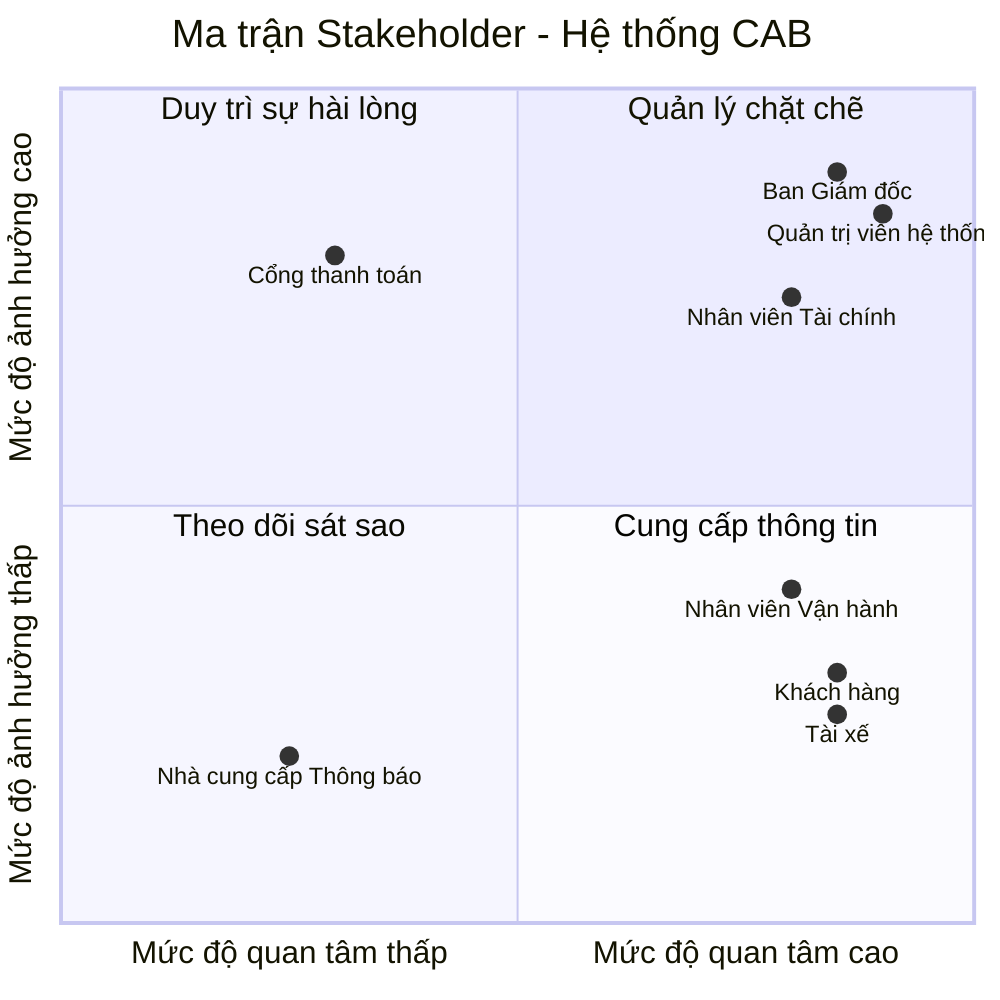

# 23653101_TRUONGHOANGLONG_CABSYSTEM
**###BƯỚC 1: TÌM HIỂU**

**Lý do hệ thống cũ không đáp ứng được và phải xây dựng hệ thống mới:**
* Việc phân công tài xế chủ yếu được thực hiện thủ công, gây tốn thời gian và dễ sai sót.
* Khách hàng khó theo dõi trạng thái chuyến đi theo thời gian thực.
* Thông tin thanh toán chưa được quản lý tập trung, gây khó khăn cho việc đối soát.
* Bộ phận vận hành gặp khó khăn khi muốn mở rộng hệ thống do kiến trúc cũ không linh hoạt và không chịu được tải cao.
### Giải pháp của hệ thống mới 
* **Tự động hóa ghép chuyến (Smart Matching):** Tự động tìm tài xế gần nhất dựa trên GPS; tự động chuyển tiếp sang tài xế khác nếu tài xế đầu tiên từ chối/không phản hồi mà không bắt khách hàng đặt lại.
* **Kiến trúc mở rộng & Chịu lỗi:** Các module (Đặt xe, Thanh toán, Thông báo) hoạt động độc lập, tự động nâng cấp tài nguyên khi tải cao vào giờ cao điểm; sự cố ở module này không làm gián đoạn toàn bộ hệ thống.
* **Bảo mật thanh toán (Tokenization):** Tích hợp cổng thanh toán bên thứ ba an toàn, không lưu thông tin thẻ nhạy cảm trên hệ thống; tự động xử lý lại khi giao dịch thất bại.
* **Quản trị & Phân quyền chặt chẽ:** Áp dụng mô hình phân quyền RBAC cho nhân viên vận hành và ghi nhật ký thao tác (Audit Logs) để kiểm soát rủi ro.
* **Khả năng mở rộng tương lai:** Thiết kế linh hoạt, dễ dàng tích hợp thêm kênh thông báo, phương thức thanh toán hoặc các dịch vụ mới (xe ghép, giao hàng...) trong tương lai.
#### Tác nhân người dùng (User Actors)
* **Khách hàng (Customer):** Đăng ký/đăng nhập, tạo yêu cầu đặt xe, theo dõi vị trí tài xế real-time, thanh toán và đánh giá chất lượng dịch vụ.
* **Tài xế (Driver):** Quản lý hồ sơ/phương tiện, bật trạng thái sẵn sàng, nhận/từ chối chuyến, cập nhật tiến trình chuyến đi và định vị GPS.
* **Nhân viên Vận hành (Ops Staff):** Giám sát chuyến đi real-time, duyệt hồ sơ tài xế, hỗ trợ xử lý sự cố chuyến đi và tra cứu giao dịch.
* **Quản trị viên / Ban Giám đốc (Admin/Management):** Phân quyền hệ thống, kiểm tra Audit Log bảo mật và xem báo cáo doanh thu, hiệu suất vận hành.

####  Tác nhân hệ thống tích hợp (External Systems)
* **Cổng thanh toán (Payment Gateway):** Xử lý giao dịch thanh toán điện tử an toàn theo cơ chế Tokenization.
* **Hạ tầng thông báo (Notification Gateway):** Gửi SMS, Email và Push Notification tức thì đến thiết bị người dùng.
**###BƯỚC 2**
**2. Các bên liên quan**

| Stakeholder | Vai trò trong hệ thống |
| :--- | :--- |
| **Khách hàng** | Khởi tạo yêu cầu đặt xe, theo dõi chuyến đi real-time, thanh toán (tiền mặt/điện tử) và đánh giá dịch vụ. |
| **Tài xế** | Cập nhật hồ sơ/phương tiện, bật trạng thái sẵn sàng, nhận/từ chối chuyến và cập nhật tiến trình chuyến đi. |
| **Nhân viên Vận hành** | Giám sát danh sách chuyến đi/tài xế real-time, quản lý tài khoản và hỗ trợ xử lý các sự cố phát sinh. |
| **Nhân viên Tài chính** | Quản lý đối soát giao dịch thanh toán, theo dõi doanh thu/chiết khấu tài xế, xử lý hoàn tiền và tra cứu dữ liệu tài chính. |
| **Ban Giám đốc** | Xem báo cáo doanh thu & hiệu suất, quản lý phân quyền hệ thống và đưa ra các quyết định kinh doanh. |
| **Quản trị viên hệ thống** | Làm rõ quy tắc nghiệp vụ, thiết kế, xây dựng và triển khai hệ thống trong thời gian 7 tuần. |
| **Cổng thanh toán** | Tiếp nhận và xử lý giao dịch thanh toán trực tuyến . |
| **Nhà cung cấp Thông báo** | Chịu trách nhiệm truyền tải các thông báo (Push Notification/SMS/Email) tức thì đến thiết bị người dùng. |
3. Lập stackholder matric

### Bước 3: Mục đích nghiệp vụ (Business Purpose & Goals)

* **Tự động hóa vận hành:** Tự động ghép chuyến thông minh qua vị trí GPS, loại bỏ hoàn toàn quy trình phân công thủ công, tối ưu chi phí nhân sự tổng đài.
* **Đa dạng phương thức thanh toán:** Hỗ trợ linh hoạt song song cả **Thanh toán tiền mặt** và **Thanh toán trực tuyến** (Ví điện tử/Thẻ) an toàn qua cơ chế Tokenization.
* **Xử lý truy cập số lượng lớn:** Đảm bảo hệ thống chịu tải cao, phục vụ hàng nghìn khách hàng và tài xế truy cập đồng thời ổn định vào các giờ cao điểm.
* **Nâng cao trải nghiệm khách hàng:** Minh bạch cước phí, theo dõi vị trí xe real-time, nhận thông báo tức thì và đánh giá chất lượng dịch vụ sau chuyến.
* **Tối ưu hiệu suất tài xế:** Giúp tài xế chủ động bật/tắt nhận chuyến, giảm thời gian di chuyển rỗng nhờ nhận các chuyến đi ở vị trí gần nhất.
* **Quản trị tài chính & Kiểm soát rủi ro:** Tập trung hóa dữ liệu giao dịch, tự động xử lý lại khi thanh toán thất bại, ghi log theo vết (Audit Log) và phân quyền truy cập chặt chẽ (RBAC).
* **Công cụ vận hành real-time:** Trang bị Dashboard quản trị cho nhân viên vận hành giám sát chuyến đi, quản lý tài khoản và can thiệp hỗ trợ sự cố kịp thời.
* **Chịu lỗi & Hoạt động liên tục (Fault Tolerance):** Đảm bảo sự cố từ các dịch vụ bên thứ ba (thanh toán, thông báo) không làm ngừng trệ chức năng đặt xe cốt lõi.
* **Hỗ trợ báo cáo & Quyết định kinh doanh:** Cung cấp báo cáo trực quan cho Ban Giám đốc về doanh thu, tỷ lệ hoàn thành/hủy chuyến và KPI hiệu suất tài xế.
* **Sẵn sàng mở rộng tương lai:** Xây dựng kiến trúc linh hoạt để dễ dàng bổ sung thêm dịch vụ mới (giao hàng, xe ghép...), kênh thông báo hoặc phương thức thanh toán mới.
  
**###Bước 4: Phạm vi dự án (Project Scope - 7 Tuần)**

#### 1. Trong phạm vi (In-Scope)

* **Xác thực & Phân quyền cơ bản (Authentication & RBAC):**
  * Đăng ký, đăng nhập an toàn cho người dùng (Khách hàng, Tài xế).
  * Phân quyền truy cập theo vai trò (Khách hàng, Tài xế, Nhân viên Vận hành, Nhân viên Tài chính, Ban Giám đốc).

* **Thiết kế modul hóa (Modular Design):**
  * **Modul Quản lý Khách hàng (Customer Management):** Quản lý thông tin hồ sơ khách hàng, lịch sử chuyến đi, thông tin thanh toán lưu trữ và lịch sử đánh giá/phản hồi dịch vụ.
  * **Modul Tài khoản & Xác thực (Auth):** Quản lý đăng nhập, phân quyền và bảo mật phiên làm việc.
  * **Modul Đặt xe (Booking):** Khởi tạo chuyến đi, tự động tìm tài xế gần nhất qua GPS và xử lý chuyển tiếp khi tài xế từ chối/hết giờ.
  * **Modul Định vị (Tracking):** Theo dõi vị trí tài xế và trạng thái chuyến đi theo thời gian thực trên bản đồ.
  * **Modul Thanh toán (Payment):** Hỗ trợ song song **Tiền mặt** và **Thanh toán trực tuyến** (môi trường thử nghiệm Sandbox).
  * **Modul Quản trị (Dashboard):** Giao diện hỗ trợ cho Nhân viên Vận hành (giám sát), Nhân viên Tài chính (xem giao dịch, đối soát) và Ban Giám đốc (xem báo cáo doanh thu).

#### 2. Ngoài phạm vi (Out-of-Scope)
* Tích hợp cổng thanh toán thực tế (chỉ dùng tài khoản thử nghiệm Sandbox).
* Các tính năng nâng cao: Đặt xe ghép, giao hàng, đặt trước chuyến đi.
* Chương trình tích điểm, khuyến mãi hoặc mã giảm giá phức tạp.

#### 3. Lộ trình 7 tuần (7-Week Roadmap)

| Tuần | Công việc chính |
| :---: | :--- |
| **1** | Thu thập yêu cầu, xác định phạm vi và lập bảng Stakeholder. |
| **2** | Phân tích nghiệp vụ (Sơ đồ Use Case, Activity Diagram). |
| **3** | Thiết kế Cơ sở dữ liệu (ERD) và phân chia cấu trúc các Modul. |
| **4** | Xây dựng Modul Auth (Đăng nhập/Phân quyền), Modul Quản lý Khách hàng & Modul Đặt xe. |
| **5** | Xây dựng Modul Thanh toán (Tiền mặt/Online), Tracking & Giao diện Dashboard Quản trị. |
| **6** | Kiểm thử tích hợp giữa các modul và sửa lỗi. |
| **7** | Hoàn thiện tài liệu README.md và tổng kết báo cáo dự án. |

###Bước 5: Yêu cầu nghiệp vụ (Business Requirements)

### Bảng Quy trình Nghiệp vụ

| STT | Giai đoạn | Quy trình nghiệp vụ | Bước thực hiện | Tác nhân | Modul hệ thống |
| :---: | :--- | :--- | :--- | :--- | :--- |
| **1** | **Khởi tạo & Xác thực** | Đăng ký & Đăng nhập | Tạo tài khoản, xác thực OTP/Mật khẩu và cấp Token phiên làm việc | Khách hàng, Tài xế | Auth Module |
| **2** | | Phân quyền (RBAC) | Cấp quyền truy cập giao diện và chức năng tương ứng theo vai trò | All Users | Auth Module |
| **3** | **Quản lý Khách & Tài xế** | Quản lý Hồ sơ Khách hàng | Lưu địa chỉ yêu thích, xem lịch sử chuyến đi & cài đặt thanh toán | Khách hàng | Customer Module |
| **4** | | Duyệt & Quản lý Tài xế | Cập nhật bằng lái/đăng ký xe, kiểm duyệt hồ sơ tài xế vận hành | Tài xế, Ops | Driver Module |
| **5** | **Đặt xe & Điều phối** | Khởi tạo Đặt xe | Chọn điểm đi/đến, hệ thống đo khoảng cách, ước tính thời gian & báo giá | Khách hàng | Booking Module |
| **6** | | Ghép chuyến Tự động | Định vị GPS, tìm tài xế gần nhất và phát thông báo mời chuyến | Hệ thống, Tài xế | Booking Module |
| **7** | | Xử lý Từ chối / Timeout | Tài xế nhận/từ chối. Quá thời gian chờ tự động chuyển sang tài xế tiếp theo | Hệ thống, Tài xế | Booking Module |
| **8** | **Vận hành & Theo dõi** | Quản lý Tiến trình | Cập nhật: **Đã nhận → Đón khách → Đang di chuyển → Hoàn thành** | Tài xế | Booking Module |
| **9** | | Theo dõi Real-time | Cập nhật vị trí GPS tài xế liên tục trên bản đồ thời gian thực | Khách hàng, Tài xế | Tracking Module |
| **10**| | Giám sát & Hỗ trợ | Giám sát danh sách chuyến đi real-time, can thiệp điều xe/hủy xe khi sự cố | NV Vận hành | Dashboard Module |
| **11**| **Thanh toán & Tài chính**| Thanh toán Tiền mặt | Khách trả tiền mặt khi đến nơi; tài xế xác nhận đã thu đủ trên ứng dụng | Khách hàng, Tài xế | Payment Module |
| **12**| | Thanh toán Trực tuyến | Tự động trừ tiền qua Ví/Thẻ (Tokenization) khi kết thúc chuyến | Hệ thống, Cổng TT | Payment Module |
| **13**| | Đối soát Tài chính | Tra cứu giao dịch, tính chiết khấu hoa hồng & quản lý ví tài xế | NV Tài chính | Dashboard Module |
| **14**| **Đánh giá & Báo cáo** | Đánh giá Dịch vụ | Chấm điểm 1-5 sao và gửi phản hồi chất lượng phục vụ sau chuyến | Khách hàng | Customer Module |
| **15**| | Báo cáo Quản trị | Trích xuất báo cáo doanh thu, tỷ lệ hoàn thành/hủy chuyến & chỉ số KPI | Ban Giám đốc | Dashboard Module |

###Bước 6 Bảng Phân rã Chức năng Hệ thống (Functional Decomposition)

| Modul | Chức năng cấp 1 | Chi tiết chức năng cấp 2 (Mức cơ bản) |
| :--- | :--- | :--- |
| **1. Auth Module** | Đăng ký & Đăng nhập | Đăng nhập tài khoản bằng SĐT/Mật khẩu; cấp Token xác thực |
| | Phân quyền (RBAC) | Cấp quyền truy cập cho 5 nhóm: Khách, Tài xế, Ops, Finance, Admin |
| **2. User Module** | Quản lý Khách hàng | Cập nhật thông tin, lưu địa chỉ yêu thích, xem lịch sử chuyến đi |
| | Quản lý Tài xế | Cập nhật bằng lái, biển số xe; NV Vận hành duyệt hồ sơ |
| **3. Booking Module** | Khởi tạo Đặt xe | Chọn điểm đi/đến, hiển thị quãng đường và báo giá cước phí trước |
| | Ghép chuyến Tự động | Tìm tài xế gần nhất qua GPS ở trạng thái "Sẵn sàng" |
| | Xử lý Từ chối/Timeout | Tài xế đếm ngược nhận chuyến; nếu từ chối/hết giờ thì quét xế tiếp theo |
| **4. Tracking Module**| Cập nhật Tiến trình | Tài xế chuyển trạng thái: **Đã nhận → Đón khách → Đang đi → Hoàn thành** |
| | Theo dõi Real-time | Hiển thị tọa độ xe chạy trực tiếp trên bản đồ của Khách hàng |
| **5. Payment Module** | Thanh toán Tiền mặt | Khách trả tiền mặt tại điểm đến; Tài xế xác nhận đã nhận tiền |
| | Thanh toán Trực tuyến | Tự động trừ tiền qua cổng thanh toán thử nghiệm (Sandbox) |
| **6. Dashboard Module**| Giám sát Vận hành | NV Vận hành xem danh sách chuyến đi real-time và can thiệp sự cố |
| | Đối soát Tài chính | NV Tài chính tra cứu lịch sử thanh toán & tính chiết khấu tài xế |
| | Đánh giá & Báo cáo | Khách hàng chấm điểm 1-5★; Ban Giám đốc xem báo cáo doanh thu |

Bước 7: vẽ usecase tổng quát

Bước 8: đặc tả usecase
### **Đặc tả UseCase Đăng nhập**

| Thuộc tính | Nội dung |
| :--- | :--- |
| **– Tên use case:** | Đăng nhập |
| **– Mô tả sơ lược:** | Chức năng Đăng nhập cho phép người dùng (Khách hàng, Tài xế, Nhân viên, Quản trị viên) xác thực tài khoản để truy cập vào hệ thống CAB System. |
| **– Actor chính:** | Người dùng (Khách hàng, Tài xế, Nhân viên Vận hành, Nhân viên Tài chính, Ban Giám đốc, Quản trị viên hệ thống) |
| **– Actor phụ:** | Không |
| **– Tiền điều kiện (Pre-condition):** | Người dùng phải có tài khoản đã được kích hoạt trên hệ thống. |
| **– Hậu điều kiện (Post-condition):** | Nếu đăng nhập thành công thì hệ thống sẽ hiển thị giao diện trang chủ theo đúng vai trò (Role). |

#### **– Luồng sự kiện chính (main flow):**

| Actor: Người dùng | System |
| :--- | :--- |
| **1.** Mở ứng dụng / Truy cập website hệ thống | |
| | **2.** Hiển thị form đăng nhập gồm các thông tin: Số điện thoại / Tên đăng nhập, Mật khẩu |
| **3.** Nhập đầy đủ thông tin đăng nhập và nhấn nút "Đăng nhập" | |
| | **4.** Kiểm tra cú pháp và định dạng dữ liệu đầu vào |
| | **5.** Xác thực thông tin tài khoản và mật khẩu trong cơ sở dữ liệu |
| | **6.** Hệ thống hiển thị trang chủ tương ứng với vai trò của người dùng. Kết thúc usecase |

#### **– Luồng sự kiện thay thế (alternate flow):**

| Actor: Người dùng | System |
| :--- | :--- |
| | **4.1.1.** Hệ thống hiển thị thông báo sai định dạng (ví dụ: Số điện thoại không hợp lệ) |
| **4.1.2.** Quay lại bước 3 | |
| | **5.1.1.** Hệ thống hiển thị thông báo "Tài khoản hoặc mật khẩu không chính xác" |
| **5.1.2.** Quay lại bước 3 | |

#### **– Luồng sự kiện ngoại lệ (exception flow):**

| Actor: Người dùng | System |
| :--- | :--- |
| | **5.2.1.** Hệ thống phát hiện tài khoản chưa tồn tại hoặc đã bị khóa |
| **5.2.3** Nhấn nút đóng hoặc OK. Kết thúc usecase | **5.2.2.** Hệ thống hiển thị thông báo "Tài khoản không tồn tại hoặc đã bị khóa" |
Bước 9: quy trình nghiệp vụ business process
Bước 10: Kết thúc trong phần thiết kế( phân tích các thiết kế business rule vd: các tài xế trong trạng thái available thì mới có ưu tiên nhận cuốc xe trc)
