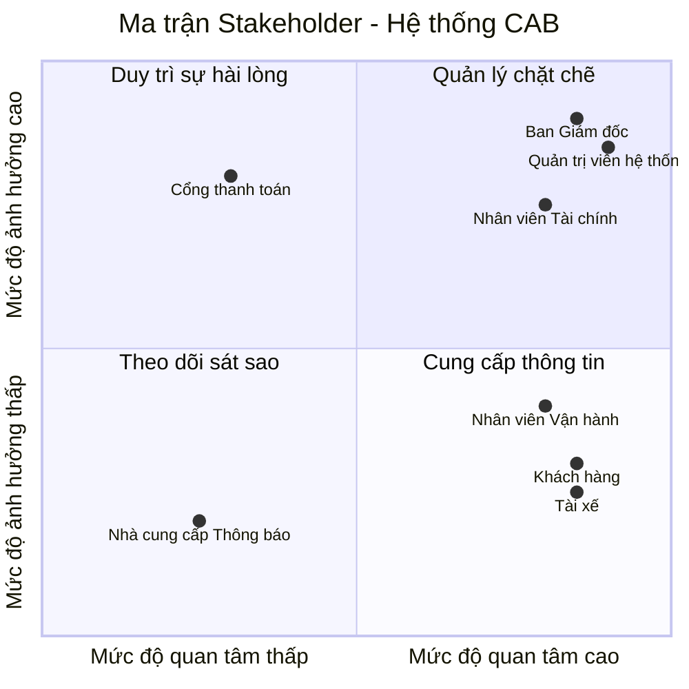

# 23653101_TRUONGHOANGLONG_CABSYSTEM
**###BƯỚC 1: TÌM HIỂU**

**Lý do hệ thống cũ không đáp ứng được và phải xây dựng hệ thống mới:**
* Việc phân công tài xế chủ yếu được thực hiện thủ công, gây tốn thời gian và dễ sai sót.
* Khách hàng khó theo dõi trạng thái chuyến đi theo thời gian thực.
* Thông tin thanh toán chưa được quản lý tập trung, gây khó khăn cho việc đối soát.
* Bộ phận vận hành gặp khó khăn khi muốn mở rộng hệ thống do kiến trúc cũ không linh hoạt và không chịu được tải cao.
### Giải pháp của hệ thống mới 
* **Tự động hóa ghép chuyến (Smart Matching):** Tự động tìm tài xế gần nhất dựa trên GPS; tự động chuyển tiếp sang tài xế khác nếu tài xế đầu tiên từ chối/không phản hồi mà không bắt khách hàng đặt lại.
* **Kiến trúc mở rộng & Chịu lỗi:** Các module (Đặt xe, Thanh toán, Thông báo) hoạt động độc lập, tự động nâng cấp tài nguyên khi tải cao vào giờ cao điểm; sự cố ở module này không làm gián đoạn toàn bộ hệ thống.
* **Bảo mật thanh toán (Tokenization):** Tích hợp cổng thanh toán bên thứ ba an toàn, không lưu thông tin thẻ nhạy cảm trên hệ thống; tự động xử lý lại khi giao dịch thất bại.
* **Quản trị & Phân quyền chặt chẽ:** Áp dụng mô hình phân quyền RBAC cho nhân viên vận hành và ghi nhật ký thao tác (Audit Logs) để kiểm soát rủi ro.
* **Khả năng mở rộng tương lai:** Thiết kế linh hoạt, dễ dàng tích hợp thêm kênh thông báo, phương thức thanh toán hoặc các dịch vụ mới (xe ghép, giao hàng...) trong tương lai.
#### Tác nhân người dùng (User Actors)
* **Khách hàng (Customer):** Đăng ký/đăng nhập, tạo yêu cầu đặt xe, theo dõi vị trí tài xế real-time, thanh toán và đánh giá chất lượng dịch vụ.
* **Tài xế (Driver):** Quản lý hồ sơ/phương tiện, bật trạng thái sẵn sàng, nhận/từ chối chuyến, cập nhật tiến trình chuyến đi và định vị GPS.
* **Nhân viên Vận hành (Ops Staff):** Giám sát chuyến đi real-time, duyệt hồ sơ tài xế, hỗ trợ xử lý sự cố chuyến đi và tra cứu giao dịch.
* **Quản trị viên / Ban Giám đốc (Admin/Management):** Phân quyền hệ thống, kiểm tra Audit Log bảo mật và xem báo cáo doanh thu, hiệu suất vận hành.

####  Tác nhân hệ thống tích hợp (External Systems)
* **Cổng thanh toán (Payment Gateway):** Xử lý giao dịch thanh toán điện tử an toàn theo cơ chế Tokenization.
* **Hạ tầng thông báo (Notification Gateway):** Gửi SMS, Email và Push Notification tức thì đến thiết bị người dùng.
**###BƯỚC 2**
**2. Các bên liên quan**

| Stakeholder | Vai trò trong hệ thống |
| :--- | :--- |
| **Khách hàng** | Khởi tạo yêu cầu đặt xe, theo dõi chuyến đi real-time, thanh toán (tiền mặt/điện tử) và đánh giá dịch vụ. |
| **Tài xế** | Cập nhật hồ sơ/phương tiện, bật trạng thái sẵn sàng, nhận/từ chối chuyến và cập nhật tiến trình chuyến đi. |
| **Nhân viên Vận hành** | Giám sát danh sách chuyến đi/tài xế real-time, quản lý tài khoản và hỗ trợ xử lý các sự cố phát sinh. |
| **Nhân viên Tài chính** | Quản lý đối soát giao dịch thanh toán, theo dõi doanh thu/chiết khấu tài xế, xử lý hoàn tiền và tra cứu dữ liệu tài chính. |
| **Ban Giám đốc** | Xem báo cáo doanh thu & hiệu suất, quản lý phân quyền hệ thống và đưa ra các quyết định kinh doanh. |
| **Quản trị viên hệ thống** | Làm rõ quy tắc nghiệp vụ, thiết kế, xây dựng và triển khai hệ thống trong thời gian 7 tuần. |
| **Cổng thanh toán** | Tiếp nhận và xử lý giao dịch thanh toán trực tuyến . |
| **Nhà cung cấp Thông báo** | Chịu trách nhiệm truyền tải các thông báo (Push Notification/SMS/Email) tức thì đến thiết bị người dùng. |
3. Lập stackholder matric

### Bước 3: Mục đích kinh doanh (Business Purpose & Goals)

* **Tự động hóa vận hành:** Tự động ghép chuyến thông minh qua vị trí GPS, loại bỏ hoàn toàn quy trình phân công thủ công, tối ưu chi phí nhân sự tổng đài.
* **Đa dạng phương thức thanh toán:** Hỗ trợ linh hoạt song song cả **Thanh toán tiền mặt** và **Thanh toán trực tuyến** (Ví điện tử/Thẻ) an toàn qua cơ chế Tokenization.
* **Xử lý truy cập số lượng lớn:** Đảm bảo hệ thống chịu tải cao, phục vụ hàng nghìn khách hàng và tài xế truy cập đồng thời ổn định vào các giờ cao điểm.
* **Nâng cao trải nghiệm khách hàng:** Minh bạch cước phí, theo dõi vị trí xe real-time, nhận thông báo tức thì và đánh giá chất lượng dịch vụ sau chuyến.
* **Tối ưu hiệu suất tài xế:** Giúp tài xế chủ động bật/tắt nhận chuyến, giảm thời gian di chuyển rỗng nhờ nhận các chuyến đi ở vị trí gần nhất.
* **Quản trị tài chính & Kiểm soát rủi ro:** Tập trung hóa dữ liệu giao dịch, tự động xử lý lại khi thanh toán thất bại, ghi log theo vết (Audit Log) và phân quyền truy cập chặt chẽ (RBAC).
* **Công cụ vận hành real-time:** Trang bị Dashboard quản trị cho nhân viên vận hành giám sát chuyến đi, quản lý tài khoản và can thiệp hỗ trợ sự cố kịp thời.
* **Chịu lỗi & Hoạt động liên tục (Fault Tolerance):** Đảm bảo sự cố từ các dịch vụ bên thứ ba (thanh toán, thông báo) không làm ngừng trệ chức năng đặt xe cốt lõi.
* **Hỗ trợ báo cáo & Quyết định kinh doanh:** Cung cấp báo cáo trực quan cho Ban Giám đốc về doanh thu, tỷ lệ hoàn thành/hủy chuyến và KPI hiệu suất tài xế.
* **Sẵn sàng mở rộng tương lai:** Xây dựng kiến trúc linh hoạt để dễ dàng bổ sung thêm dịch vụ mới (giao hàng, xe ghép...), kênh thông báo hoặc phương thức thanh toán mới.
  
**###Bước 4: Phạm vi dự án (Project Scope - 7 Tuần)**

#### 1. Trong phạm vi (In-Scope)

* **Xác thực & Phân quyền cơ bản (Authentication & RBAC):**
  * Đăng ký, đăng nhập an toàn cho người dùng (Khách hàng, Tài xế).
  * Phân quyền truy cập theo vai trò (Khách hàng, Tài xế, Nhân viên Vận hành, Nhân viên Tài chính, Ban Giám đốc).

* **Thiết kế modul hóa (Modular Design):**
  * **Modul Quản lý Khách hàng (Customer Management):** Quản lý thông tin hồ sơ khách hàng, lịch sử chuyến đi, thông tin thanh toán lưu trữ và lịch sử đánh giá/phản hồi dịch vụ.
  * **Modul Tài khoản & Xác thực (Auth):** Quản lý đăng nhập, phân quyền và bảo mật phiên làm việc.
  * **Modul Đặt xe (Booking):** Khởi tạo chuyến đi, tự động tìm tài xế gần nhất qua GPS và xử lý chuyển tiếp khi tài xế từ chối/hết giờ.
  * **Modul Định vị (Tracking):** Theo dõi vị trí tài xế và trạng thái chuyến đi theo thời gian thực trên bản đồ.
  * **Modul Thanh toán (Payment):** Hỗ trợ song song **Tiền mặt** và **Thanh toán trực tuyến** (môi trường thử nghiệm Sandbox).
  * **Modul Quản trị (Dashboard):** Giao diện hỗ trợ cho Nhân viên Vận hành (giám sát), Nhân viên Tài chính (xem giao dịch, đối soát) và Ban Giám đốc (xem báo cáo doanh thu).

#### 2. Ngoài phạm vi (Out-of-Scope)
* Tích hợp cổng thanh toán thực tế (chỉ dùng tài khoản thử nghiệm Sandbox).
* Các tính năng nâng cao: Đặt xe ghép, giao hàng, đặt trước chuyến đi.
* Chương trình tích điểm, khuyến mãi hoặc mã giảm giá phức tạp.

#### 3. Lộ trình 7 tuần (7-Week Roadmap)

| Tuần | Công việc chính |
| :---: | :--- |
| **1** | Thu thập yêu cầu, xác định phạm vi và lập bảng Stakeholder. |
| **2** | Phân tích nghiệp vụ (Sơ đồ Use Case, Activity Diagram). |
| **3** | Thiết kế Cơ sở dữ liệu (ERD) và phân chia cấu trúc các Modul. |
| **4** | Xây dựng Modul Auth (Đăng nhập/Phân quyền), Modul Quản lý Khách hàng & Modul Đặt xe. |
| **5** | Xây dựng Modul Thanh toán (Tiền mặt/Online), Tracking & Giao diện Dashboard Quản trị. |
| **6** | Kiểm thử tích hợp giữa các modul và sửa lỗi. |
| **7** | Hoàn thiện tài liệu README.md và tổng kết báo cáo dự án. |

### Bước 5: Yêu cầu nghiệp vụ (Business Requirements)

#### Bảng Quy trình Nghiệp vụ

| Mã BR | Yêu cầu Nghiệp vụ cốt lõi | KPI & Tiêu chí Nghiệm thu cụ thể |
| :---: | :--- | :--- |
| **BR-01** | **Điều phối & Ghép chuyến thông minh (Smart Matching)** | • **100%** luồng phân công chạy tự động dựa trên tọa độ GPS, loại bỏ hoàn toàn quy trình can thiệp thủ công từ tổng đài. • Hệ thống tự động chuyển tiếp yêu cầu sang tài xế kế cận khi tài xế trước từ chối hoặc hết thời gian phản hồi (timeout). • Đảm bảo trải nghiệm liền mạch: Giữ nguyên dữ liệu chuyến đi, **không bắt khách hàng phải thao tác đặt lại chuyến**. |
| **BR-02** | **Định vị hành trình & Truyền tải thông báo tức thì** | • Cho phép Khách hàng giám sát vị trí tài xế và tiến trình chuyến đi theo thời gian thực trên bản đồ (Modul Tracking). • Tự động kích hoạt **100%** thông báo đa kênh (**Push Notification/SMS/Email**) qua Notification Gateway đến thiết bị người dùng theo từng mốc chuyến đi. • Thu thập phản hồi và đánh giá chất lượng dịch vụ của khách hàng ngay sau khi kết thúc hành trình. |
| **BR-03** | **Quản lý Cước phí & Tích hợp Thanh toán An toàn (Tokenization)** | • Tích hợp linh hoạt hai phương thức: **Thanh toán tiền mặt** và **Thanh toán trực tuyến** (kết nối Cổng thanh toán bên thứ ba qua môi trường thử nghiệm Sandbox). • Tuân thủ an toàn dữ liệu: **0%** lưu trữ thông tin thẻ nhạy cảm (CVV, số thẻ đầy đủ) trên hệ thống CAB nhờ cơ chế Tokenization. • Hỗ trợ tự động xử lý lại (Retry) giao dịch điện tử hoặc cho phép chuyển sang tiền mặt khi thanh toán thất bại. |
| **BR-04** | **Phân quyền truy cập RBAC & Giám sát Vận hành Real-time** | • Thiết lập mô hình phân quyền **RBAC** chặt chẽ cho 5 nhóm tác nhân (*Khách hàng, Tài xế, Nhân viên Vận hành, Nhân viên Tài chính, Ban Giám đốc/Admin*). • Trang bị Dashboard cho Nhân viên Vận hành giám sát các chuyến đi real-time, tra cứu lịch sử và hỗ trợ xử lý sự cố phát sinh. • **100%** các thao tác thay đổi dữ liệu hoặc phân quyền hệ thống phải được ghi lại nhật ký vết (**Audit Logs**) để quản trị rủi ro. |
| **BR-05** | **Quản lý Tài chính, Đối soát & Báo cáo Quản trị** | • Cung cấp công cụ cho Nhân viên Tài chính thực hiện tra cứu giao dịch, đối soát doanh thu/chiết khấu tài xế và xử lý yêu cầu hoàn tiền. • Xuất báo cáo trực quan cho Ban Giám đốc về các chỉ số vận hành: *Doanh thu tổng, số lượng chuyến đi, tỷ lệ hoàn thành/hủy chuyến, KPI hiệu suất tài xế*. |
| **BR-06** | **Thiết kế Modul hóa & Tối ưu Khả năng Chịu lỗi (Fault Tolerance)** | • Kiến trúc phân chia Modul độc lập (*Auth, Customer, Booking, Tracking, Payment, Dashboard*). • **Đảm bảo tính hoạt động liên tục**: Sự cố từ các dịch vụ bên thứ ba (Cổng thanh toán, Hạ tầng thông báo) không làm ngừng trệ chức năng Đặt xe cốt lõi. • Đáp ứng khả năng chịu tải cao vào giờ cao điểm và sẵn sàng mở rộng các dịch vụ mới (*giao hàng, xe ghép...*) trong tương lai. |

### Bước 6: Yêu cầu Chức năng Hệ thống (Functional Requirements - FR)
#### 1. Khách hàng (Customer)
* **FR-CUS-01 (Đăng ký / Đăng nhập):** Đăng ký tài khoản mới và xác thực đăng nhập để truy cập hệ thống.
* **FR-CUS-02 (Quản lý hồ sơ):** Xem, cập nhật thông tin cá nhân (Họ tên, Email, Ảnh đại diện) và quản lý danh sách địa chỉ yêu thích.
* **FR-CUS-03 (Đặt xe):** Nhập điểm đi, điểm đến, chọn loại xe, xem cước phí dự kiến và gửi yêu cầu tìm tài xế.
* **FR-CUS-04 (Hủy xe):** Chủ động hủy yêu cầu đặt xe hoặc hủy chuyến trước khi tài xế đón.
* **FR-CUS-05 (Thanh toán):** Chọn phương thức thanh toán (Tiền mặt / Online) và thực hiện giao dịch cho chuyến đi.
* **FR-CUS-06 (Đánh giá dịch vụ):** Chấm điểm số sao (1–5 sao) và gửi nhận xét về chất lượng chuyến đi sau khi hoàn tất.

#### 2. Tài xế (Driver)
* **FR-DRI-01 (Quản lý hồ sơ & Phương tiện):** Cập nhật thông tin cá nhân và tải lên giấy tờ xe (Bằng lái, Biển số, Cavet, Đăng kiểm) để chờ duyệt.
* **FR-DRI-02 (Cập nhật trạng thái sẵn sàng):** Chủ động bật/tắt chế độ nhận chuyến (Sẵn sàng / Ngừng nhận chuyến).
* **FR-DRI-03 (Xử lý yêu cầu chuyến đi):** Nhận thông báo chuyến đi mới và thực hiện Chấp nhận hoặc Từ chối trong thời gian quy định.
* **FR-DRI-04 (Cập nhật tiến trình đi):** Cập nhật trạng thái thực tế của chuyến đi theo luồng: *Đã đến điểm đón -> Bắt đầu di chuyển -> Hoàn thành chuyến đi*.
* **FR-DRI-05 (Xác nhận thu tiền mặt):** Xác nhận đã thu đủ số tiền mặt từ khách hàng đối với các chuyến đi thanh toán bằng tiền mặt.

#### 3. Nhân viên Vận hành (Ops Staff)
* **FR-OPS-01 (Duyệt hồ sơ tài xế):** Kiểm tra thông tin, hình ảnh giấy tờ do tài xế cung cấp để Phê duyệt hoặc Từ chối cấp quyền hoạt động.
* **FR-OPS-02 (Giám sát vận hành):** Theo dõi danh sách các chuyến đi đang diễn ra và vị trí/trạng thái của tài xế real-time trên bản đồ.
* **FR-OPS-03 (Can thiệp sự cố):** Can thiệp hủy chuyến, điều lại xe hoặc xử lý các sự cố phát sinh trong quá trình vận hành.

#### 4. Nhân viên Tài chính (Finance Staff)
* **FR-FIN-01 (Tra cứu giao dịch):** Khai thác và kiểm tra chi tiết thông tin lịch sử các giao dịch thanh toán trên hệ thống.
* **FR-FIN-02 (Đối soát tài chính):** Đối soát dữ liệu thanh toán giữa CSDL hệ thống và Cổng thanh toán để phát hiện, xử lý các giao dịch chênh lệch.
* **FR-FIN-03 (Quản lý ví tài xế):** Quản lý số dư, lịch sử biến động nguồn tiền, khấu trừ chiết khấu và công nợ trên ví của tài xế.

#### 5. Ban Giám đốc (Management)
* **FR-MGT-01 (Xem báo cáo doanh thu):** Trích xuất và theo dõi các chỉ số doanh thu tổng quan, doanh thu theo thời gian và phương thức thanh toán.
* **FR-MGT-02 (Xem báo cáo hiệu suất):** Theo dõi các báo cáo chỉ số KPI, tỷ lệ hoàn thành/hủy chuyến và hiệu suất hoạt động của tài xế.

#### 6. Quản trị viên Hệ thống (System Admin)
* **FR-ADM-01 (Cập nhật hệ thống):** Cấu hình tham số vận hành, cập nhật tính năng và bảo trì các thiết lập chung của hệ thống.
* **FR-ADM-03 (Sao lưu và lưu trữ):** Thực hiện sao lưu dữ liệu định kỳ, lưu trữ nhật ký thao tác (Audit Log) và khôi phục dữ liệu khi cần.

#### 7. Hệ thống Tích hợp bên ngoài (External Systems)
* **FR-EXT-01 (Cổng thanh toán - Xử lý giao dịch online):** Tiếp nhận và xử lý các giao dịch thanh toán trực tuyến qua Thẻ/Ví điện tử an toàn theo cơ chế Tokenization.
* **FR-EXT-02 (Nhà cung cấp Thông báo - Gửi thông báo):** Chịu trách nhiệm truyền tải các Push Notification, SMS, Email tức thì đến thiết bị của người dùng.

Bước 7: vẽ usecase tổng quát

Bước 8: đặc tả usecase
**###KHÁCH HÀNG**
**Đặc tả usecase Đăng ký**
##1. Use case: Đăng ký

| Thuộc tính | Nội dung |
| :--- | :--- |
| **– Tên use case:** | Đăng ký |
| **– Mô tả sơ lược:** | Cho phép Khách hàng tạo tài khoản mới trên hệ thống CAB System bằng số điện thoại/email để có thể sử dụng dịch vụ đặt xe. |
| **– Actor chính:** | Khách hàng |
| **– Actor phụ:** | Nhà cung cấp Thông báo (gửi mã OTP xác thực) |
| **– Tiền điều kiện (Pre-condition):** | Khách hàng chưa có tài khoản được đăng ký bằng số điện thoại/email trên hệ thống. |
| **– Hậu điều kiện (Post-condition):** | Tài khoản Khách hàng được tạo và kích hoạt thành công, sẵn sàng đăng nhập sử dụng. |

#### – Luồng sự kiện chính (main flow):

| Actor: Khách hàng | System |
| :--- | :--- |
| **1.** Chọn chức năng "Đăng ký" | |
| | **2.** Hiển thị form đăng ký gồm: Họ tên, Số điện thoại, Email, Mật khẩu, Xác nhận mật khẩu |
| **3.** Nhập đầy đủ thông tin và nhấn nút "Đăng ký" | |
| | **4.** Kiểm tra định dạng dữ liệu đầu vào (số điện thoại, email, độ mạnh mật khẩu) |
| | **5.** Kiểm tra số điện thoại/email chưa tồn tại trong hệ thống |
| | **6.** Gửi mã OTP xác thực đến số điện thoại/email đăng ký |
| **7.** Nhập mã OTP và nhấn "Xác nhận" | |
| | **8.** Xác thực mã OTP hợp lệ, tạo tài khoản, hiển thị thông báo đăng ký thành công. Kết thúc use case |

#### – Luồng sự kiện thay thế (alternate flow):

| Actor: Khách hàng | System |
| :--- | :--- |
| | **4.1.** Dữ liệu sai định dạng (ví dụ: số điện thoại không hợp lệ, mật khẩu không đủ mạnh), hiển thị thông báo lỗi tương ứng |
| **4.2.** Nhập lại thông tin, quay lại bước 3 | |
| | **5.1.** Số điện thoại/Email đã tồn tại trên hệ thống, hiển thị thông báo "Số điện thoại/Email đã được sử dụng" |
| **5.2.** Nhập lại thông tin khác, quay lại bước 3 | |
| | **8.1.** Mã OTP không đúng hoặc đã hết hạn, hiển thị thông báo "Mã OTP không chính xác hoặc đã hết hạn" |
| **8.2.** Chọn nhập lại mã OTP hoặc nhấn "Gửi lại mã OTP" | **8.3.** Nếu Khách hàng chọn nhập lại → quay lại bước 7; nếu Khách hàng chọn "Gửi lại mã OTP" → gửi mã OTP mới, quay lại bước 7 |

#### – Luồng sự kiện ngoại lệ (exception flow):

| Actor: Khách hàng | System |
| :--- | :--- |
| | **9.1.** Mất kết nối Internet trong quá trình gửi thông tin đăng ký, gửi OTP hoặc xác thực OTP, hiển thị thông báo "Mất kết nối, vui lòng kiểm tra Internet và thử lại" |
| **9.2.** Nhấn "OK", kiểm tra kết nối và thực hiện lại từ bước tương ứng | |

##2. Use case: Đăng nhập

| Thuộc tính | Nội dung |
| :--- | :--- |
| **– Tên use case:** | Đăng nhập |
| **– Mô tả sơ lược:** | Cho phép Người dùng (Khách hàng, Tài xế, Nhân viên Vận hành, Nhân viên Tài chính, Ban Giám đốc, Quản trị viên hệ thống) xác thực danh tính bằng Số điện thoại/Email và Mật khẩu để truy cập hệ thống theo đúng vai trò và quyền hạn được phân quyền (RBAC). |
| **– Actor chính:** | Người dùng (Khách hàng/Tài xế/Nhân viên Vận hành/Nhân viên Tài chính/Ban Giám đốc/Quản trị viên hệ thống) |
| **– Actor phụ:** | Không có |
| **– Tiền điều kiện (Pre-condition):** | Người dùng đã có tài khoản được đăng ký/khởi tạo hợp lệ trên hệ thống. |
| **– Hậu điều kiện (Post-condition):** | Người dùng được xác thực thành công, hệ thống khởi tạo phiên làm việc (session), ghi nhận vào Audit Log và điều hướng vào giao diện tương ứng với vai trò. |

#### – Luồng sự kiện chính (main flow):

| Actor: Người dùng | System |
| :--- | :--- |
| **1.** Chọn chức năng "Đăng nhập" | |
| | **2.** Hiển thị form đăng nhập gồm: Số điện thoại/Email, Mật khẩu |
| **3.** Nhập thông tin đăng nhập và nhấn nút "Đăng nhập" | |
| | **4.** Kiểm tra dữ liệu đầu vào: (a) dữ liệu đã được nhập đầy đủ; (b) dữ liệu đúng định dạng quy định |
| | **5.** Kiểm tra tài khoản có tồn tại trong hệ thống |
| | **6.** Kiểm tra mật khẩu có khớp với tài khoản |
| | **7.** Kiểm tra trạng thái tài khoản (đã được duyệt/kích hoạt, không bị khóa hoặc vô hiệu hóa) |
| | **8.** Xác định vai trò (Role) của tài khoản theo mô hình RBAC |
| | **9.** Khởi tạo phiên làm việc (session), ghi nhận thời gian đăng nhập vào Audit Log |
| | **10.** Điều hướng người dùng vào giao diện/Dashboard tương ứng với vai trò. Kết thúc use case |

#### – Luồng sự kiện thay thế (alternate flow):

| Actor: Người dùng | System |
| :--- | :--- |
| | **4.1.** Số điện thoại/Email bị bỏ trống, hiển thị thông báo "Vui lòng nhập Số điện thoại/Email" |
| **4.1.1.** Nhập lại thông tin, quay lại bước 3 | |
| | **4.2.** Mật khẩu bị bỏ trống, hiển thị thông báo "Vui lòng nhập Mật khẩu" |
| **4.2.1.** Nhập lại thông tin, quay lại bước 3 | |
| | **4.3.** Số điện thoại/Email sai định dạng, hiển thị thông báo "Số điện thoại/Email không đúng định dạng" |
| **4.3.1.** Nhập lại thông tin, quay lại bước 3 | |
| | **5.1.** Tài khoản không tồn tại, hiển thị thông báo chung "Số điện thoại/Email hoặc mật khẩu không đúng" (không tiết lộ chi tiết tài khoản) |
| **5.1.1.** Nhập lại thông tin, quay lại bước 3 | |
| | **6.1.** Mật khẩu không đúng, hiển thị thông báo "Số điện thoại/Email hoặc mật khẩu không đúng" và ghi nhận số lần đăng nhập sai liên tiếp |
| | **6.1.1.** Số lần đăng nhập sai liên tiếp từ 1 đến 4 lần: tài khoản chưa bị khóa |
| **6.1.2.** Nhập lại thông tin, quay lại bước 3 | |
| | **6.2.** Số lần đăng nhập sai liên tiếp đạt đến lần thứ 5: tạm khóa tài khoản theo thời gian quy định của hệ thống, hiển thị thông báo "Tài khoản tạm khóa do đăng nhập sai quá nhiều lần, vui lòng thử lại sau" và không cho phép đăng nhập trong thời gian khóa |
| | **7.1.** Tài khoản chưa được duyệt (ví dụ: Tài xế chưa được phê duyệt), hiển thị thông báo "Tài khoản chưa được kích hoạt hoặc đã bị khóa" và không cho phép đăng nhập |
| | **7.2.** Tài khoản đang bị khóa, hiển thị thông báo "Tài khoản chưa được kích hoạt hoặc đã bị khóa" và không cho phép đăng nhập |
| | **7.3.** Tài khoản đã bị vô hiệu hóa, hiển thị thông báo "Tài khoản chưa được kích hoạt hoặc đã bị khóa" và không cho phép đăng nhập |

#### – Luồng sự kiện ngoại lệ (exception flow):

| Actor: Người dùng | System |
| :--- | :--- |
| | **3.1.** Mất kết nối Internet khi gửi thông tin đăng nhập (phát sinh tại bước 3), hiển thị thông báo "Mất kết nối, vui lòng kiểm tra Internet và thử lại" |
| **3.2.** Nhấn "OK", kiểm tra kết nối và thực hiện lại từ bước 3 | |
| | **8.1.** Hệ thống gặp sự cố nội bộ (server lỗi/timeout) trong quá trình xác thực tài khoản/mật khẩu/vai trò (phát sinh tại bước 4, 5, 6, 7 hoặc 8), hiển thị thông báo "Hệ thống đang gặp sự cố, vui lòng thử lại sau" và ghi log lỗi để Quản trị viên hệ thống xử lý |
| | **9.1.** Hệ thống không tạo được phiên làm việc (session) hoặc gặp lỗi khi ghi Audit Log (phát sinh tại bước 9), hệ thống ghi nhận lỗi và xử lý theo cơ chế dự phòng của hệ thống |

## 3. Quản lý hồ sơ (Khách hàng)

| **Quản lý hồ sơ** | |
|---|---|
| **Mục đích** | Cho phép Khách hàng xem, cập nhật thông tin cá nhân và quản lý địa chỉ yêu thích. |
| **Mô tả** | Use Case cho phép Khách hàng xem, cập nhật hồ sơ và thêm/xoá địa chỉ yêu thích trong hệ thống. |
| **Tiền điều kiện** | Khách hàng đã đăng nhập thành công và hệ thống hoạt động bình thường. |
| **Hậu điều kiện** | Nếu Use Case thành công, thông tin hồ sơ được hiển thị hoặc cập nhật, hoặc địa chỉ yêu thích được thêm/xoá và dữ liệu thay đổi được lưu vào hệ thống. Nếu Use Case không thành công, dữ liệu hiện tại không thay đổi. |
| **Actor chính** | Khách hàng |
| **Actor phụ** | Không |

### Basic flow

| Khách hàng | Hệ thống |
|---|---|
| 1. Chọn chức năng "Quản lý hồ sơ" | 2. Hiển thị các chức năng: Xem hồ sơ, Cập nhật hồ sơ, Thêm địa chỉ yêu thích, Xoá địa chỉ yêu thích |
| 3. Chọn một trong các chức năng được yêu cầu.  Nếu chọn "Xem hồ sơ", subflow **Xem hồ sơ** được thực hiện.  Nếu chọn "Cập nhật hồ sơ", subflow **Cập nhật hồ sơ** được thực hiện.  Nếu chọn "Thêm địa chỉ yêu thích", subflow **Thêm địa chỉ yêu thích** được thực hiện.  Nếu chọn "Xoá địa chỉ yêu thích", subflow **Xoá địa chỉ yêu thích** được thực hiện. | |

### Xem hồ sơ

| Khách hàng | Hệ thống |
|---|---|
| 1. Chọn chức năng "Xem hồ sơ" | 2. Hiển thị thông tin hồ sơ gồm: Họ tên, Email, Số điện thoại, Ảnh đại diện và danh sách địa chỉ yêu thích. |

### Cập nhật hồ sơ

| Khách hàng | Hệ thống |
|---|---|
| 1. Chọn chức năng "Cập nhật hồ sơ" | 2. Hiển thị biểu mẫu chứa thông tin hồ sơ hiện tại (Họ tên, Email, Ảnh đại diện). |
| 3. Thay đổi thông tin cần cập nhật (Họ tên, Email, Ảnh đại diện). | 4. Hiển thị thông tin đã nhập để Khách hàng kiểm tra. |
| 5. Xác nhận cập nhật thông tin hồ sơ. | 6. Kiểm tra thông tin hồ sơ. |
| | 7. Cập nhật thông tin hồ sơ vào CSDL. |
| | 8. Thông báo cập nhật hồ sơ thành công. |

### Thêm địa chỉ yêu thích

| Khách hàng | Hệ thống |
|---|---|
| 1. Chọn chức năng "Thêm địa chỉ yêu thích" | 2. Hiển thị biểu mẫu nhập thông tin địa chỉ. |
| 3. Nhập thông tin địa chỉ gồm: Tên địa chỉ, Địa chỉ chi tiết, Toạ độ (GPS). | |
| 4. Xác nhận thêm địa chỉ. | 5. Kiểm tra thông tin địa chỉ. |
| | 6. Lưu địa chỉ vào CSDL. |
| | 7. Thông báo thêm địa chỉ thành công. |

### Xoá địa chỉ yêu thích

| Khách hàng | Hệ thống |
|---|---|
| 1. Chọn địa chỉ cần xoá. | 2. Hiển thị thông tin địa chỉ được chọn. |
| 3. Chọn "Xoá". | 4. Yêu cầu xác nhận thao tác xoá. |
| 5. Xác nhận xoá. | 6. Xoá địa chỉ khỏi CSDL. |
| | 7. Thông báo xoá địa chỉ thành công. |

### Alternative flow

**Subflow Cập nhật hồ sơ**

- **5.1** Khách hàng không xác nhận cập nhật thông tin.
  Hệ thống: Hủy thao tác cập nhật, quay lại bước 3 để Khách hàng chỉnh sửa lại thông tin.
- **6.1** Thông tin hồ sơ không hợp lệ.
  Hệ thống: Thông báo lỗi và yêu cầu nhập lại thông tin.
  Khách hàng: Nhập lại thông tin, quay lại bước 3.

**Subflow Thêm địa chỉ yêu thích**

- **4.1** Khách hàng không xác nhận thêm địa chỉ.
  Hệ thống: Hủy thao tác thêm địa chỉ, quay lại bước 3 để Khách hàng nhập lại thông tin.
- **5.1** Thông tin địa chỉ không hợp lệ.
  Hệ thống: Thông báo lỗi và yêu cầu nhập lại thông tin.
  Khách hàng: Nhập lại thông tin địa chỉ, quay lại bước 3.

**Subflow Xoá địa chỉ yêu thích**

- **5.1** Khách hàng không xác nhận xoá địa chỉ.
  Hệ thống: Hủy thao tác xoá địa chỉ và quay lại bước 1.

### Exception flow

**Subflow Cập nhật hồ sơ**

- **8.1** Hệ thống: Không thể cập nhật hồ sơ do mất kết nối với hệ thống. Kết thúc Use Case.

**Subflow Thêm địa chỉ yêu thích**

- **7.1** Hệ thống: Không thể thêm địa chỉ do mất kết nối với hệ thống. Kết thúc Use Case.

**Subflow Xoá địa chỉ yêu thích**

- **7.1** Hệ thống: Không thể xoá địa chỉ do mất kết nối với hệ thống. Kết thúc Use Case.

##4. Use case: Đánh giá dịch vụ

| Thuộc tính | Nội dung |
| :--- | :--- |
| **– Tên use case:** | Đánh giá dịch vụ |
| **– Mô tả sơ lược:** | Cho phép Khách hàng chấm điểm từ 1–5 sao và gửi nhận xét về chất lượng chuyến đi sau khi chuyến đi hoàn tất. |
| **– Actor chính:** | Khách hàng |
| **– Actor phụ:** | Không có |
| **– Tiền điều kiện (Pre-condition):** | Khách hàng đã đăng nhập và chuyến đi đã hoàn thành. |
| **– Hậu điều kiện (Post-condition):** | Đánh giá được lưu vào hệ thống và gắn với chuyến đi và Tài xế tương ứng. |

### – Luồng sự kiện chính (main flow):

| Actor | System |
| :--- | :--- |
| **1.** Chọn chức năng "Đánh giá dịch vụ" của chuyến đi đã hoàn thành | |
| | **2.** Kiểm tra chuyến đi chưa được đánh giá và hiển thị form đánh giá gồm: số sao (1–5), ô nhập nhận xét và nút "Gửi đánh giá" |
| **3.** Chọn số sao từ 1–5 và nhập nhận xét (nếu có) | |
| **4.** Nhấn nút "Gửi đánh giá" | |
| | **5.** Kiểm tra dữ liệu đánh giá hợp lệ |
| | **6.** Lưu đánh giá vào cơ sở dữ liệu và gắn đánh giá với chuyến đi và Tài xế tương ứng |
| | **7.** Hiển thị thông báo "Đánh giá thành công" và kết thúc use case |

### – Luồng sự kiện thay thế (alternate flow):

| Actor | System |
| :--- | :--- |
| | **2.1.** Chuyến đi đã được đánh giá trước đó, hiển thị thông báo "Chuyến đi này đã được đánh giá" và kết thúc use case |

### – Luồng sự kiện ngoại lệ (exception flow):

| Actor | System |
| :--- | :--- |
| | **5.1.** Số sao bị bỏ trống hoặc không nằm trong phạm vi 1–5, hiển thị thông báo "Vui lòng chọn số sao từ 1 đến 5" |
| **5.1.1.** Chọn lại số sao và nhấn "Gửi đánh giá", quay lại bước 4 | |
| | **6.1.** Không thể lưu đánh giá do lỗi cơ sở dữ liệu hoặc lỗi hệ thống, hiển thị thông báo "Không thể lưu đánh giá, vui lòng thử lại sau" |
| **6.1.1.** Nhấn "OK" và thực hiện lại thao tác gửi đánh giá | |
| | **6.2.** Mất kết nối trong quá trình gửi đánh giá, hiển thị thông báo "Mất kết nối, vui lòng kiểm tra Internet và thử lại" |
| **6.2.1.** Kiểm tra kết nối và thực hiện lại thao tác gửi đánh giá | |

##5. Use case: Đặt xe

| Thuộc tính | Nội dung |
| :--- | :--- |
| **– Tên use case:** | Đặt xe |
| **– Mô tả sơ lược:** | Cho phép Khách hàng nhập điểm đón, điểm đến, chọn loại xe, xem cước phí dự kiến và gửi yêu cầu đặt xe để hệ thống tự động tìm Tài xế gần nhất. |
| **– Actor chính:** | Khách hàng |
| **– Actor phụ:** | Tài xế |
| **– Tiền điều kiện (Pre-condition):** | Khách hàng đã đăng nhập và không có chuyến đi khác đang ở trạng thái xử lý hoặc thực hiện. |
| **– Hậu điều kiện (Post-condition):** | Yêu cầu đặt xe được ghi nhận, chuyến đi được gán cho Tài xế đã chấp nhận và trạng thái chuyến đi là "Đang đến đón". |

### – Luồng sự kiện chính (main flow):

| Actor | System |
| :--- | :--- |
| **1.** Khách hàng chọn chức năng "Đặt xe" | |
| | **2.** Hiển thị màn hình đặt xe |
| **3.** Khách hàng nhập điểm đón, điểm đến và chọn loại xe | |
| | **4.** Tính toán và hiển thị cước phí dự kiến cho chuyến đi |
| **5.** Khách hàng xác nhận thông tin và nhấn nút "Đặt xe" | |
| | **6.** Kiểm tra tính hợp lệ của điểm đón, điểm đến và loại xe đã chọn |
| | **7.** Tìm Tài xế khả dụng gần nhất trong phạm vi tìm kiếm dựa trên tọa độ GPS |
| | **8.** Gửi yêu cầu chuyến đi đến Tài xế đó |
| | **9.** Chờ phản hồi từ Tài xế trong thời gian quy định |
| **10.** Nhận được thông báo tài xế chấp nhận chuyến đi | |
| | **11.** Cập nhật trạng thái chuyến đi thành "Đang đến đón" |
| | **12.** Hiển thị thông tin Tài xế (họ tên, biển số xe, số điện thoại) và vị trí Tài xế trên bản đồ cho Khách hàng. Kết thúc use case |

### – Luồng sự kiện thay thế (alternate flow):

| Actor | System |
| :--- | :--- |
| **9.1.** Khách hàng hủy yêu cầu đặt xe trong lúc hệ thống đang chờ phản hồi từ Tài xế | |
| | **9.1.1.** Hệ thống hủy yêu cầu đặt xe và kết thúc use case |
| **9.2.** Tài xế từ chối chuyến đi hoặc hết thời gian phản hồi (timeout) tại bước 9 | |
| | **9.2.1.** Hệ thống tự động tìm và gửi yêu cầu đến Tài xế khả dụng gần kế tiếp, giữ nguyên dữ liệu chuyến đi, không yêu cầu Khách hàng đặt lại và quay lại bước 8 |

### – Luồng sự kiện ngoại lệ (exception flow):

| Actor | System |
| :--- | :--- |
| | **6.1.** Điểm đón hoặc điểm đến không hợp lệ, hoặc chưa chọn loại xe; hiển thị thông báo "Thông tin chuyến đi không hợp lệ, vui lòng kiểm tra lại." |
| **6.1.1.** Khách hàng nhập lại thông tin và nhấn "Đặt xe", quay lại bước 5 | |
| | **7.1.** Không có Tài xế khả dụng trong phạm vi tìm kiếm; hiển thị thông báo "Hiện không có tài xế khả dụng, vui lòng thử lại sau" và kết thúc use case |
| | **7.2.** Trong quá trình chuyển tiếp (fallback) tại bước 9.2, không còn Tài xế khả dụng khác để chuyển tiếp; hiển thị thông báo "Không tìm được tài xế, vui lòng thử lại sau" và kết thúc use case |
### Bước 9: quy trình nghiệp vụ business process
### QUY TRÌNH 1: ĐẶT XE VÀ TỰ ĐỘNG GHÉP CHUYẾN

### QUY TRÌNH 2: THỰC HIỆN VÀ HOÀN THÀNH CHUYẾN ĐI

### DUYỆT HỒ SƠ TÀI XẾ & TÍCH HỢP HỆ THỐNG

### BƯỚC 10: PHÂN TÍCH QUY TẮC NGHIỆP VỤ (BUSINESS RULES ANALYSIS)

| Nhóm Quy tắc | Tên Quy tắc Nghiệp vụ | Nội dung Chi tiết Đặc tả |
| :--- | :--- | :--- |
| **Ghép chuyến tự động** | Trạng thái Khả dụng | • Chỉ những Tài xế đang ở trạng thái **"Trực tuyến"** (Online) và **"Sẵn sàng"** (Available) mới được hệ thống ưu tiên phát thông báo mời chuyến. |
| **Ghép chuyến tự động** | Thuật toán Định vị (GPS) | • Hệ thống tự động quét và ưu tiên gửi đơn đặt xe cho Tài xế ở gần vị trí điểm đón của Khách hàng nhất trong bán kính tối đa 3km. |
| **Ghép chuyến tự động** | Thời gian Chờ (Timeout) | • Tài xế có tối đa 15 giây để nhấn **"Nhận chuyến"**. Quá 15 giây không phản hồi, hệ thống tự động coi là Từ chối và chuyển chuyến đi cho Tài xế tiếp theo mà không bắt Khách hàng đặt lại. |
| **Vận hành & Hồ sơ** | Điều kiện Hoạt động | • Tài xế chỉ được phép bật trạng thái **"Trực tuyến"** khi hồ sơ cá nhân và phương tiện (Bằng lái, Cavet, Đăng kiểm) đã được Nhân viên Vận hành phê duyệt. |
| **Đặt & Hủy chuyến** | Phí Hủy chuyến | • Khách hàng được miễn phí hủy chuyến trong vòng 2 phút đầu sau khi ghép xế thành công. Nếu hủy sau 2 phút, hệ thống sẽ ghi nhận phí phạt hủy chuyến vào đơn đặt tiếp theo. |
| **Thanh toán & Cước phí** | Khấu trừ Chiết khấu | • Hệ thống tự động trừ % hoa hồng chiết khấu dịch vụ trực tiếp vào Ví tài xế ngay khi chuyến đi hoàn thành thành công. |
| **Đánh giá & Khóa tài khoản** | Tỷ lệ Hoàn thành & Điểm Sao | • Tài xế có điểm đánh giá trung bình dưới 4.0 hoặc tỷ lệ hủy chuyến quá 15% trong tuần sẽ bị hệ thống tự động tạm khóa quyền nhận chuyến. |

--------------
### ĐẶC TẢ API
# Tài liệu API System

Tài liệu API của hệ thống được xây dựng theo chuẩn **OpenAPI 3.0.0** và được kiểm tra tính hợp lệ bằng **Swagger Editor**. 

Tất cả các tệp cấu hình API được phân chia chi tiết theo từng nhóm chức năng nghiệp vụ và lưu trữ tại thư mục `API/`.

---

## Danh sách API theo Nhóm chức năng

### 1. Khách hàng
| STT | Chức năng | Method / Thao tác | Tài liệu API |
| :---: | :--- | :--- | :--- |
| **1** | Đăng ký và Đăng nhập | `POST` đăng ký đăng nhập | `01_Đăng ký_Đăng nhập_Khách hàng.yaml` |
| **2** | Quản lý hồ sơ | `GET`, `POST`, `PUT`, `DELETE` quản lý hồ sơ | `02_Quản lý hồ sơ_Khách hàng.yaml` |
| **3** | Đặt xe | `POST` đặt xe | `03_Đặt xe_Khách hàng.yaml` |
| **4** | Hủy xe | `POST` hủy xe | `04_Hủy xe_Khách hàng.yaml` |
| **5** | Thanh toán | `POST` thanh toán | `05_Thanh toán_Khách hàng.yaml` |
| **6** | Đánh giá dịch vụ | `POST` đánh giá dịch vụ | `06_Đánh giá dịch vụ_Khách hàng.yaml` |

### 2. Tài xế
| STT | Chức năng | Method / Thao tác | Tài liệu API |
| :---: | :--- | :--- | :--- |
| **1** | Quản lý hồ sơ & Phương tiện | `GET`, `POST`, `PUT`, `DELETE` quản lý hồ sơ và phương tiện tài xế | `07_Quản lý hồ sơ & Phương tiện_Tài xế.yaml` |
| **2** | Cập nhật trạng thái sẵn sàng | `PUT` cập nhật trạng thái sẵn sàng | `08_Cập nhật trạng thái sẵn sàng_Tài xế.yaml` |
| **3** | Xử lý yêu cầu chuyến đi | `POST` xử lý yêu cầu chuyến đi | `09_Xử lý yêu cầu chuyến đi_Tài xế.yaml` |
| **4** | Cập nhật tiến trình đi | `PUT` cập nhật tiến trình đi | `10_Cập nhật tiến trình đi_Tài xế.yaml` |
| **5** | Xác nhận thu tiền mặt | `POST` xác nhận thu tiền mặt | `11_Xác nhận thu tiền mặt_Tài xế.yaml` |

### 3. Nhân viên Vận hành
| STT | Chức năng | Method / Thao tác | Tài liệu API |
| :---: | :--- | :--- | :--- |
| **1** | Duyệt hồ sơ tài xế | `POST` duyệt hồ sơ tài xế | `12_Duyệt hồ sơ tài xế_Nhân viên Vận hành.yaml` |
| **2** | Giám sát vận hành | `GET` giám sát vận hành | `13_Giám sát vận hành_Nhân viên Vận hành.yaml` |
| **3** | Can thiệp sự cố | `POST` can thiệp sự cố | `14_Can thiệp sự cố_Nhân viên Vận hành.yaml` |

### 4. Nhân viên Tài chính
| STT | Chức năng | Method / Thao tác | Tài liệu API |
| :---: | :--- | :--- | :--- |
| **1** | Tra cứu giao dịch | `GET` tra cứu giao dịch | `15_Tra cứu giao dịch_Nhân viên Tài chính.yaml` |
| **2** | Đối soát tài chính | `POST` đối soát tài chính | `16_Đối soát tài chính_Nhân viên Tài chính.yaml` |
| **3** | Quản lý ví tài xế | `GET`, `POST`, `PUT`, `DELETE` quản lý ví tài xế | `17_Quản lý ví tài xế_Nhân viên Tài chính.yaml` |

### 5. Ban Giám đốc
| STT | Chức năng | Method / Thao tác | Tài liệu API |
| :---: | :--- | :--- | :--- |
| **1** | Xem báo cáo doanh thu | `GET` xem báo cáo doanh thu | `18_Xem báo cáo doanh thu_Ban Giám đốc.yaml` |
| **2** | Xem báo cáo hiệu suất | `GET` xem báo cáo hiệu suất | `19_Xem báo cáo hiệu suất_Ban Giám đốc.yaml` |

### 6. Quản trị viên Hệ thống
| STT | Chức năng | Method / Thao tác | Tài liệu API |
| :---: | :--- | :--- | :--- |
| **1** | Cập nhật hệ thống | `GET`, `POST`, `PUT`, `DELETE` cập nhật hệ thống | `20_Cập nhật hệ thống_Quản trị viên Hệ thống.yaml` |
| **2** | Sao lưu và lưu trữ | `POST` sao lưu và lưu trữ | `21_Sao lưu và lưu trữ_Quản trị viên Hệ thống.yaml` |

### 7. Hệ thống Tích hợp bên ngoài
| STT | Chức năng | Method / Thao tác | Tài liệu API |
| :---: | :--- | :--- | :--- |
| **1** | Cổng thanh toán - Xử lý giao dịch online | `POST` cổng thanh toán | `22_Cổng thanh toán - Xử lý giao dịch online_Hệ thống Tích hợp bên ngoài.yaml` |
| **2** | Nhà cung cấp Thông báo - Gửi thông báo | `POST` nhà cung cấp thông báo | `23_Nhà cung cấp Thông báo - Gửi thông báo_Hệ thống Tích hợp bên ngoài.yaml` |

---

## Công cụ và Tiêu chuẩn

* **OpenAPI 3.0.0:** Tiêu chuẩn cấu trúc mô tả API.
* **YAML:** Định dạng tập tin được sử dụng để định nghĩa chi tiết các API.
* **Swagger Editor:** Công cụ chính được áp dụng để kiểm thử (validate) và trực quan hóa giao diện API.
* **HTTP Methods:** `GET`, `POST`, `PUT`, `DELETE`.
* **HTTP Status Codes:** `200` (OK), `201` (Created), `400` (Bad Request), `401` (Unauthorized), `403` (Forbidden), `404` (Not Found), `500` (Internal Server Error) tùy theo từng ngữ cảnh xử lý.
* **Authentication:** Sử dụng các cơ chế xác thực tiêu chuẩn phù hợp với từng phân quyền, bao gồm mã hóa **Bearer Token / JWT** đối với các API yêu cầu đăng nhập.

